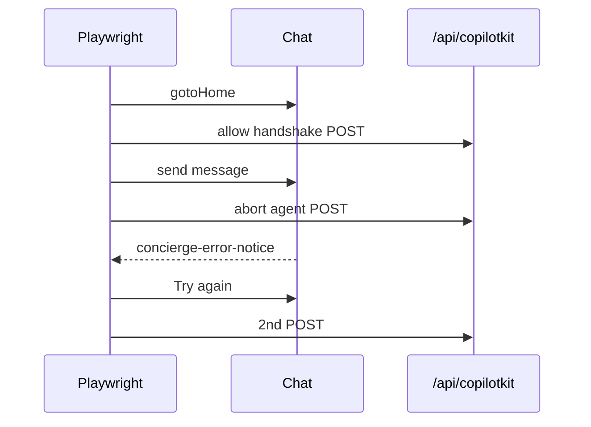

# UX-T-016 — `concierge-run-error.spec.ts`

## Target file

`mdeapp/e2e/concierge-run-error.spec.ts`

## Preconditions

- `cd mdeapp && npm run dev` — UI `:3001`
- Reference smoke: `scripts/smoke-ux015-error-bridge.mjs` (route abort pattern)

## Spec structure

```typescript
import { test, expect } from "@playwright/test";
import { gotoHome, sendConciergeMessage } from "./helpers/maps-layout";
import {
  watchCriticalConsoleErrors,
  assertConsoleClean,
  DESKTOP_VIEWPORT,
} from "./helpers/screen-evidence";

test.describe.configure({ mode: "serial" });
test.use({ viewport: DESKTOP_VIEWPORT });

test("shows error notice when CopilotKit POST fails after send", async ({ page }) => {
  const errors = watchCriticalConsoleErrors(page);
  let failCopilotPosts = false;
  let postCount = 0;

  await page.route("**/api/copilotkit**", async (route) => {
    if (route.request().method() === "POST") postCount++;
    if (failCopilotPosts && route.request().method() === "POST") {
      await route.abort("failed");
      return;
    }
    await route.continue();
  });

  await gotoHome(page);
  failCopilotPosts = true;
  await sendConciergeMessage(page, "test error bridge smoke");

  await expect(page.locator('[data-testid="concierge-error-notice"]')).toBeVisible({
    timeout: 45_000,
  });
  await expect(page.getByText("Something went wrong")).toBeVisible();
  await expect(page.getByRole("button", { name: "Try again" })).toBeVisible();

  const body = await page.locator("#copilot-chat-region").innerText();
  expect(body).not.toMatch(/RUN_ERROR|EAUTHTIMEOUT|INCOMPLETE_STREAM/);

  await page.getByRole("button", { name: "Try again" }).click();
  await expect.poll(() => postCount).toBeGreaterThan(1);

  assertConsoleClean(errors);
});
```

## Acceptance criteria

- [ ] Spec passes: `npx playwright test e2e/concierge-run-error.spec.ts --project=chromium`
- [ ] Does not call rental/event fast-path (query must not match fast-path regex)
- [ ] Screenshot saved to evidence path
- [ ] Optional: add `"test:e2e:ux"` script in `package.json`

## Anti-patterns

- Do not use `networkidle` on `goto`
- Do not require live Gemini / successful agent stream

## Flow


