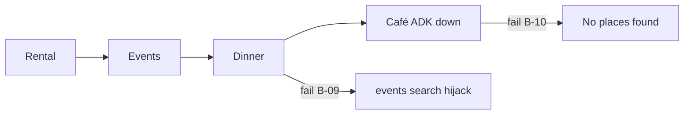

# UX-T-031 — `live-audit-verticals.spec.ts`

## Target file

`mdeapp/e2e/live-audit-verticals.spec.ts`

## Critical rule

**One serial `test.describe`** — scenarios 1→4 share the same page context. Scenario 3 must run **after** scenario 2 (event memory B-09).

## Scenarios

| Step | Query | Network | UI assert |
|------|-------|---------|-------------|
| **1 Rental** | `1BR in Laureles under $80/night` | `waitForResponse('**/api/rentals/search')` status 200 | ≥1 `[data-testid="rental-card"]`; map not `[data-testid="map-empty-state"]` |
| **2 Events** | `salsa events this weekend` | `**/api/events/search` 200 | ≥1 `[data-testid="event-card"]`; optional text matching `/Nothing for this weekend|upcoming events/i` |
| **3 Restaurant** | `quiet rooftop dinner in Provenza` | **No** new `/api/events/search` as primary response to this send | Body must **not** match `/Found \d+ events/i` |
| **4 Café** | `good specialty coffee in Laureles` | `POST **/api/copilotkit` (agent path) | ≥1 `[data-testid="cafe-card"]` OR grounded place card; **not** `No places found` |

## Helpers

Reuse from `e2e/helpers/maps-layout.ts`:

- `gotoHome`, `sendConciergeMessage`, `waitForRentalCards`, `RENTAL_QUERY`
- `hideCopilotWebInspector`

From `e2e/helpers/screen-evidence.ts`:

- `watchCriticalConsoleErrors`, `assertConsoleClean`, `captureScreenEvidence`, `DESKTOP_VIEWPORT`

## Scenario 3 — network trap

```typescript
let eventsSearchAfterDinner = false;
page.on("response", (res) => {
  if (
    res.url().includes("/api/events/search") &&
    res.request().method() === "POST" &&
    dinnerQuerySent
  ) {
    eventsSearchAfterDinner = true;
  }
});
// after send dinner query:
expect(eventsSearchAfterDinner).toBe(false);
await expect(page.locator("#copilot-chat-region")).not.toContainText(/Found \d+ events/);
```

## Scenario 4 — ADK down mock

Before step 4, route ADK invoke:

```typescript
await page.route("**/v1/grounding/invoke**", (route) =>
  route.fulfill({
    status: 503,
    contentType: "application/json",
    body: JSON.stringify({ pins: [], metadata: { reason: "adk_unavailable" } }),
  }),
);
```

Or mock env `ADK_GROUNDING_URL` unreachable (prefer route for determinism).

## Expected failure until feature ships

| Scenario | Fails until |
|----------|-------------|
| 3 | UX-019 (B-09 memory guard L55/L81) |
| 4 | UX-013 (`venue_anchors` café fallback) |

**Implement spec first** — red → green proves fix.

## Acceptance criteria

- [ ] Serial spec file created with 4 tests
- [ ] Scenarios 1–2 pass on current main/branch
- [ ] Scenarios 3–4 documented as `@fixme` or `test.fixme` until UX-019/013 land (or fail loudly)
- [ ] Screenshots: `01-rental.png` … `04-cafe.png` in evidence folder
- [ ] `assertConsoleClean` after each step (allow Maps billing warn in dev)

## Command

```bash
cd mdeapp
npx playwright test e2e/live-audit-verticals.spec.ts --project=chromium --workers=1
```

## Flow


