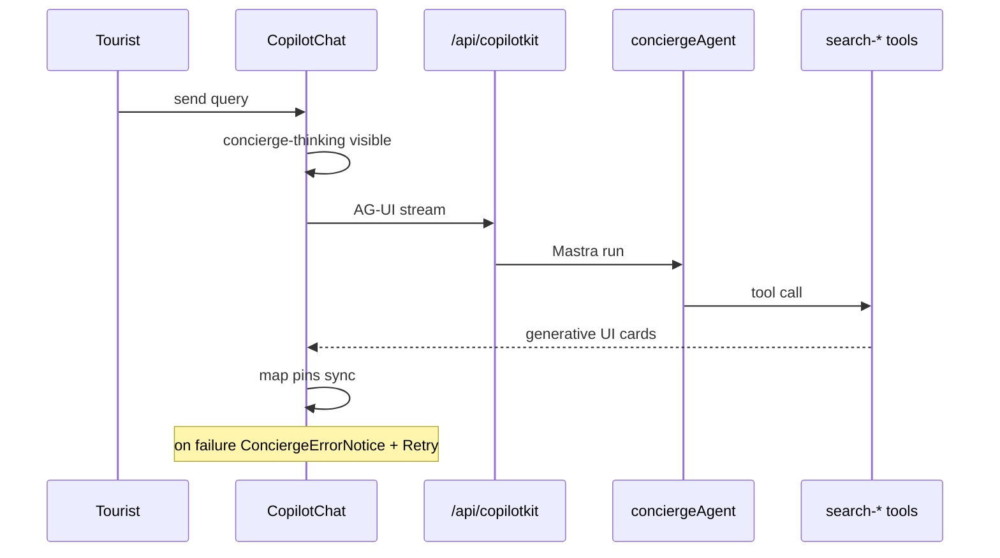

# UX-T-CK — CopilotKit MVP test matrix

**Real-world goal:**

```text
User asks → Copilot routes correctly → tool runs → rich cards render → map pins update → errors show clearly.
```

**Agent name invariant:** UI `useCoAgent({ name: "conciergeAgent" })` must match `Mastra({ agents: { conciergeAgent } })`.

---

## Priority matrix

### P0 — must have

| ID | Test | What it proves | Implementation |
|----|------|----------------|----------------|
| CK-P0-01 | CopilotKit provider loads | `/` renders without provider/runtime crash | Playwright: `gotoHome` + `[data-testid="copilot-chat-region"]` visible; Vitest: `copilotkit-client-props.test.ts` |
| CK-P0-02 | `/api/copilotkit` responds | Runtime route exists; not 500 on handshake | `curl -X POST :3001/api/copilotkit` → 400/200; Playwright: `waitForCopilotRuntime` |
| CK-P0-03 | Normal chat turn works | User send → assistant response or cards | Playwright: non-fast-path query OR rental fast-path cards |
| CK-P0-04 | Error bridge works | Failed `/api/copilotkit` → error bubble | [UX-T-016](UX-T-016-concierge-run-error.spec.md) · `scripts/smoke-ux015-error-bridge.mjs` |
| CK-P0-05 | Thinking indicator works | Pending → `Searching Medellín…` → clears | Vitest: `concierge-thinking-indicator.test.tsx` · Playwright: assert `[data-testid="concierge-thinking"]` during turn |
| CK-P0-06 | Tool render works | Search tool output → rich cards in chat | Playwright: rental query → `[data-testid="rental-card"]`; no raw JSON in `#copilot-chat-region` |
| CK-P0-07 | No duplicate POST storm | One send ≠ uncontrolled `/api/copilotkit` loop | Playwright: count POSTs in 10s after single send; assert ≤ N (suggest max 5 handshake + 1 run) |

### P1 — important

| ID | Test | What it proves | Implementation |
|----|------|----------------|----------------|
| CK-P1-01 | Rental query → cards + pins | `"1BR Laureles under $80"` | `smoke-copilot-rental.mjs` · UX-T-031 scenario 1 |
| CK-P1-02 | Restaurant query → cards | `"quiet dinner in Provenza"` → restaurant/place cards, not empty | UX-T-031 scenario 3 (after UX-019) |
| CK-P1-03 | Café query ≠ events | `"coffee in Laureles"` → café cards, not event cards | UX-T-031 scenario 4 · no `/api/events/search` for café send |
| CK-P1-04 | Event query → event cards | `"salsa events this weekend"` | UX-T-031 scenario 2 · `[data-testid="event-card"]` |
| CK-P1-05 | Map sync | Cards rendered → map pins appear | Count cards vs markers (UX-T-030) |
| CK-P1-06 | Error recovery | After failed request, next message succeeds | Extend UX-T-016: fail once, unmock, retry succeeds |

### P2 — regression

| ID | Test | What it proves | Implementation |
|----|------|----------------|----------------|
| CK-P2-01 | No v2 Copilot imports | `@copilotkit/react-core/v2` blocked | Hook / `rg '@copilotkit/react-core/v2' mdeapp/src` in CI |
| CK-P2-02 | Agent tools registered | Concierge search tools exposed | `concierge.test.ts` — `search-rentals`, `search-events`, `search-restaurants`, `search-grounded-places`, … |
| CK-P2-03 | Working memory / intents | `restaurant_search`, `cafe_search` Zod-safe | `classify-intent.test.ts` · `conciergeWorkingMemorySchema.parse` |
| CK-P2-04 | Mobile chat | Input/send/cards @ 390px | `SCREEN-001-home-chrome.spec.ts` mobile + extend |
| CK-P2-05 | Console hygiene | No runtime errors after chat turn | `watchCriticalConsoleErrors` + `assertConsoleClean` |

**Note:** There is no `extract-intent-slots` tool on disk (2026-05-31). Router exposes `classifyIntentTool`; concierge exposes six `search-*` tools — verify via `conciergeAgent.listTools()` before writing assertions.

---

## Best first 5 tests to implement

| # | Test | Spec | Output |
|---|------|------|--------|
| 1 | Copilot error bridge smoke | UX-T-016 | `e2e/concierge-run-error.spec.ts` + `smoke:copilot:error` |
| 2 | Thinking indicator smoke | CK-P0-05 | Playwright in `e2e/copilotkit-mvp.spec.ts` |
| 3 | Rental search cards + pins | CK-P1-01 | `scripts/smoke-copilot-rental.mjs` |
| 4 | Café query does not call events search | CK-P1-03 | UX-T-031 scenario 4 |
| 5 | Restaurant query renders place cards | CK-P1-02 | UX-T-031 scenario 3 |

---

## Target file — `mdeapp/e2e/copilotkit-mvp.spec.ts`

Serial describe `@copilotkit-mvp`, chromium, 1280×900.

```typescript
import { test, expect } from "@playwright/test";
import {
  gotoHome,
  sendConciergeMessage,
  waitForRentalCards,
  hideCopilotWebInspector,
  waitForCopilotRuntime,
  RENTAL_QUERY,
} from "./helpers/maps-layout";
import {
  watchCriticalConsoleErrors,
  assertConsoleClean,
  DESKTOP_VIEWPORT,
} from "./helpers/screen-evidence";

test.describe.configure({ mode: "serial" });
test.use({ viewport: DESKTOP_VIEWPORT });

test.describe("@copilotkit-mvp P0", () => {
  test("CK-P0-01 provider + chat region loads", async ({ page }) => {
    const errors = watchCriticalConsoleErrors(page);
    await gotoHome(page);
    await expect(page.locator('[data-testid="copilot-chat-region"]')).toBeVisible();
    await expect(page.locator(".copilotKitInput textarea")).toBeVisible();
    assertConsoleClean(errors);
  });

  test("CK-P0-02 runtime handshake", async ({ page }) => {
    await gotoHome(page);
    const res = await page.waitForResponse(
      (r) => r.url().includes("/api/copilotkit") && r.status() < 500,
      { timeout: 30_000 },
    );
    expect(res.status()).toBeLessThan(500);
  });

  test("CK-P0-05 thinking indicator during rental turn", async ({ page }) => {
    await gotoHome(page);
    await sendConciergeMessage(page, RENTAL_QUERY);
    // May flash quickly — optional soft assert or waitForSelector with short timeout
    const sawThinking = await page
      .locator('[data-testid="concierge-thinking"]')
      .waitFor({ state: "visible", timeout: 15_000 })
      .then(() => true)
      .catch(() => false);
    await waitForRentalCards(page);
    expect(sawThinking || true).toBeTruthy(); // tighten once stable
  });

  test("CK-P0-06 + CK-P1-01 rental tool render + cards", async ({ page }) => {
    const errors = watchCriticalConsoleErrors(page);
    await gotoHome(page);
    await sendConciergeMessage(page, RENTAL_QUERY);
    await waitForRentalCards(page);
    await expect(page.locator('[data-testid="rental-card"]').first()).toBeVisible();
    const text = await page.locator("#copilot-chat-region").innerText();
    expect(text).not.toMatch(/\{"results":/);
    assertConsoleClean(errors);
  });

  test("CK-P0-07 no POST storm on single send", async ({ page }) => {
    let posts = 0;
    page.on("request", (req) => {
      if (req.url().includes("/api/copilotkit") && req.method() === "POST") posts++;
    });
    await gotoHome(page);
    await sendConciergeMessage(page, RENTAL_QUERY);
    await page.waitForTimeout(10_000);
    expect(posts).toBeLessThanOrEqual(8); // tune after baseline capture
  });
});
```

Split error/recovery tests into [UX-T-016](UX-T-016-concierge-run-error.spec.md). Merge vertical scenarios from [UX-T-031](UX-T-031-live-audit-verticals.spec.md).

---

## Smoke scripts to add (`package.json`)

```json
{
  "smoke:copilot:error": "node scripts/smoke-ux015-error-bridge.mjs",
  "smoke:copilot:rental": "node scripts/smoke-copilot-rental.mjs",
  "smoke:copilot:intents": "node scripts/smoke-copilot-intents.mjs",
  "test:e2e:copilot": "playwright test e2e/copilotkit-mvp.spec.ts e2e/concierge-run-error.spec.ts --project=chromium --workers=1"
}
```

### `scripts/smoke-copilot-rental.mjs` (sketch)

- `goto` `:3001/` · wait `[data-testid="copilot-chat-ready"]`
- Send `1BR in Laureles under $80/night` (React input trick — copy from `smoke-ux015-error-bridge.mjs`)
- Assert ≥1 `[data-testid="rental-card"]`
- Optional: map not `[data-testid="map-empty-state"]`
- Exit 0/1 JSON summary

### `scripts/smoke-copilot-intents.mjs` (sketch)

Serial queries in one page:

1. `"salsa events this weekend"` → event card visible
2. `"good specialty coffee in Laureles"` → no `Found N events` in body
3. Log POST URLs — fail if café send triggers `/api/events/search`

---

## Floor commands (before merge)

```bash
cd mdeapp
npm run lint
npm run typecheck
npm test
npm run build
npx playwright test e2e/screens/SCREEN-001-home-chrome.spec.ts --project=chromium
npx playwright test e2e/copilotkit-mvp.spec.ts e2e/concierge-run-error.spec.ts --project=chromium --workers=1
```

---

## Agent prompt — CopilotKit test implementation

Copy into agent session when implementing CK tests:

```markdown
Implement CopilotKit MVP tests per `tasks/ux/tasks/tests/UX-T-CK-copilotkit-mvp-tests.md`.

Rules:
- CopilotKit **1.55.2 v1 only** — zero `@copilotkit/react-core/v2` in `mdeapp/src`
- Agent name `conciergeAgent` must match Mastra registry
- Use `sendConciergeMessage` from `e2e/helpers/maps-layout.ts` (not plain fill)
- Hide dev inspector: `hideCopilotWebInspector(page)`
- Evidence → `tasks/testing/evidence/<date>/copilotkit-mvp/`

Deliverables:
1. `e2e/copilotkit-mvp.spec.ts` — P0 tests CK-P0-01..07 (split error to UX-T-016)
2. `scripts/smoke-copilot-rental.mjs` + `scripts/smoke-copilot-intents.mjs`
3. `package.json` scripts: smoke:copilot:*, test:e2e:copilot
4. Run floor commands; capture pass/fail + screenshots

Do NOT assert exact LLM prose. Assert testids, network routes, card counts, POST counts.

After Playwright green: one Chrome DevTools MCP pass on :3001 — network waterfall for POST storm check, console clean.
```

---

## Flow diagram



---

## Acceptance criteria

- [ ] All P0 rows have automated coverage (Vitest and/or Playwright and/or smoke script)
- [ ] P1 rows 1–4 covered by UX-T-031 or smoke scripts
- [ ] `npm run test:e2e:copilot` passes locally with dev on :3001
- [ ] Evidence folder with ≥1 screenshot per P0 test
- [ ] INDEX updated — UX-T-CK status 🟢 when green

## Verification (2026-05-31)

| Claim | Result |
|-------|--------|
| Vitest thinking indicator | ✅ exists |
| Vitest concierge tools | ✅ `concierge.test.ts` |
| Error bridge smoke script | ✅ `smoke-ux015-error-bridge.mjs` |
| `e2e/copilotkit-mvp.spec.ts` | ❌ not yet |
| `smoke-copilot-rental.mjs` | ❌ not yet |
| `smoke-copilot-intents.mjs` | ❌ not yet |

## Related specs

- [UX-T-016](UX-T-016-concierge-run-error.spec.md) — CK-P0-04, CK-P1-06
- [UX-T-031](UX-T-031-live-audit-verticals.spec.md) — CK-P1-01..04
- [UX-T-014](UX-T-014-agent-card-emit-vitest.md) — CK-P0-06 tool render path
- [AGENT-PROMPT-chrome-playwright.md](AGENT-PROMPT-chrome-playwright.md)
