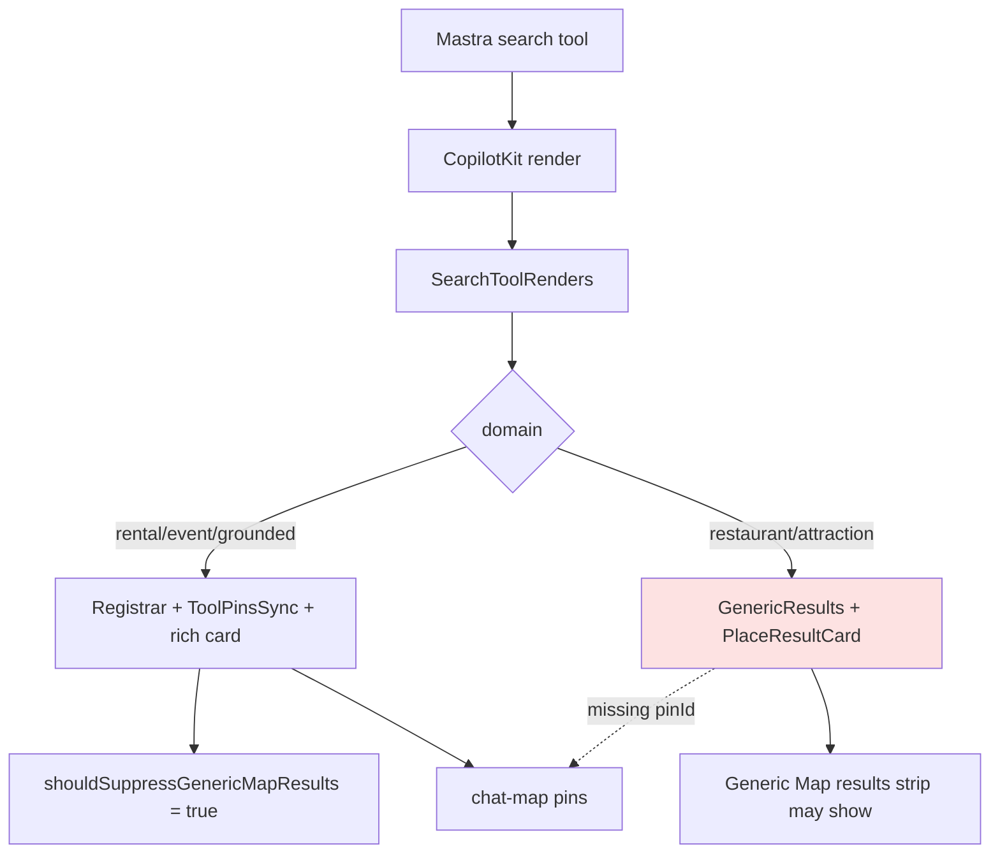

# UX-T-CU — Card unification MVP test matrix

**Parent strategy:** [`UX-010-CARD-UNIFICATION-STRATEGY.md`](../UX-010-CARD-UNIFICATION-STRATEGY.md) §8  
**North star:** One search result = one rich card + one map pin + one detail path.  
**Benchmark:** `CafeResultCard` (9/10). **Weakest:** `PlaceResultCard` via `GenericResults` (3/10).

## Real-world goal

```text
Camila asks for rentals, then dinner, then cafés
→ every vertical uses the same card grammar (photo, badges, Details, hover→pin)
→ map never shows a duplicate "Map results" strip
→ restaurant/attraction feel as trustworthy as café cards
```

## Disk truth (2026-05-31)

| Claim | Verified |
|-------|----------|
| Pipeline | `SearchToolRenders` → `normalizeToolEnvelope` → domain branch → cards |
| Rental / café / event | `RichCardResultsRegistrar` + `ToolPinsSync` + `pinId` ✅ |
| Restaurant fast | `RestaurantResults` — registrar ✅, **`pinId` still missing** in `GenericResults` ❌ UX-022 |
| Restaurant agent / attraction | bare `GenericResults` — **no registrar**, **no `pinId`** ❌ UX-022 |
| Event | registrar ✅ ~L343 — not UX-022 scope |
| Agent restaurant cards | `writer?.custom` in tools — UX-014 removes / mirrors generative UI |
| `RICH_CARD_CATEGORIES` | includes `restaurant`, `attraction` — suppression **ready** once registrar mounts |
| aria-label | **Only** `CafeResultCard` — rental/event/place missing ❌ UX-021 |
| E2E dedup | ✅ `e2e/rich-card-dedup.spec.ts` — rental, event, café |
| Restaurant e2e | ❌ not in dedup spec yet |
| Orphan | `GroundedPlaceCard` still on disk — UX-029 |

---

## Priority matrix

### P0 — ship blockers (UX-010 §7)

| ID | Test | What it proves | Implementation |
|----|------|----------------|----------------|
| CU-P0-01 | Pipeline wiring — rental/café/event | Registrar + pins on rich verticals | `search-tool-renders-cards.test.ts` |
| CU-P0-02 | **UX-022 gap** — restaurant/attraction | GenericResults lacks registrar + pinId | same (passes until UX-022, then flip) |
| CU-P0-03 | Suppression registry | `shouldSuppressGenericMapResults` when category active | `rich-card-results.test.ts` |
| CU-P0-04 | **UX-021 gap** — aria-label | WCAG 4.1.2 on interactive cards | `card-interaction-a11y.test.tsx` |
| CU-P0-05 | No duplicate Map results strip | 0 `[data-testid="results-column"]` | ✅ `rich-card-dedup.spec.ts` |
| CU-P0-06 | Agent card path | No `writer?.custom` in renders; tool keys match | [UX-T-014](UX-T-014-agent-card-emit-vitest.md) |
| CU-P0-07 | **UX-027** — no prod copy leaks | Rental card DOM has no internal ticket strings | Vitest static or grep |

### P1 — UX consistency

| ID | Test | Implementation |
|----|------|----------------|
| CU-P1-01 | Pin parity N cards = N markers | `e2e/card-unification.spec.ts` |
| CU-P1-02 | Hover → pin highlight | Playwright hover + `[data-pin-id]` / marker state |
| CU-P1-03 | Click Details → panel | Café: `cafe-details-cta`; rental/event: sheet testids |
| CU-P1-04 | `data-result-kind` on cards | Vitest static markup (café ✅) |
| CU-P1-05 | Sparse fallback no crash | `PlaceResultCard` minimal props |
| CU-P1-06 | Restaurant domain e2e | extend `rich-card-dedup` after UX-022/025 |

### P2 — maintainability

| ID | Test | Implementation |
|----|------|----------------|
| CU-P2-01 | `normalizeToolEnvelope` branches | ✅ `normalize-tool-envelope.test.ts` |
| CU-P2-02 | Orphan `GroundedPlaceCard` unused | grep import count — UX-029 |
| CU-P2-03 | axe on card list fixture | Vitest-axe or Playwright (optional) |
| CU-P2-04 | Shell slots (post UX-023) | `ResultCardShell` unit tests |

---

## Map sync contract (must test)

Every synced list card:

```html
data-pin-id={pinId}
data-result-kind={kind}
data-selected="true"|"false"
```

Every domain list (after UX-022):

```tsx
<ToolPinsSync category={category} result={result} />
<RichCardResultsRegistrar category={category} count={rows.length} />
```

---

## Best first 10 card tests

| # | Test | Target |
|---|------|--------|
| 1 | `shouldSuppressGenericMapResults` all rich categories | extend `rich-card-results.test.ts` |
| 2 | Rental/event/grounded have registrar in source | `search-tool-renders-cards.test.ts` |
| 3 | GenericResults UX-022 gap documented | same |
| 4 | Café aria-label + data-pin-id | ✅ `cafe-result-card.test.tsx` |
| 5 | Rental/event aria gap (UX-021) | `card-interaction-a11y.test.tsx` |
| 6 | PlaceResultCard sparse fallback | ✅ `place-result-card.test.tsx` |
| 7 | Dedup e2e rental/event/café | ✅ `rich-card-dedup.spec.ts` |
| 8 | Restaurant e2e + pin parity | `card-unification.spec.ts` (after UX-022) |
| 9 | Pin count === card count helper | `maps-layout.ts` + Playwright |
| 10 | UX-014 writer.custom migration | `mastra-tool-action-names.test.ts` |

---

## Target Vitest — `search-tool-renders-cards.test.ts`

Static read of `search-tool-renders.tsx` — no RTL mount (keeps CI fast):

```typescript
describe("search-tool-renders card wiring", () => {
  it("CU-P0-01 rental/event/grounded mount RichCardResultsRegistrar", () => {
    expect(src).toMatch(/RichCardResultsRegistrar category="rental"/);
    expect(src).toMatch(/RichCardResultsRegistrar category="event"/);
    expect(src).toMatch(/RichCardResultsRegistrar category="grounded"/);
  });

  it("CU-P0-02 UX-022 backlog: GenericResults has no registrar yet", () => {
    const block = extractFunctionBody("GenericResults");
    expect(block).not.toContain("RichCardResultsRegistrar");
  });

  it("CU-P0-02 UX-022 backlog: GenericResults PlaceResultCard omits pinId", () => {
    const block = extractFunctionBody("GenericResults");
    expect(block).toContain("<PlaceResultCard");
    expect(block).not.toMatch(/\bpinId=/);
  });
});
```

**When UX-022 lands:** replace backlog tests with positive assertions + delete gap comments.

---

## Target Vitest — `card-interaction-a11y.test.tsx`

```typescript
describe("UX-021 aria-label contract", () => {
  it("CU-P0-04 CafeResultCard has aria-label on interactive region", () => {
    expect(html).toContain('aria-label="Open details for');
  });

  it("CU-P0-04 RentalCard missing aria-label until UX-021", () => {
    expect(html).not.toContain("aria-label=");
  });
  // same for EventCard, PlaceResultCard non-interactive path
});
```

---

## Playwright — `e2e/card-unification.spec.ts`

See [UX-T-030](UX-T-030-card-unification.spec.md). Serial per domain:

| Domain | Query | Card testid | After |
|--------|-------|---------------|-------|
| Rental | `1BR in Laureles under $80/night` | `rental-card` | now |
| Event | `salsa events this weekend` | `event-card` | now |
| Café | `good specialty coffee in Laureles` | `grounded-card` | UX-013 |
| Restaurant | `quiet rooftop dinner Provenza` | `restaurant-card` | UX-022/025 |

Helper (adjust marker selector to `CategoryMapMarker` / `[data-pin-id]`):

```typescript
async function assertCardPinParity(page: Page, cardTestId: string) {
  const cards = page.locator(`[data-testid="${cardTestId}"]`);
  const n = await cards.count();
  expect(n).toBeGreaterThan(0);
  for (let i = 0; i < n; i++) {
    const pinId = await cards.nth(i).getAttribute("data-pin-id");
    expect(pinId).toBeTruthy();
  }
  const markers = page.locator('[data-testid="chat-map"] [data-pin-id]');
  await expect(markers).toHaveCount(n);
}
```

Reuse from `e2e/helpers/maps-layout.ts`: `assertNoGenericMapResultsList`, `assertSingleEventCardSurface`.

---

## Suggested commands

```bash
cd mdeapp
npm run test:cards
npm test -- rich-card-results search-tool-renders-cards card-interaction-a11y cafe-result-card place-result-card event-card
npx playwright test e2e/rich-card-dedup.spec.ts e2e/card-unification.spec.ts --project=chromium --workers=1
```

### `package.json` scripts

```json
{
  "test:cards": "vitest run src/platform/copilot/__tests__/rich-card-results.test.ts src/components/copilot/__tests__/search-tool-renders-cards.test.ts src/components/copilot/__tests__/card-interaction-a11y.test.tsx src/components/copilot/__tests__/cafe-result-card.test.tsx src/components/copilot/__tests__/event-card.test.tsx src/components/copilot/__tests__/place-result-card.test.tsx src/lib/normalize-tool-envelope.test.ts"
}
```

---

## Agent prompt — card unification test implementation

```markdown
Implement card tests per `tasks/ux/tasks/tests/UX-T-CU-card-unification-mvp-tests.md`.

Read first:
- `tasks/ux/tasks/UX-010-CARD-UNIFICATION-STRATEGY.md` §8
- `mdeapp/src/components/copilot/search-tool-renders.tsx` — GenericResults vs RentalResults
- `mdeapp/src/platform/copilot/rich-card-results.ts`
- `mdeapp/e2e/rich-card-dedup.spec.ts` + `e2e/helpers/maps-layout.ts`
- Benchmark: `cafe-result-card.tsx`

Rules:
- Do NOT redesign cards — test contracts only
- UX-022 backlog tests must pass on current disk; flip when registrar lands
- Playwright uses sendConciergeMessage input trick — not fill() alone
- Evidence → `tasks/testing/evidence/<date>/card-unification/`

Deliverables:
1. search-tool-renders-cards.test.ts
2. extend rich-card-results.test.ts (restaurant/attraction suppression)
3. card-interaction-a11y.test.tsx
4. e2e/card-unification.spec.ts (rental + event first; restaurant when UX-022 green)
5. `npm run test:cards` green
```

---

## Flow diagram



---

## Task crosswalk (UX-010 §6)

| UX task | Test task coverage |
|---------|-------------------|
| UX-014 agent emit | UX-T-014, CU-P0-06 |
| UX-021 aria | CU-P0-04, card-interaction-a11y |
| UX-022 GenericResults fix | CU-P0-02 (flip when done) |
| UX-023 shell | CU-P2-04 |
| UX-025 RestaurantCard | CU-P1-06 |
| UX-030 lock-in | UX-T-030, this matrix |

---

## Acceptance criteria

- [ ] `npm run test:cards` passes on current branch
- [ ] UX-022 backlog tests documented and flipped when GenericResults fixed
- [ ] `rich-card-dedup.spec.ts` green locally
- [ ] Restaurant Playwright added after UX-022
- [ ] INDEX UX-T-CU 🟢 when evidence captured

## Verification (2026-05-31)

| Claim | Result |
|-------|--------|
| rich-card-results.test.ts | ✅ extended |
| search-tool-renders-cards.test.ts | ✅ |
| card-interaction-a11y.test.tsx | ✅ |
| cafe/event/place card vitest | ✅ exists |
| rich-card-dedup.spec.ts | ✅ 3 domains |
| card-unification.spec.ts | ❌ Playwright |
| GenericResults registrar | ❌ UX-022 |
| `npm run test:cards` | ✅ 23 tests |

## Related specs

- [UX-T-030-card-unification.spec.md](UX-T-030-card-unification.spec.md) — Playwright detail
- [UX-T-014-agent-card-emit-vitest.md](UX-T-014-agent-card-emit-vitest.md) — agent path
- [UX-T-031-live-audit-verticals.spec.md](UX-T-031-live-audit-verticals.spec.md) — scenario 3 restaurant misroute
