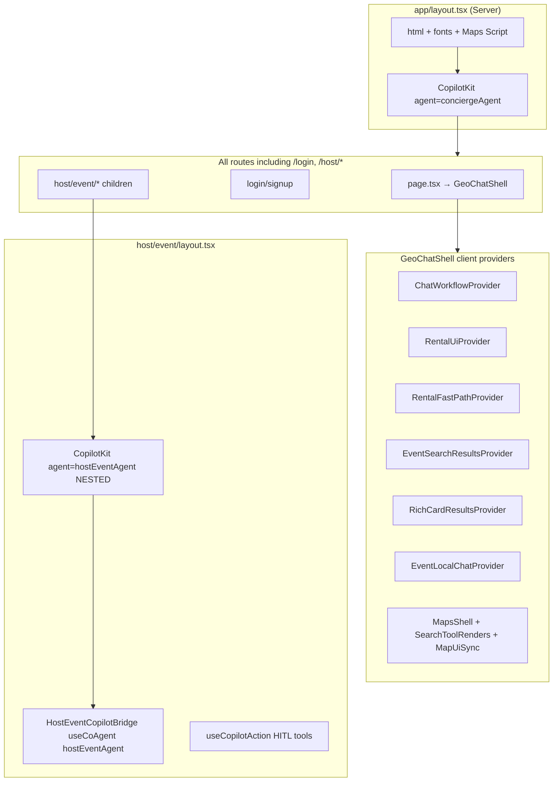
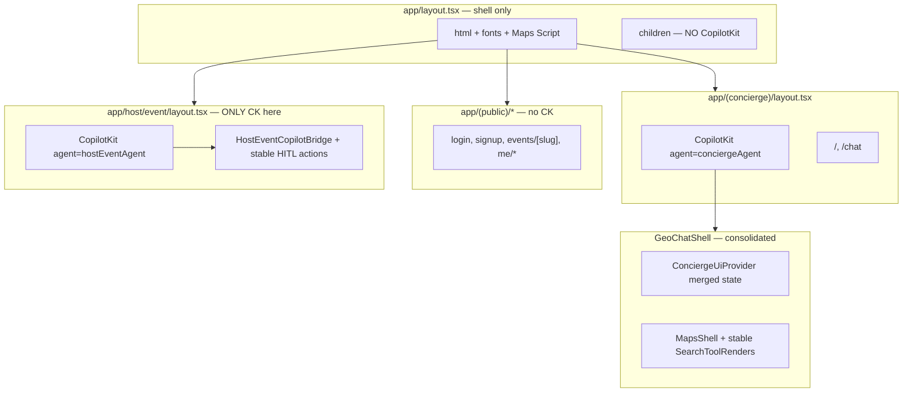
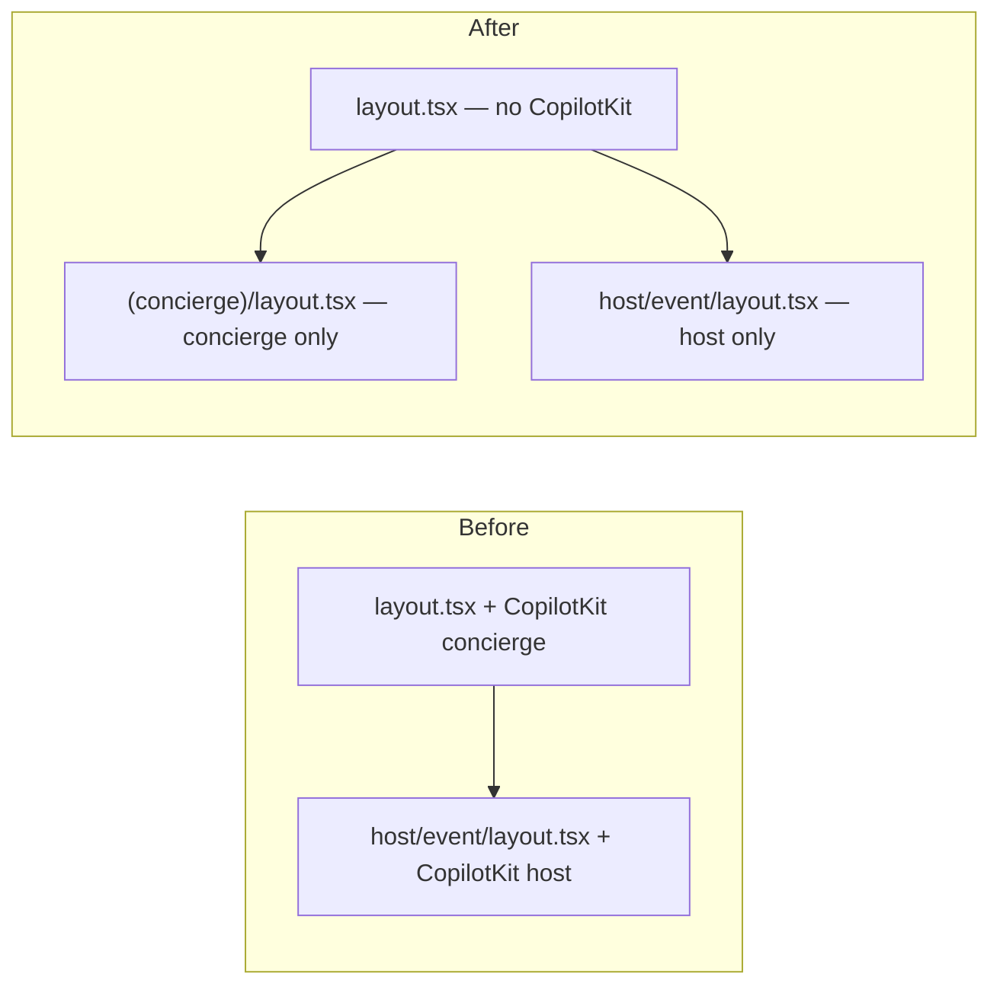
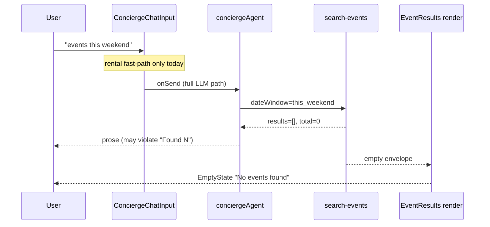
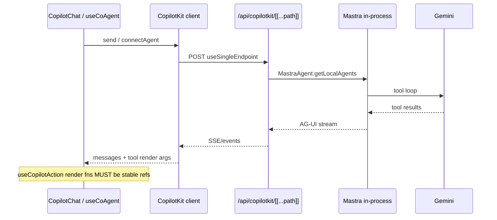

# CopilotKit — Next Steps After Runtime Stabilization

**Date:** 2026-05-30  
**Baseline commit:** `8fa5f10` (`fix(copilotkit): stabilize runtime transport and tool renders`)  
**Prior audit:** [`01-copilotkit-audit.md`](01-copilotkit-audit.md)

---

## Executive Summary

| Metric | Score | Notes |
|--------|------:|-------|
| **Architecture (provider layout)** | **62 / 100** | Single runtime endpoint + stable tool renders; nested `<CopilotKit>` and 6 concierge-only context providers on `/` |
| **Runtime stability** | **88 / 100** | 60s idle `POST /api/copilotkit` delta = 0; bounded POST per turn; no resource exhaustion |
| **Production readiness** | **68 / 100** | Camila path shippable for discovery; Roberto host path + events truthfulness block full prod |

Runtime spam is **fixed** on `/`. Remaining work is **structural** (one provider per tree), **SSR hygiene**, and **events data/agent alignment** — not CopilotKit transport.

**Recommended next task (strict):** **P1 — Host route-group provider split** — see [Recommended Next Task](#recommended-next-task-one-slice).

---

## Findings Table

| Issue | Severity | Root cause | Affected files | Fix | Risk if ignored |
|-------|----------|------------|----------------|-----|-----------------|
| Nested `<CopilotKit>` on `/host/event/*` | **P1 / High** | Root `layout.tsx` wraps **all** routes with `conciergeAgent`; `host/event/layout.tsx` adds second `hostEventAgent` | `src/app/layout.tsx`, `src/app/host/event/layout.tsx` | Route group: concierge provider only on `(concierge)` routes; host provider only under `host/event` | Duplicate runtime sessions, HITL/tool registration on wrong agent, extra POST on login/host |
| Hydration mismatch in chat messages | **P1 / Medium** (prod **Low**) | Client-only tree still SSR-pre-renders; `useCopilotChatInternal()` message list + `interrupt` differ server vs first client paint; Cursor injects `data-cursor-ref` | `concierge-chat-messages.tsx`, `chat-center-panel.tsx`, provider stack in `geo-chat-shell.tsx` | Defer message list until `mounted`; or `suppressHydrationWarning` on messages container; keep keys stable | Console noise; possible layout flicker; rare prod-only if message IDs unstable |
| Events: agent says N events, UI empty | **P2 / High** (product) | **`this_weekend` DB window returns 0 rows** (localhost proof); agent prose can violate “no Found N without tool” | `search-events.ts`, `concierge.ts`, `search-tool-renders.tsx` (`EventResults`), `concierge-chat-input.tsx` (no event fast-path) | Seed weekend rows **or** align copy to `total`; wire `useEventSearchFastPath.handleUserMessage` in input; enforce tool-empty → empty UI + short agent line | Tourist trusts wrong count; chips/query bar disagree with typed chat |
| Event fast-path not on typed send | **P2 / Medium** | `ConciergeChatInput` intercepts **rental** only; events fast-path only on `ChatQueryBar` chips | `concierge-chat-input.tsx`, `use-event-search-fast-path.ts`, `chat-query-bar.tsx` | Mirror rental: try event fast-path before `onSend` | Inconsistent latency and DB path for typed vs chip queries |
| `EventResults` empty when `results=[]` but citations exist | **P2 / Low** | `EventResults` shows `EmptyState` when `rows.length===0`; web citations may still populate panel footer | `search-tool-renders.tsx`, `event-web-citation-sync.tsx` | When `total===0` and citations present, show “Web sources” not “No events found” | Confusing empty state after grounding |
| Six nested concierge providers | **P2 / Medium** | Feature slices added as separate contexts under `GeoChatShell` | `geo-chat-shell.tsx`, `*-context.tsx` | Merge search UI state (event rows + rich cards + rental UI) behind one `ConciergeUiProvider` | Rerender cascades as map/chat grow |
| `MapUiSync` → `setState` on pin changes | **P2 / Low** (post-fix) | Debounced 300ms co-agent writes; stable after tool-render fix | `map-ui-sync.tsx` | Keep debounce; consider push only on user selection not every pin merge | Extra agent memory churn if debounce removed |
| Login loads under root `CopilotKit` | **P2 / Medium** | `/login` is child of root layout | `src/app/layout.tsx` | Concierge provider only on routes that need chat | ~7 CK POST on login page (observed); wasted work |
| Host HITL `useCopilotAction` inline handlers | **P3 / Medium** | `host-event-copilot-bridge.tsx` uses inline `handler` / `renderAndWaitForResponse` (not ref-stable) | `host-event-copilot-bridge.tsx` | Apply same stable pattern as `focus-map-pin-action.tsx` after provider split | Risk of runtime re-registration loop on host wizard |

---

## Localhost Proof (2026-05-30)

| Check | Result |
|-------|--------|
| `POST /api/events/search` `dateWindow: "this_weekend"` | `{"results":[],"total":0,"source":"supabase"}` |
| `POST /api/events/search` `dateWindow: "any"` | **10** results |
| `GET /` | **200** (port 3001) |
| Prior session: 60s idle POST delta | **0** (see `01-copilotkit-audit.md`) |
| Prior session: `npm run floor` | **pass** @ `8fa5f10` |

**Conclusion:** “No events found” for **this weekend** is **correct UI** for current DB + Bogota window; agent claiming “6 events” is **agent/copy bug**, not empty tool render failure.

---

## Mermaid — Current Provider Architecture



---

## Mermaid — Recommended Provider Architecture



---

## Mermaid — Host Route-Group Split



**Target file tree (exact):**

```text
src/app/
  layout.tsx                    # fonts, globals, Maps script — NO CopilotKit
  (concierge)/
    layout.tsx                  # <CopilotKit {...conciergeAgent}>
    page.tsx                    # move from app/page.tsx
    chat/
      page.tsx                  # move from app/chat/page.tsx
  host/
    event/
      layout.tsx                # <CopilotKit {...hostEventAgent}> ONLY
      new/page.tsx              # unchanged path /host/event/new
  login/page.tsx                # no CopilotKit ancestor
  signup/page.tsx
  events/[slug]/...
  ...                           # other routes: no CopilotKit unless added explicitly
```

**Auth impact:** Unchanged. `middleware.ts` still protects `/host/*`; `next=/host/event/new` on login redirect works the same. Only **which layout wraps CopilotKit** changes.

**Agent ownership:**

| Surface | Provider | `useCoAgent` name |
|---------|----------|-------------------|
| `/`, `/chat` | `(concierge)/layout.tsx` | `conciergeAgent` |
| `/host/event/new` | `host/event/layout.tsx` | `hostEventAgent` |

**Runtime sessions:** One `CopilotKit` instance per page tree → one `connectAgent` / agent binding per navigation, not nested duplicate clients.

---

## P1 — Host Route-Group Migration Plan

| Step | Action | Verify |
|------|--------|--------|
| 1 | Remove `<CopilotKit>` from `app/layout.tsx` | `rg CopilotKit src/app/layout.tsx` → no match |
| 2 | Add `app/(concierge)/layout.tsx` with `getCopilotKitClientProps("conciergeAgent")` | `GET /` 200 |
| 3 | Move `app/page.tsx` → `app/(concierge)/page.tsx` | `/` unchanged URL |
| 4 | Move `app/chat/page.tsx` → `app/(concierge)/chat/page.tsx` | `/chat` 200 |
| 5 | Keep `host/event/layout.tsx` as sole host provider | `/host/event/new` → login 307 when logged out |
| 6 | Smoke: login → `next` redirect → wizard | `hostEventAgent` in POST info body when on host |
| 7 | HITL: trigger `preview_and_publish` | Panel renders; `respond()` unblocks |
| 8 | Network: 60s idle on `/` and on host (authed) | POST delta = 0 |
| 9 | `npm run floor` | exit 0 |

**Risks:**

- Missing a route under `(concierge)` → page renders **without** CopilotKit (chat broken). Mitigation: grep `useCoAgent|CopilotChat|CopilotKit` and ensure those routes are under `(concierge)`.
- Accidentally nesting groups — only **one** `CopilotKit` per leaf layout chain.
- Shared components imported on host that call `useCoAgent({ name: "conciergeAgent" })` — must not mount on host pages.

**Ledger:** New row `C-0XX` host-provider-split (do not mix with `8fa5f10` runtime slice).

---

## P1 — Hydration Mismatch Audit

**Observed:** React hydration warning targeting `concierge-chat-messages.tsx` (~line 63, `<Component key=…>`).

| Hypothesis | Classification | Evidence |
|------------|----------------|----------|
| Cursor `data-cursor-ref` on DOM | **Harmless / dev tooling** | Diff shows attribute only on browser automation |
| `useCopilotChatInternal().messages` empty on SSR, populated on hydrate | **Production risk: Low** | Client component still pre-rendered; CK store not hydrated on server |
| `labels.initial` + `initialMessages` | **Low** | Stable string in `CONCIERGE_LABELS` |
| `localMessages` from `EventLocalChatProvider` | **Low** | Starts `[]` both sides |
| `interrupt` node in message list | **Medium** | Can differ if HITL active on first paint |
| Radix/Base UI IDs | **Not primary** | Messages use CopilotKit components |

**Minimal fix strategy (safest first):**

1. Add `const [mounted, setMounted] = useState(false); useEffect(() => setMounted(true), []);`
2. Until `mounted`, render static shell (or `labels.initial` only) inside `.copilotKitMessagesContainer`.
3. After mount, render full `copilotMessages` + `localMessages` map.
4. Optional: `suppressHydrationWarning` on `.copilotKitMessages` if warnings persist without functional impact.

**Do not:** Rip out `EventLocalChatProvider` before provider split — unrelated to host P1.

---

## P2 — Events Empty-State Audit

**Pipeline:**



| Layer | Status |
|-------|--------|
| Tool `search-events` | Works; audited; returns empty for weekend |
| `/api/events/search` | Same query → `[]` (proven) |
| `EventResults` in `search-tool-renders.tsx` | Correctly shows empty when `rows.length===0` |
| Fast-path `useEventSearchFastPath` | **Not wired** to `ConciergeChatInput` |
| Agent instructions | Forbid “Found N” without tool — **violated in manual test** |

**Fix options (pick in order):**

1. **Data:** Seed or migrate events with `event_start_time` inside current Bogota `this_weekend` window.
2. **Product copy:** When `total===0`, agent template: “No published events in that window — try Any or a category chip.”
3. **Input parity:** Wire `handleUserMessage` from `useEventSearchFastPath` in `ConciergeChatInput` (same as rental).
4. **QA gate:** Playwright assert `events-empty` visible **iff** tool JSON `total===0`.

---

## P2 — Provider Consolidation Audit

| Provider | Owns | Merge candidate? |
|----------|------|------------------|
| `ChatWorkflowProvider` | Tool/workflow strip status | Keep or fold into `ConciergeUiProvider` |
| `RentalUiProvider` | Sheets, schedule, venue detail | Keep (large surface) |
| `RentalFastPathProvider` | Rental clarify/search bypass | Merge with rental UI |
| `EventSearchResultsProvider` | Event rows + web citations | **Merge** with `RichCardResultsProvider` |
| `RichCardResultsProvider` | Registrar for tool cards | **Merge** with event rows |
| `EventLocalChatProvider` | Fast-path local bubbles | Keep until fast-path unified |

**Recommended consolidation (post host-split):** `ConciergeUiProvider` = `{ eventRows, webCitations, richCardRegistry }` + keep `RentalUiProvider` + `RentalFastPathProvider` for now.

**Performance:** Nesting depth 6 → every `setRows` / `setState` can rerender `MapsShell` children. Not a runtime spam issue after stable tool renders; still worth trimming in W6+.

---

## Mermaid — CopilotKit Runtime Flow (Pattern 1)



---

## Required Tests — Checklist

### 1. Runtime idle (60s)

- [ ] Open `/`, wait 15s settle, record `POST /api/copilotkit` count
- [ ] Idle 60s → **delta = 0**

### 2. Multi-prompt stress

Prompts: rentals, cafés, nightlife, events, mixed.

- [ ] POST count bounded (~1 per agent turn, not runaway)
- [ ] No `ERR_INSUFFICIENT_RESOURCES`
- [ ] No render loop in React devtools (tool render count stable)

### 3. Host route stress

- [ ] `/host/event/new` → login with `next` preserved
- [ ] After auth: `hostEventAgent` responds
- [ ] HITL `preview_and_publish` completes
- [ ] 60s idle on host: POST delta = 0
- [ ] **No nested provider** in React tree (single `CopilotKit`)

### 4. Build + floor

```bash
cd mdeapp && npm run lint && npm run typecheck && npm run build && npm test && npm run floor
```

### 5. Browser verification

Capture: Network (CK POST), Console (hydration), runtime POST counts.

| Route | POST idle | Hydration | Cards |
|-------|-----------|-----------|-------|
| `/` | 0 @ 60s | note warnings | rental/café ok |
| `/host/event/new` | 0 @ 60s authed | N/A host chat | HITL ok |

---

## Recommended Next Task (one slice)

### Implement **P1 — Host route-group provider split**

**Why highest priority (strict):**

1. **Only remaining P1 architecture defect** after `8fa5f10` — nested providers are real on disk, not speculative.
2. **Roberto production blocker** — HITL + `hostEventAgent` must not share a tree with `conciergeAgent` (wrong agent binding, duplicate sessions).
3. **Observed extra POST on login** — root `CopilotKit` loads on `/login`; split removes wasted runtime work on non-chat routes.
4. **Events/hydration are P2** — weekend empty state is **correct** given DB (proven); hydration is classify **Low prod risk** with mounted-gate fix.
5. **Provider consolidation depends on split** — merging contexts before host tree is clean increases blast radius.

**Do not start with:** events pipeline alone (symptom is data + agent copy); hydration-only (does not unblock host); consolidation first (6 providers under wrong root CK).

**Slice size:** ~5–10 files, one ledger row, `npm run floor` + host smoke + idle test before commit.

---

## Related

- Runtime verification: [`01-copilotkit-audit.md`](01-copilotkit-audit.md)
- Commit playbook: [`tasks/commit/00-commit-playbook.md`](../../commit/00-commit-playbook.md)
- CopilotKit Mastra ref: `CopilotKit/examples/integrations/mastra/`
