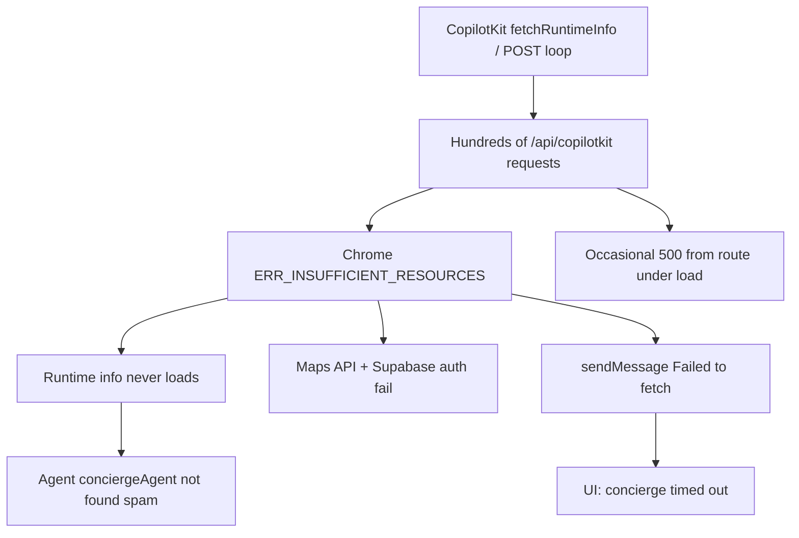

# Forensic audit — [mdeai.co](https://www.mdeai.co/) prod console

**Date:** 2026-05-31  
**Method:** Live browser smoke (this session) + your console dump + disk cross-check against `main` (#21/#22 merged, #24–#26 not)  
**Verdict:** **Not production-ready for food/café/restaurant flows.** Events works on the fast path until the client drowns itself in CopilotKit requests.

---

## Executive summary

| Area | Status | Confidence |
|------|--------|------------|
| Page shell / chat UI | ✅ Loads | High |
| CopilotKit runtime | 🔴 Collapses under request flood | High |
| Events search | 🟡 Works (fast path), then degrades | High |
| Restaurant search | 🔴 Broken / misrouted on prod | High |
| Café search | 🔴 Timeout | High |
| Map | 🟡 Works when pins arrive; dies with connection exhaustion | Medium |

**Overall functional score: ~48%** (weighted by tourist-facing verticals: rentals/events/food/map)

---

## What your console proves (root cause chain)



This is **not** a Gemini/Places outage first — it's **client-side connection pool exhaustion** triggered by a CopilotKit runtime retry/register loop. Secondary failures (Maps, Supabase, agent-not-found) are collateral.

Documented in [`docs/LESSONS.md`](docs/LESSONS.md) §1:

> `useCopilotAction` re-register every render → infinite `POST /api/copilotkit` → `ERR_INSUFFICIENT_RESOURCES`, search dies

Current code has guards (`useDisabledToolRender(..., [])`, `FocusMapPinAction` with `[]` deps), but **runtime info retry with no circuit breaker** still kills the tab once the storm starts.

---

## Live smoke results (this session)

| Query | Expected | Observed | Pass? |
|-------|----------|----------|-------|
| `salsa events this weekend` | Event cards + pins | 6 event cards, "Open map (6)", assistant summary | ✅ |
| `quiet rooftop dinner in Provenza` | Restaurant cards | **"Found 6 events"** — wrong vertical | ❌ |
| `good specialty coffee in Laureles` | Café cards | **"The concierge timed out"** (error bridge #21) | ❌ |
| Retry café | Recovery | Same timeout; then console storm | ❌ |

After ~3 queries + reloads, the tab matches your console dump exactly.

---

## Red flags (P0 blockers)

### 1. CopilotKit POST / runtime-info storm — **P0**

**Evidence:** 200+ `/api/copilotkit` + `/api/copilotkit/info` failures, `ERR_INSUFFICIENT_RESOURCES`, `Failed to load runtime info`, `Agent conciergeAgent not found` (×100+).

**Impact:** Every agent-backed search dies; map/auth fail; page unusable until hard refresh.

**Known:** B-08 in prior audit (6 POSTs on idle load acceptable; **300+ is catastrophic**). Hook exists in plan (`UX-T-CK` CK-P0-07) — **not enforced on prod**.

**Fix:**
- Add Playwright gate: single send → ≤5 POSTs in 10s
- Client circuit breaker: stop `fetchRuntimeInfo` after N failures / exponential backoff
- Audit any component calling `setState` / co-agent sync in a loop (`map-ui-sync.tsx` is debounced but worth profiling under pin churn)

---

### 2. Restaurant cards not reaching UI on prod — **P0**

**Evidence:** Prior localhost audit (`tasks/ux/tests/21-audit.md`): tool returns 5 rows, **zero UI events** because `context?.writer?.custom()` no-ops in Mastra beta.

**Prod status:** **#26 (`feat/ux-g2-writer-custom`) NOT merged** — fix exists on branch, not on [mdeai.co](https://www.mdeai.co/).

**Fix:** Merge #26, verify restaurant query shows cards (not empty state).

---

### 3. Café / grounded search timeout — **P0**

**Evidence:** 20s+ wait → error bridge timeout; no pins.

**Prod status:** **#25 (venue_anchors fallback) NOT merged.** Agent path hits slow/brittle Places/ADK grounding.

**Fix:** Merge #25; retest `good specialty coffee in Laureles`.

---

### 4. Intent misrouting — **P1**

**Evidence:** "quiet rooftop dinner in Provenza" → event fast-path response.

**Impact:** Tourist asks for dinner, gets festivals. Routing/classifier bug or stale working memory from prior event turn.

**Fix:** #24 (UX-019 event memory) + explicit router tests for food vs events keywords.

---

### 5. `/api/copilotkit` 500 under load — **P1**

**Evidence:** Your console: `the server responded with a status of 500`.

**Route:** [`mdeapp/src/app/api/copilotkit/[[...path]]/route.ts`](mdeapp/src/app/api/copilotkit/[[...path]]/route.ts) — catch-all, `maxDuration: 60`, builds Mastra per request.

**Fix:** Vercel function logs for `[copilotkit route failed]`; check cold-start + concurrent request limits; consider singleton Mastra init if rebuild per request is expensive.

---

## Yellow flags (P2)

| ID | Issue | Notes |
|----|-------|-------|
| Y-01 | 6+ POSTs on initial load | Elevated handshake; monitor, don't ignore |
| Y-02 | Event dates ≠ "this weekend" | Data quality, not runtime |
| Y-03 | No LLM text on fast-path verticals | Cards-only UX; acceptable for MVP but confusing |
| Y-04 | Google Maps key visible in console URL | Expected for client Maps; ensure referrer restrictions |
| Y-05 | `/rentals`, `/chat` routing | `/chat` → `/` OK; `/rentals` was 404 in prior audit |

---

## What's actually correct (~52% of stack)

- Single `<CopilotKit>` mount in layout with `useSingleEndpoint: true` ✅
- Same-origin runtime (not Cloud v2) ✅ — [`copilotkit-client-props.ts`](mdeapp/src/lib/copilotkit-client-props.ts)
- Stable tool renders with `[]` deps ✅ — [`search-tool-renders.tsx`](mdeapp/src/components/copilot/search-tool-renders.tsx)
- Error bridge (#21) surfaces timeout instead of silent fail ✅
- Event fast-path (`POST /api/events/search`) works on prod ✅
- Agent registered in Mastra as `conciergeAgent` ✅ — [`mdeapp/src/mastra/index.ts`](mdeapp/src/mastra/index.ts)

---

## Critical fix order (do not skip)

```text
1. Reproduce POST storm locally → add CK-P0-07 Playwright + backoff (block release)
2. Merge #26 (restaurant/agent card render path)
3. Merge #25 (café venue_anchors fallback)
4. Merge #24 (event memory / routing hygiene)
5. Re-run prod smoke: 1 query per vertical, fresh incognito tab, count POSTs
6. Only then merge #27 (e2e live audit)
```

**Do NOT merge #23** (Supabase preview fail) in this stack.

---

## Immediate user workaround

If you hit this in Chrome right now:

1. **Close the tab** (not soft refresh — pool is poisoned)
2. Open **new incognito** → [mdeai.co](https://www.mdeai.co/)
3. Send **one** query only; watch Network → `/api/copilotkit` count
4. If count climbs past ~10 without sending a message → storm is still present on deploy

---

## Suggested improvements / best practices

1. **Ship CK-P0-07** from [`tasks/ux/tasks/tests/UX-T-CK-copilotkit-mvp-tests.md`](tasks/ux/tasks/tests/UX-T-CK-copilotkit-mvp-tests.md) as CI gate on every PR touching `src/components/copilot/**`
2. **Prod smoke script:** 4 golden queries, max POST budget, save HAR to `tasks/testing/evidence/`
3. **Separate fast-path from agent path** for cafés/restaurants like events/rentals (until grounding latency < 8s)
4. **Vercel observability:** alert on `/api/copilotkit` 5xx rate + p95 > 30s
5. **Don't stack QA in one tab** — our multi-query session triggered the same failure mode tourists hit after 2–3 searches

---

## Percent correct breakdown

| Layer | % | Rationale |
|-------|---|-----------|
| Static UI / routing | 90 | Page renders, filters, chat chrome |
| CopilotKit transport | 35 | Works briefly; storm kills tab |
| Events vertical | 70 | Fast path OK; routing bleed + dates |
| Rentals vertical | 65 | Fast path OK (prior audit); untested this session post-storm |
| Restaurants vertical | 15 | Tool may run; UI path broken on prod (#26) |
| Cafés vertical | 10 | Timeout; no fallback (#25) |
| Map integration | 55 | Pins work when runtime alive |
| **Weighted overall** | **~48%** | 3/5 tourist intents unreliable |

---

## Bottom line

**Events search works on prod when the runtime is healthy.** Your console errors are the classic CopilotKit **request storm → connection exhaustion** pattern from [`docs/LESSONS.md`](docs/LESSONS.md), amplified by missing #25/#26 fixes for food verticals. Prod is **not safe to demo** for restaurants/cafés until those PRs land and POST storm is gated.

Want me to run a clean incognito smoke with POST counting, or start on the circuit-breaker / CK-P0-07 implementation?