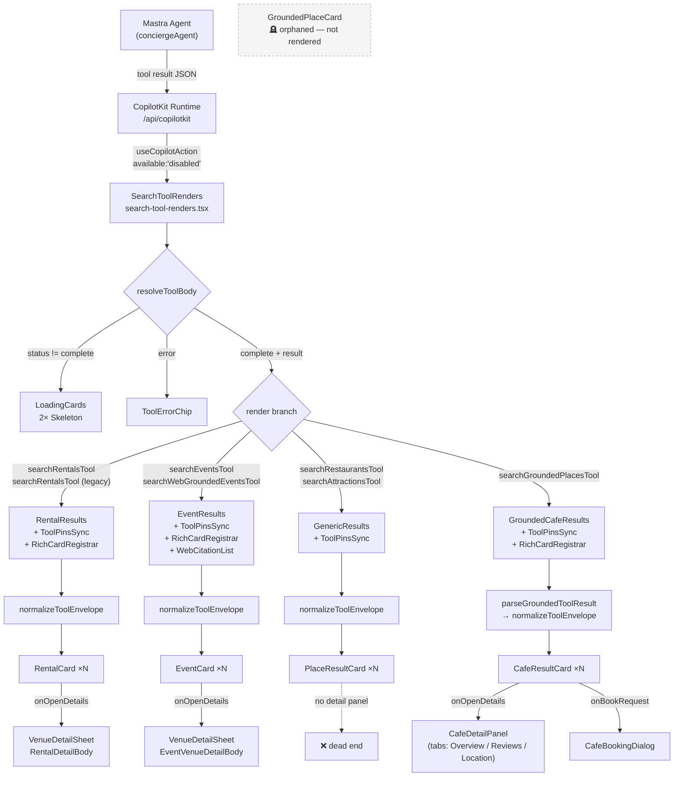

# Card Component Audit — mdeai
**Date:** 2026-05-31  
**Branch:** `feat/ux-002-005-chat`  
**Scope:** All search-result card components + rendering pipeline  
**Benchmark:** `CafeResultCard` (richest card in codebase)

---

## 1. Inventory

| Card | File | Props | Image | Rating | Price | CTA buttons | Injectable testId | `aria-label` | Hover→pin | Detail panel |
|---|---|---|---|---|---|---|---|---|---|---|
| **CafeResultCard** ✅ | `copilot/cafe-result-card.tsx` | 18 | ✅ 96×96 w/ attribution | ✅ `★ N (count)` | ✅ `<Badge>` | ✅ Details + Request + Maps | ✅ optional w/ default | ✅ `"Open details for {title}"` | ✅ | ✅ `CafeDetailPanel` |
| **RentalCard** ⚠️ | `copilot/rental-card.tsx` | 13 | ✅ 200×120 side-by-side | ❌ | ✅ price pill | ✅ Details + Schedule + Save | ❌ hardcoded | ❌ | ❌ | ✅ `VenueDetailSheet` |
| **EventCard** ⚠️ | `copilot/event-card.tsx` | 13 | ✅ full-width banner h-28 | ❌ | ✅ price pill | ✅ Buy + Source + Details | ❌ hardcoded | ❌ | ❌ | ✅ `VenueDetailSheet` |
| **PlaceResultCard** ❌ | `copilot/place-result-card.tsx` | 8 | ❌ none | ❌ | ⚠️ raw `<p>` text | ❌ plain `<a>` only | ⚠️ required (no default) | ❌ | ❌ | ❌ |
| **GroundedPlaceCard** 🪦 | `copilot/grounded-place-card.tsx` | 15 | ✅ 80×80 w/ attribution | ✅ `★ N` | ⚠️ raw `<span>` | ❌ Maps links only | ⚠️ required (no default) | ❌ | ❌ | ❌ |
| **SelectedPlaceOverlayCard** | `maps/SelectedPlaceOverlayCard.tsx` | 1 (`MapPin`) | ✅ 300×160 | ✅ | ❌ | ⚠️ Save/Add disabled stubs | ✅ fixed + sub-IDs | ✅ on save/add | N/A | N/A — is overlay |

> 🪦 **GroundedPlaceCard is orphaned** — no call-site in the production rendering pipeline; `GroundedCafeResults` renders `CafeResultCard` directly.

---

## 2. Rendering Pipeline



---

## 3. Card Interaction State Machine

```mermaid
stateDiagram-v2
    [*] --> Default : card mounted in results list

    Default --> Hovered : onMouseEnter / onFocus
    note right of Hovered
        CafeResultCard only.
        RentalCard & EventCard
        require a click to
        highlight the map pin.
    end note
    Hovered --> Default : mouseleave / blur
    Hovered --> Selected : click / Enter

    Default --> Selected : click / Enter / Space

    Selected --> Default : another card clicked\nor pin deselected

    Selected --> DetailPanel : "Details" CTA\nor onOpenDetails()

    state DetailPanel {
        [*] --> Overview
        Overview --> Reviews : tab
        Overview --> MapLocation : tab
        Reviews --> Overview : tab
        MapLocation --> Overview : tab
        Overview --> BookingDialog : "Request visit"
        BookingDialog --> Overview : cancel / confirm
    }
    note right of DetailPanel
        CafeResultCard → CafeDetailPanel (rich tabs)
        RentalCard & EventCard → VenueDetailSheet (simpler)
        PlaceResultCard → ❌ no panel
    end note

    DetailPanel --> Default : close (X)
```

---

## 4. Pattern Inconsistencies

| Pattern | CafeResultCard (gold) | RentalCard | EventCard | PlaceResultCard | GroundedPlaceCard |
|---|---|---|---|---|---|
| **Selected state** | `cn()` | `cn()` ✅ | template literal ❌ | template literal ❌ | template literal ❌ |
| **testId strategy** | optional + default | hardcoded ❌ | hardcoded ❌ | required, no default ⚠️ | required, no default ⚠️ |
| **Hover → pin highlight** | `onMouseEnter`+`onFocus` ✅ | ❌ | ❌ | ❌ | ❌ |
| **`aria-label` on interactive div** | ✅ | ❌ | ❌ | ❌ | ❌ |
| **`data-result-kind` attr** | `"cafe"` ✅ | ❌ | ❌ | ❌ | ❌ |
| **Price primitive** | `<Badge variant="outline">` | `bg-primary/10` pill | `bg-primary/10` pill | raw `<p>` | raw `<span>` |
| **Hours badge** | `<Badge>` ✅ | N/A | N/A | N/A | raw `<span className="bg-emerald-100">` ❌ |
| **CTA placement** | footer row w/ `border-t` | inside clickable body ❌ | inside clickable body ❌ | no CTAs | no CTAs |
| **`onSelect` signature** | `() => void` | `(id: string) => void` ⚠️ | `(id: string) => void` ⚠️ | `() => void` ✅ | `() => void` ✅ |
| **Image layout** | 96×96 square left | 200×120 right | full-width banner top | none | 80×80 square left |
| **`overflow-hidden` on root** | ✅ | ✅ | ✅ | ❌ | ✅ |
| **Rank indicator** | "Match #N" ✅ | "Best match" badge ✅ | ❌ | ❌ | ❌ |
| **`data-selected` attr** | ✅ `"true"/"false"` | ❌ | ❌ | ❌ | ❌ |

---

## 5. Shipping Copy Leaks (fix before prod)

| File | Line | Issue |
|---|---|---|
| `rental-card.tsx` | ~214 | Placeholder text `"Photo soon"` — dev note leaked to DOM |
| `rental-card.tsx` | ~186 | `title="Saved collections ship with SCREEN-011"` — internal ticket visible in browser inspector |

---

## 6. Improvement Recommendations (priority order)

### P0 — Accessibility (WCAG 4.1.2 violations)

**R-01** Add `aria-label` to all `role="button"` card divs

Affects: `RentalCard`, `EventCard`, `PlaceResultCard`, `GroundedPlaceCard`

```tsx
// pattern from CafeResultCard — apply to all cards
<div
  role="button"
  tabIndex={0}
  aria-label={`Open details for ${title}`}
  onClick={...}
  onKeyDown={...}
>
```

---

### P1 — Interaction parity (hover-to-highlight)

**R-02** Add `onMouseEnter`/`onFocus` → pin highlight to `RentalCard` and `EventCard`

```tsx
// rental-card.tsx article root
onMouseEnter={() => onSelect?.()}
onFocus={() => onSelect?.()}
```

Normalize `RentalCard.onSelect` and `EventCard.onSelect` from `(id: string) => void` → `() => void` (callers already close over the pin id).

---

### P2 — Styling consistency

**R-03** Replace template-literal selected-state with `cn()` in `EventCard`, `PlaceResultCard`, `GroundedPlaceCard`

```tsx
// before
className={`... ${selected ? "border-primary ring-2 ring-primary/30" : "border-border"}`}

// after
className={cn("...", selected ? "border-primary ring-2 ring-primary/30" : "border-border")}
```

**R-04** Replace raw `<span className="bg-emerald-100 ...">` hours badge in `GroundedPlaceCard` with `<Badge variant="secondary">` — already the pattern in `CafeResultCard`.

**R-05** Normalize `priceLabel` in `PlaceResultCard` from raw `<p>` to `<Badge variant="outline">`.

---

### P2 — Test addressability

**R-06** Add `data-result-kind` attribute to `RentalCard`, `EventCard`, `PlaceResultCard`

Enables `page.locator('[data-result-kind="rental"]')` in Playwright without coupling to text content.

**R-07** Make `testId` optional with default on `RentalCard` and `EventCard`

```tsx
// before — hardcoded
data-testid="rental-card"

// after — injectable with default
({ testId = "rental-card", ...}: RentalCardProps) =>
  <article data-testid={testId} ...>
```

Fix `PlaceResultCard` (currently required, no default): make it `testId = "place-result-card"`.

---

### P3 — PlaceResultCard upgrade

**R-08** PlaceResultCard is the weakest card used for restaurants and attractions. Minimum upgrade:
- Add a 64×64 category-glyph placeholder (`bg-muted rounded-lg` with a `MapPin` icon)
- Add a `<Button size="sm" variant="outline">View on Maps</Button>` CTA replacing the plain `<a>`
- Add `overflow-hidden` to root `<article>`

This brings restaurant/attraction fallback results visually in line with the grounded cafe cards that appear in the same session.

---

### P4 — Remove production-shipping leaks

**R-09** `rental-card.tsx` placeholder: `"Photo soon"` → `"Photo"` or remove text  
**R-10** `rental-card.tsx` Save button: `title="Saved collections ship with SCREEN-011"` → `title="Save for later (coming soon)"`

---

### P5 — Retire orphaned GroundedPlaceCard

**R-11** `GroundedPlaceCard` has no production call-site — `GroundedCafeResults` renders `CafeResultCard` directly. Options:
- **Delete** — remove `grounded-place-card.tsx` and its 4 tests (update tests to target `CafeResultCard`)  
- **Repurpose** — document as "compact card variant" and use for non-cafe grounded results (attractions, POIs) with formal `data-result-kind="grounded-place"`

---

## 7. Proposed Shared `CardInteractionProps` Type

Currently each card redeclares the same interaction props independently. A shared type eliminates drift:

```typescript
// src/platform/copilot/card-interaction-props.ts  (new file)
export type CardInteractionProps = {
  /** Unique pin/result id — used for map highlight and scroll-into-view. */
  pinId: string;
  /** Card is currently highlighted (map pin selected or list selection). */
  selected?: boolean;
  /** Highlight the map pin without opening detail — called on click/hover/focus. */
  onSelect?: () => void;
  /** Open full detail panel / sheet. */
  onOpenDetails?: () => void;
  /** Optional override for data-testid. Defaults to the card's base test id. */
  testId?: string;
};
```

All five cards can `extend CardInteractionProps`. This also makes it trivial to add `data-selected` and `aria-label` once in the pattern rather than per-card.

---

## 8. Summary Score

| Card | Score | Status |
|---|---|---|
| CafeResultCard | 9/10 | Gold standard — minor: no `data-selected` on selected → ✅ actually has it; `cn()` ✅; hover ✅ |
| RentalCard | 6/10 | Good structure, missing hover, aria, data-result-kind, shipping leaks |
| EventCard | 5/10 | Missing hover, aria, data-result-kind, cn(), rank indicator |
| PlaceResultCard | 3/10 | Weakest — no image, no badge primitives, no CTA, shared testId for all list items |
| GroundedPlaceCard | 4/10 (orphaned) | Good richness but not rendered; inconsistent badge primitives |

**Overall unification: 58%** — the pipeline is solid but surface-level visual and interaction parity is ~40% below `CafeResultCard`.

The highest-leverage fixes are **R-01** (aria-labels, P0) and **R-08** (PlaceResultCard upgrade, P3) — together they cover the two extremes of the quality gap.
