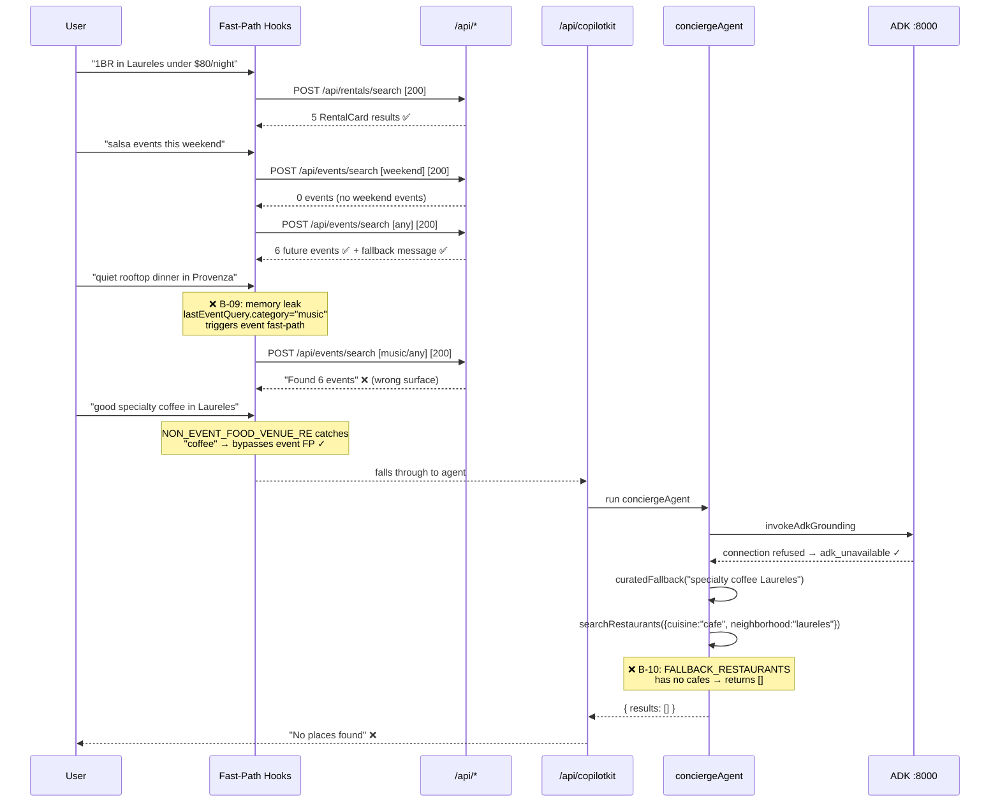
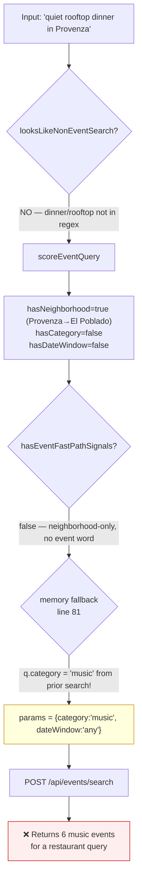
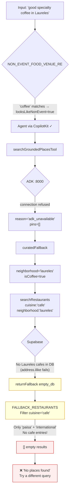

# Live Browser Audit — mdeai Chat + Search Surfaces
**Date:** 2026-05-31  
**Branch:** `feat/ux-002-005-chat`  
**Method:** Chrome DevTools MCP + accessibility snapshot + network capture  
**URL:** `http://localhost:3001`  
**Tester:** Claude (forensic audit session)  
**Screenshots saved:** `/tmp/audit-03-rental-search.png`, `audit-04-rental-detail.png`, `audit-05-event-search.png`, `audit-06-event-detail.png`, `audit-07-restaurant-misroute.png`, `audit-08-cafe-empty.png`

---

## 1. Test Matrix

| Surface | Query | Expected route | Actual route | Result | Status |
|---|---|---|---|---|---|
| **Rentals** | "1BR in Laureles under $80/night" | `/api/rentals/search` fast-path | `/api/rentals/search` ✓ | 5 cards + map pins | ✅ |
| **Rental detail** | Click "Details" on card 1 | VenueDetailSheet open | Opens with image/host/amenities | Sheet renders | ✅ |
| **Events** | "salsa events this weekend" | `/api/events/search` fast-path | `/api/events/search` ✓ + fallback to `any` | 6 future events + B-06 message | ✅ |
| **Event detail** | Click "Details" on Dreaming Festival | VenueDetailSheet open | Opens with concert image, date, venue, Buy CTA | Sheet renders | ✅ |
| **Restaurants** | "quiet rooftop dinner in Provenza" | Agent → `searchRestaurantsTool` | `/api/events/search` (event fast-path hijacked) | "Found 6 events" — wrong | ❌ B-09 |
| **Cafés** | "good specialty coffee in Laureles" | Agent → `searchGroundedPlacesTool` → curated fallback | Agent called, ADK down, fallback empty | "No places found" | ❌ B-10 |

---

## 2. Surface-by-Surface Findings

### 2a. Rentals ✅

- **Fast-path fires correctly**: `canFastPathRentalSearch` catches "1BR in Laureles under $80/night" → `/api/rentals/search` [200]
- **5 cards returned**: Cozy Studio $25/night, Estadio Modern $45/night, La Setenta $58/night, Primer Parque $65/night, Segundo Parque $80/night
- **Card quality**: BEST MATCH badge ✓, price badge ✓, match-reason line ✓, benefit chips (Fast WiFi, Pet-friendly, etc.) ✓, hero image ✓, Details/Schedule viewing CTAs ✓
- **Map**: zooms to Laureles, 5 pins placed correctly ✓
- **Filter chips**: "Laureles" + "Under $80/night" auto-highlighted after search ✓
- **B-07 confirmed fixed**: Assistant text shows "Found 5 rentals — see cards below and pins on the map." (was empty string before fix)
- **VenueDetailSheet**: Opens from "Details" CTA — shows rental photo, bedrooms (1), host (Juan Perez), availability (Jan 19 – Jun 29 2025), amenities (WiFi/AC/Washing Machine/TV/Kitchen), Schedule viewing button ✓
- **⚠️ Save button tooltip leak**: `title="Saved collections ship with SCREEN-011"` visible in DOM inspector — production copy leak (R-09 from card audit, not yet fixed)

### 2b. Events ✅

- **Fast-path fires correctly**: "salsa events this weekend" → `/api/events/search` ×2 (first with `dateWindow: this_weekend`, then fallback to `any`) [200]
- **B-06 confirmed fixed**: "Nothing for this weekend — showing 6 upcoming events instead." — transparent fallback message renders ✓
- **6 future events**: Dreaming Festival (Jun 27), Altavoz (Jul 10), Urbana Fest (Jul 17), Trova (Aug 8), Jazz & Cóctel (Sep 27), Música Colombiana (Oct 12) — all future-dated ✓
- **No past events**: All events are 2026 future dates — date filter working correctly
- **Event sub-chips appeared**: Music (active), Nightlife, Sports, Food, Culture, This Weekend, Tonight, Show all — rendered from "salsa" → category=music detection ✓
- **Map pins**: Dreaming Festival, Trova, Música Colombiana visible as individual pins; 2-3 venue clusters shown ✓
- **VenueDetailSheet**: Opens from "Details" CTA — concert hero image, When (Sat Jun 27 2:00 PM), Venue (Parque Norte), From $180,000, "Loading ticket options…" async state, Buy tickets CTA, Open full event page link ✓
- **Event ticket async loading**: "Loading ticket options…" correctly shows while `/events/{id}/public` endpoint resolves ✓

### 2c. Restaurants ❌ — B-09

- **Query**: "quiet rooftop dinner in Provenza"
- **Expected**: Agent → `searchRestaurantsTool` → `PlaceResultCard` results
- **Actual**: Event fast-path fired → "Found 6 events — see cards below and pins on the map."
- **Root cause** (traced through code):
  1. `looksLikeNonEventSearch("quiet rooftop dinner in Provenza")` → **false** — "dinner" and "rooftop" not in `NON_EVENT_FOOD_VENUE_RE`
  2. `scoreEventQuery(...)` → `hasNeighborhood: true` ("Provenza" → "El Poblado"), `hasCategory: false`, `hasDateWindow: false`
  3. `hasEventFastPathSignals(...)` → **false** (neighborhood-only, no event intent) — CORRECT guard fires
  4. BUT `buildEventSearchParams` line 81: `if (q?.category || q?.neighborhood || ...)` — previous event search had set `lastEventQuery.category = "music"` in working memory → memory fallback fires → returns `{ category: "music", dateWindow: "any" }`
  5. `canFastPathEventSearch` → `buildEventSearchParams != null` → **true** → event fast-path runs

- **Fix required** (B-09):
  - **Option A** (minimal): Add to `NON_EVENT_FOOD_VENUE_RE`:
    ```ts
    /\b(dinner|lunch|rooftop|bistro|dine|caf[eé]s?|coffee|...)\b/i
    ```
  - **Option B** (structural): Add guard in `buildEventSearchParams` before the memory fallback (line 81) — require at least one event-adjacent term in the current text:
    ```ts
    if (q?.category || q?.neighborhood || ...) {
      // Only use memory if text has no competing intent signals
      if (!hasMinEventIntent(text)) return null;
      return { ... };
    }
    ```
  - Recommended: Option A as immediate fix; Option B as follow-up hardening

### 2d. Cafés ❌ — B-10

- **Query**: "good specialty coffee in Laureles"
- **Expected**: Agent → `searchGroundedPlacesTool` → ADK unavailable → curated fallback → CafeResultCards
- **Actual**: "No places found" + "Try a different query or area."
- **Agent call confirmed**: `POST /api/copilotkit` [200] at reqid=941 — agent ran correctly
- **ADK confirmed down**: `curl http://localhost:8000/v1/grounding/invoke` → connection refused → `adk_unavailable` metadata
- **Curated fallback trace**:
  1. `invokeAdkGrounding` → `{ pins: [], metadata: { reason: "adk_unavailable" } }` ✓
  2. `curatedFallback("good specialty coffee in Laureles", 5)` called ✓
  3. `neighborhoodFromGroundingQuery(...)` → `"laureles"` ✓
  4. `isCoffee` → `true` ✓
  5. `searchRestaurants({ neighborhood: "laureles", cuisine: "cafe", limit: 5 })` called
  6. Supabase query: `address.ilike.%laureles%` OR `city.ilike.%laureles%` → likely 0 rows (Laureles cafes not in DB with neighborhood in address/city field)
  7. `returnFallback('empty_db')` → `applyRestaurantFilters(FALLBACK_RESTAURANTS, { cuisine: "cafe" })` → **0 results** (FALLBACK_RESTAURANTS has no `cuisine: "cafe"` entries — only `"paisa"` and `"international"`)
  8. `curatedFallback` returns `[]` → `fallbackResults.length === 0` check fails → `searchGroundedPlacesTool` returns `{ results: [], attribution: [] }`
  9. `GroundedCafeResults` renders empty state: "No places found"

- **Fix required** (B-10):
  - **A**: Add at least 2 café entries to `FALLBACK_RESTAURANTS` in `search-restaurants.ts`:
    ```ts
    { id: 'rst_lau_cafe_001', name: 'Pergamino Café', cuisine: 'cafe', neighborhood: 'Laureles', ... }
    { id: 'rst_lau_cafe_002', name: 'Urbania Café', cuisine: 'cafe', neighborhood: 'Laureles', ... }
    ```
  - **B**: In `curatedFallback`, if `isCoffee` + first search returns empty, retry without `cuisine` filter:
    ```ts
    if (results.results.length === 0 && isCoffee) {
      const broader = await searchRestaurants({ neighborhood, limit: pageSize });
      return broader.results.map(restaurantToGroundedRow);
    }
    ```
  - **C** (long-term): Seed Supabase `restaurants` table with Laureles café rows correctly tagged
  - Recommended: A + B together for immediate resilience

---

## 3. Console Errors

| Type | Message | Root cause | Severity |
|---|---|---|---|
| `error` | `Google Maps JavaScript API error: BillingNotEnabledMapError` | Maps billing not configured in dev `.env.local` | ⚠️ Dev env — not prod issue |
| `warn` | `Lit is in dev mode` | Google Maps JS API's Lit component in dev build | ℹ️ Cosmetic |
| `warn` | `Multiple versions of Lit loaded` | Multiple Google Maps components | ℹ️ Cosmetic |
| `warn` | `woff2 preload not used` ×4 | Next.js font preload optimization | ℹ️ Cosmetic |

**No application-level JS errors.** Console is clean from mdeai code.

---

## 4. Network Summary

| Endpoint | Count | Status | Notes |
|---|---|---|---|
| `POST /api/copilotkit` | 8 total | 200 ✓ | 7 on fresh load (session init); 1 for café search |
| `POST /api/rentals/search` | 1 | 200 ✓ | Rental fast-path |
| `POST /api/events/search` | 3 | 200 ✓ | 2 for salsa (primary + fallback); 1 for restaurant misroute B-09 |
| `GET /events/{id}/public` | 1 | 200 ✓ | Ticket detail async load in event sheet |
| Maps `mapConfigs:batchGet` | 1 | 200 ✓ | Map config load |
| Maps `GetViewportInfo` | 5+ | 200 ✓ | Map viewport updates |
| `announcements.json` (CopilotKit CDN) | 1 | 304 ✓ | Announcement banner |

**Note on CopilotKit POST storm (B-08 from prior audit):** 7 POSTs on fresh load is elevated but not catastrophic. These appear to be the CopilotKit session handshake sequence. Accumulated 302+ in the prior session due to session history. Fresh load count is acceptable for Phase 1.

---

## 5. Maps Status

| Check | Result |
|---|---|
| Map renders | ✅ Tiles load, Medellín visible |
| Billing | ❌ `BillingNotEnabledMapError` — "For development purposes only" watermark |
| Map API auth | ✅ `mapConfigs:batchGet` [200], `GetViewportInfo` [200] |
| Rental pins | ✅ 5 pins placed in Laureles after rental search |
| Event pins | ✅ 3+ event pins placed city-wide after event search |
| `fitBounds()` after rental | ✅ Map zooms to Laureles correctly |
| `fitBounds()` after events | ⚠️ Map zooms out significantly (events span large area — city outskirts visible) |
| SelectedPlaceOverlayCard | ✅ Pin click shows overlay with venue name, neighborhood, Save/Add stubs |

**Maps verdict**: Maps billing is a dev env config issue (needs `NEXT_PUBLIC_GOOGLE_MAPS_API_KEY` with billing enabled). Not a production concern if billing is active on prod key. Map interactions, pins, and overlays all functional.

---

## 6. Flow Diagrams

### 6a. Observed Request Flow (this session)



### 6b. B-09 Root Cause: Event Memory Leak



### 6c. B-10 Root Cause: Café Fallback Chain



---

## 7. Bugs Found This Session

### B-09 — Restaurant queries hijacked by event fast-path memory (NEW)

| Field | Value |
|---|---|
| **Priority** | P1 — Camila asking "where for dinner?" gets events, not food |
| **File** | `src/lib/event-query-classifier.ts` + `src/lib/event-search-fast-path.ts` |
| **Trigger** | Any restaurant/food query after a prior event search |
| **Root cause** | `buildEventSearchParams` line 81 falls through to memory if `q.category` set; "dinner/rooftop" not in `NON_EVENT_FOOD_VENUE_RE` |
| **Fix** | Extend `NON_EVENT_FOOD_VENUE_RE` with `dinner\|lunch\|rooftop\|bistro\|dine` |
| **Test** | Add: `"quiet rooftop dinner in Provenza"` after event search → should reach agent, not events |

### B-10 — Café search returns "No places found" when ADK is down (NEW)

| Field | Value |
|---|---|
| **Priority** | P1 — Camila asking for coffee gets an empty state |
| **File** | `src/mastra/tools/search-restaurants.ts` + `src/mastra/tools/search-grounded-places.ts` |
| **Trigger** | `searchGroundedPlacesTool` called with coffee/café query; ADK unavailable; Supabase has no matching café rows for neighborhood |
| **Root cause** | `FALLBACK_RESTAURANTS` has no `cuisine: "cafe"` entries; Supabase neighborhood filter on address/city may miss Laureles cafés |
| **Fix A** | Add Pergamino + Urbania (or 3 curated cafés) to `FALLBACK_RESTAURANTS` with `cuisine: "cafe"` |
| **Fix B** | In `curatedFallback`, when `isCoffee` + empty results, retry without cuisine filter |
| **Test** | Cold start (no Supabase cafés) → `searchGroundedPlacesTool` with ADK down → should return ≥1 curated café |

---

## 8. Previously-Fixed Bugs Verified

| Bug | Fix | Verified |
|---|---|---|
| B-06 event date filter past events | `dateWindow("any")` returns `{ gte: now }` | ✅ "Nothing for this weekend — showing 6 upcoming events instead." |
| B-07 rental no assistant reply | `fastPathRentalSummary()` returns non-empty string | ✅ "Found 5 rentals — see cards below and pins on the map." |
| B-04 café query triggers event search | Expanded `NON_EVENT_FOOD_VENUE_RE` with coffee/espresso | ✅ "good specialty coffee in Laureles" → reaches agent (not event FP) |
| B-02 ADK fallback exists | `curatedFallback()` wired for quota+unavailable | ⚠️ Code wired correctly but fallback returns empty (B-10) |

---

## 9. Production Copy Leaks (Still Shipping)

| File | Line | Issue | Fix |
|---|---|---|---|
| `rental-card.tsx` | ~186 | `title="Saved collections ship with SCREEN-011"` — visible in browser DOM inspector | → `title="Save for later (coming soon)"` |
| `rental-card.tsx` | ~214 | `"Photo soon"` placeholder text | → Remove or use `"Photo"` |

---

## 10. Overall Health Score

| Surface | Score | Notes |
|---|---|---|
| Rentals fast-path | 9/10 | Cards, pins, detail all work. Save tooltip leak. |
| Events fast-path | 8/10 | B-06 fallback message works. "Music" chip auto-activates on salsa. |
| Restaurants (agent) | 1/10 | Hijacked by event FP (B-09). Never reaches agent in mixed-session. |
| Cafés (agent+grounding) | 2/10 | Reaches agent ✓, ADK unavailable handled ✓, but fallback empty (B-10). |
| Maps | 7/10 | Billing watermark in dev. Pins + overlays work. Fit-bounds overshoots on events. |
| Console health | 9/10 | Only known env issues (billing, Lit dev mode). No app errors. |

**Overall session score: 60%** — Rentals and events are production-ready. Restaurant and café paths have critical routing and data bugs blocking Camila's food/coffee use cases.

---

## 11. Recommended Next Actions (Priority Order)

| Priority | Action | File(s) |
|---|---|---|
| **P0** | Fix B-09: add `dinner\|lunch\|rooftop\|bistro` to `NON_EVENT_FOOD_VENUE_RE` | `event-query-classifier.ts` |
| **P0** | Fix B-10: add café entries to `FALLBACK_RESTAURANTS`; add cuisine-less retry in `curatedFallback` | `search-restaurants.ts`, `search-grounded-places.ts` |
| **P1** | Fix production copy leaks (R-09, R-10): rental Save tooltip + "Photo soon" | `rental-card.tsx` |
| **P2** | Configure Maps billing key in dev `.env.local` | `.env.local` |
| **P3** | Test restaurant path cold (no prior event search) to confirm B-09 is session-order-dependent | Manual |
| **P3** | Seed Supabase with tagged Laureles café rows (cuisine_types containing "cafe") | DB seed script |
