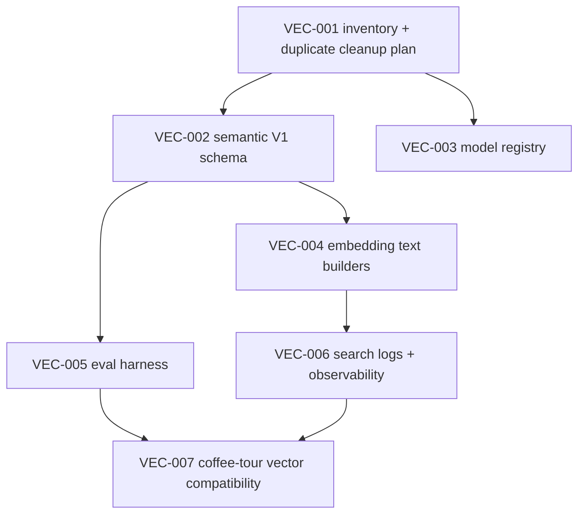

# Vector intelligence task index

This folder turns the pgvector strategy into small, shippable tasks for `mdeai.co`.

## Forensic verdict

The strategy is directionally correct, but not production-ready. The verified first move is not "build the whole semantic city graph"; it is to inventory the existing pgvector layer, clean duplicate indexes, lock the embedding contract, add RLS boundaries, and create evals before adding more vectors.

## Verified current state

| Item | Verified result |
|---|---|
| Supabase project | `zkwcbyxiwklihegjhuql` |
| `vector` extension | Installed, version `0.8.0`, schema `public` |
| Other useful extensions | `postgis`, `pg_trgm`, `pg_cron`, `pg_stat_statements` |
| Existing vector tables | `listing_embeddings`, `event_embeddings`, `restaurant_embeddings` |
| Existing dimensions | `vector(768)` |
| Existing model | `gemini-embedding-001` |
| Existing rows | listings 44, events 43, restaurants 43 |
| Existing RPCs | `semantic_search_*`, `hybrid_search_*` |
| Critical issue | Duplicate HNSW indexes on all three embedding tables |
| Missing V1 tables | `semantic_embeddings`, `embedding_jobs`, `semantic_search_logs`, `semantic_eval_queries`, `semantic_similarity_edges` |

## Task order

## Tasks

| ID | Title | Priority | Purpose | Status |
|---|---|---:|---|---|
| [VEC-001](./VEC-001-pgvector-inventory-and-duplicate-index-plan.md) | pgvector inventory + duplicate HNSW cleanup plan | P0 | Prove exact current vector state before any schema work. | Not Started |
| [VEC-002](./VEC-002-semantic-v1-schema-and-rls-plan.md) | Semantic V1 schema + RLS plan | P0 | Design the smallest safe shared semantic schema. | Not Started |
| [VEC-003](./VEC-003-model-registry-and-embedding-contract.md) | Model registry + embedding contract | P0 | Lock provider/model/dimensions before migrations. | Not Started |
| [VEC-004](./VEC-004-embedding-text-builders.md) | Embedding text builders | P0 | Generate clean semantic text instead of embedding raw JSON. | Not Started |
| [VEC-005](./VEC-005-semantic-eval-harness.md) | Golden semantic eval harness | P0 | Stop vector search from silently getting worse. | Not Started |
| [VEC-006](./VEC-006-semantic-search-logs-and-observability.md) | Search logs + observability | P1 | Store query/results/scores/latency for tuning. | Not Started |
| [VEC-007](./VEC-007-coffee-tour-vector-compatibility.md) | Coffee-tour vector compatibility | P1 | Connect CTI-011 to the shared semantic layer without duplicate schema. | Not Started |

**Downstream:** VEC-004/005 unblock **SCREEN-021 Phase B** (café semantic rerank). See [`../screens/INDEX.md`](../screens/INDEX.md) cafe order table.

Build only:

1. `semantic_embeddings`
2. `embedding_jobs`
3. `semantic_search_logs`
4. `semantic_eval_queries`
5. RLS policies for public vs private content
6. Embedding text builders
7. A small eval runner

Defer:

- full creator intelligence graph,
- Gorse,
- autonomous OpenClaw ranking writes,
- user taste vectors,
- all-domain similarity edges beyond a small proof,
- cafe/restaurant full redesign until evals exist.

## Done gate for this task pack

No vector task is `Done` unless the evidence states:

- what was verified locally,
- what was verified live in Supabase,
- what was not verified,
- whether localhost runtime proof is required or N/A,
- whether any DB mutation was performed.
