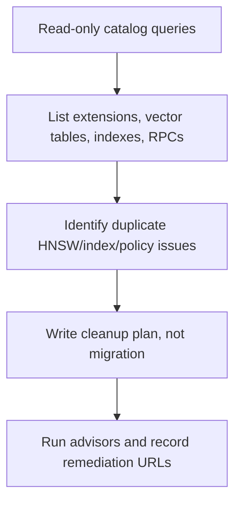

# VEC-001 - pgvector inventory + duplicate HNSW cleanup plan

## Purpose

Create a read-only forensic snapshot of the current pgvector setup before mdeai adds any new semantic schema.

This protects Sofia from building V2 on top of hidden duplicates, stale migrations, or accidental assumptions.

## User story

As **Sofia**, I need exact proof of the current pgvector tables, indexes, RPCs, policies, row counts, and model dimensions, so that Camila's future semantic search is built on facts instead of planning-doc optimism.

## Real-world example

Before adding "quiet coffee tour near Medellin" semantic search, Sofia confirms whether the existing vector layer is clean. Today it is not: duplicate HNSW indexes exist on `listing_embeddings`, `event_embeddings`, and `restaurant_embeddings`.

## Verified starting point

| Check | Current finding |
|---|---|
| `vector` extension | Installed, `0.8.0` |
| Current dimensions | `vector(768)` |
| Current model | `gemini-embedding-001` |
| Existing rows | listings 44, events 43, restaurants 43 |
| Duplicate vector indexes | Yes: one duplicate HNSW pair per existing embedding table |
| Current semantic V1 tables | Not present |

## Workflow

## Goals

1. Record installed vector/PostGIS/FTS extensions.
2. Record all vector columns, dimensions, and tables.
3. Record all vector indexes, including duplicate HNSW pairs.
4. Record semantic/hybrid RPC signatures.
5. Record embedding table RLS policies and duplicate policy risks.
6. Produce a cleanup recommendation with exact `DROP INDEX CONCURRENTLY` candidates, but do not apply it.

## Success criteria

1. Evidence file includes live Supabase query outputs summarized in plain English.
2. Duplicate index pairs are named exactly.
3. No database mutation happens in this task.
4. Cleanup plan says which index in each duplicate pair to keep and why.
5. Advisor output is checked for duplicate indexes and relevant performance warnings.
6. Follow-up tasks are unblocked only after this inventory is reviewed.

## Suggested evidence path

`/home/sk/mdeai/tasks/notes/VEC-001-evidence.md`

## Out of scope

- Creating new tables.
- Dropping indexes.
- Changing RLS policies.
- Re-embedding rows.

## Notes

Supabase docs say HNSW is the default vector index choice for performance and can be created before data exists. That supports keeping one HNSW index per embedding table, not duplicate copies.
