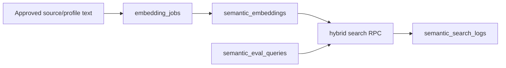

# VEC-002 - Semantic V1 schema + RLS plan

## Purpose

Design the smallest safe shared semantic schema for mdeai instead of creating a separate embedding table for every product idea.

## User story

As **Patricia**, I need public place embeddings and private user-memory embeddings separated by RLS, so that Camila can search public cafes while her personal preferences stay private.

## Real-world example

Camila searches "quiet cafe like the ones I saved last week." Public cafe profile embeddings may be readable by anyone, but Camila's saved-place preference embedding must be visible only to Camila and server-side tools.

## Correct V1 schema

Start with:

| Table | Purpose |
|---|---|
| `semantic_embeddings` | Shared public/private embedding registry. |
| `embedding_jobs` | Tracks embedding generation, refresh, failures, and model/dimension. |
| `semantic_search_logs` | Stores query, filters, result ids, scores, and latency. |
| `semantic_eval_queries` | Golden test queries and expected outcomes. |

Defer:

- `semantic_similarity_edges`
- `user_taste_vectors`
- creator graph tables
- Gorse integration
- OpenClaw autonomous enrichment writes

## Proposed flow

## RLS boundary

| Content | Example | Read policy |
|---|---|---|
| Public approved entity chunk | cafe profile, event vibe, coffee-tour profile | anon/authenticated can read when `visibility='public'` and `review_status='approved'` |
| Private user memory | Camila's saved-place taste summary | owner-only using `(select auth.uid())` |
| Service processing rows | pending embedding job, failed job details | service/admin only |
| Draft enrichment text | OpenClaw draft source | not public until approved |

## Goals

1. Draft SQL for the four V1 tables.
2. Include explicit `visibility` and `owner_id` controls.
3. Include `entity_type`, `entity_id`, `content_type`, `content_hash`, `model`, `dimension`, `source_id`, `review_status`.
4. Include HNSW index only once, with naming convention.
5. Include RLS policies and RLS test cases.
6. Keep legacy `listing_embeddings`, `event_embeddings`, and `restaurant_embeddings` untouched until compatibility is planned.

## Success criteria

1. Migration draft creates no more than four V1 tables.
2. Every new table has RLS enabled and at least one policy.
3. Public and private rows cannot be returned by the same broad public policy.
4. Service-role writes are limited to server-only paths.
5. SQL includes comments explaining fact vs semantic content boundaries.
6. Advisors are run after the migration is applied to a branch or reviewed environment.
7. The task explicitly records whether the live database was mutated.

## Out of scope

- Full cafe schema.
- Full coffee-tour schema.
- User taste personalization.
- Similarity graph.
- OpenClaw enrichment tables.

## Implementation warning

Do not build a giant first migration. The audit is correct: over-modeling the semantic city graph before cafe/tour usage is proven would slow the MVP and make RLS harder to verify.
