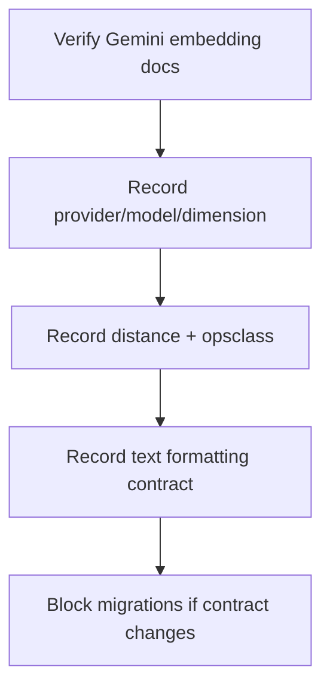

# VEC-003 - Model registry + embedding contract

## Purpose

Lock the embedding provider, model, output dimensions, distance operator, and text formatting rules before new vector migrations.

## User story

As **Sofia**, I need one embedding contract for document vectors and query vectors, so that Camila's query embedding lives in the same vector space as the cafe, event, rental, and coffee-tour chunks.

## Real-world example

If mdeai embeds coffee tours with `gemini-embedding-001` at 768 dimensions but later queries with a different Gemini embedding model at 1536 or 3072 dimensions, semantic search becomes invalid. The results might still run but the distances would not mean what the ranking code thinks they mean.

## Model contract

Current live data uses:

| Field | Current value |
|---|---|
| Provider | Google Gemini |
| Model | `gemini-embedding-001` |
| Dimension | `768` |
| Storage type | `vector(768)` |
| Distance | cosine distance, `<=>`, `vector_cosine_ops` |

Before coding, re-verify current Gemini embedding model status. Current official docs recommend output dimensions such as 768, 1536, or 3072 and support configurable output dimensionality.

## Flow

## Goals

1. Create a small model registry note or table plan.
2. Record the current live model and dimensions.
3. Define whether V1 keeps `gemini-embedding-001` / 768 or migrates to a newer Gemini embedding model.
4. Define query/document text prefixing and formatting.
5. Define upgrade rules: new model rows first, full re-embed, eval comparison, then cutover.

## Success criteria

1. The embedding model and dimension are named in one canonical place.
2. The task cites the official Gemini embeddings docs used for the decision.
3. The contract states that query and document embeddings must use the same model and formatting.
4. The contract states that mixed-model similarity is invalid.
5. VEC-002 cannot apply a migration until this contract is complete.

## Out of scope

- Re-embedding old rows.
- Choosing OpenAI as default.
- Building multimodal embeddings.

## Notes

The strategy doc's "lock `gemini-embedding-001` 768" recommendation is correct for compatibility with current live rows. It should still be re-verified before new migrations because Gemini embedding docs move quickly.
