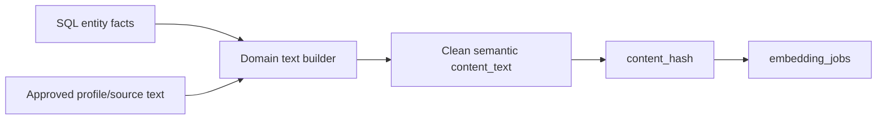

# VEC-004 - Embedding text builders

## Purpose

Create deterministic builders that turn mdeai entities into clean semantic text. Do not embed raw JSON, ratings, URLs, or IDs.

## User story

As **Camila**, I want "quiet cafe with fast Wi-Fi" to match work-friendly cafes, not cafes that only have high ratings or long URLs in the record.

## Real-world example

Good embedding text:

```text
Quiet remote-work cafe in Laureles with ergonomic seating, cold brew, fiber internet, natural lighting, and calm weekday atmosphere.
```

Bad embedding text:

```text
4.8 stars, 123 reviews, open now, https://maps.google.com/...
```

## Flow



## Builders to create first

| Builder | Purpose |
|---|---|
| `buildCafeEmbeddingText` | Workability, coffee quality, ambience, brunch, local authenticity. |
| `buildCoffeeTourEmbeddingText` | Authenticity, education, logistics, social impact, scenery. |
| `buildRestaurantEmbeddingText` | Cuisine, occasion, dish themes, ambience. |
| `buildEventEmbeddingText` | Audience, theme, venue vibe, schedule context. |
| `buildRentalEmbeddingText` | Lifestyle fit, amenities, host/lease risks, neighborhood fit. |

## Goals

1. Add builder functions in a shared semantic module.
2. Keep facts and semantic descriptions clearly separated.
3. Hash the final text for invalidation.
4. Include tests for good and bad examples.
5. Keep output concise enough for embedding model limits.

## Success criteria

1. Tests prove IDs, URLs, ratings-only strings, and raw JSON are excluded.
2. Tests prove domain-specific semantic fields are included.
3. Each builder returns `{ contentText, contentHash, contentType, sourceIds }`.
4. The output is stable for identical input.
5. No client-side code calls embedding APIs.

## Out of scope

- Calling Gemini embeddings.
- Writing to Supabase.
- Ranking search results.

## Notes

This task makes the future vector layer understandable. Patricia can review the text that generated a recommendation instead of debugging invisible math.
