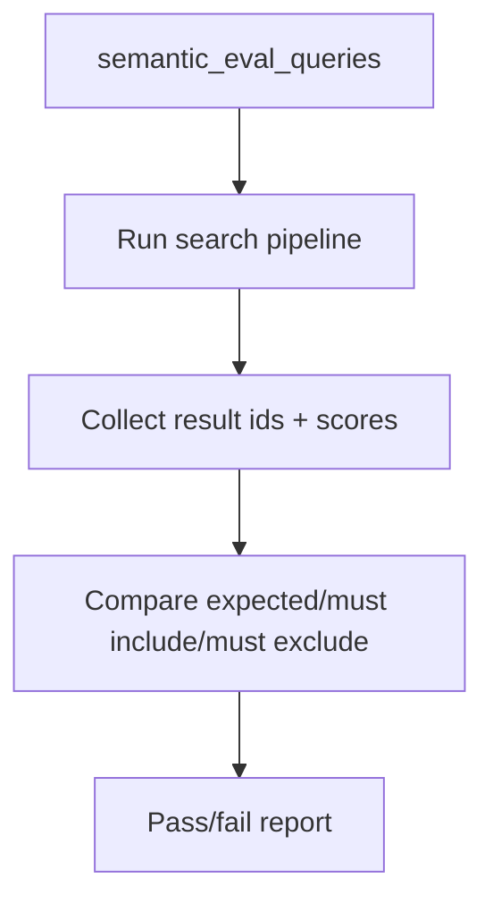

# VEC-005 - Golden semantic eval harness

## Purpose

Add a small evaluation system before scaling vector search. Without this, every "improvement" to embeddings is guesswork.

## User story

As **Lucia**, I need repeatable semantic tests so I can catch when a change makes "quiet cafe in Laureles" return loud brunch/social cafes.

## Real-world example

```text
Query: quiet cafe in Laureles with fast Wi-Fi
Expected: work-friendly cafes
Must include tags: quiet, laptop_friendly, wifi
Must exclude tags: nightclub, loud, brunch_only
```

## Eval flow



## Table shape

```text
semantic_eval_queries
- id
- query
- domain
- expected_entity_ids
- must_include_tags
- must_exclude_tags
- filters_jsonb
- notes
- active
- created_at
```

## Starter eval set

Create at least 50 queries:

| Domain | Count |
|---|---:|
| Cafes | 12 |
| Coffee tours | 10 |
| Rentals | 10 |
| Events | 8 |
| Restaurants | 6 |
| Neighborhoods | 4 |

## Goals

1. Create `semantic_eval_queries`.
2. Seed at least 50 human-readable queries.
3. Add a runner that can call the local retrieval function or RPC wrapper.
4. Report pass/fail, top results, missing expected IDs, and excluded-tag violations.
5. Store eval output in an evidence file.

## Success criteria

1. `npm` script or documented command runs the evals.
2. Evals fail if expected results are absent.
3. Evals fail if excluded tags appear in top results.
4. Report includes domain-level pass rate.
5. The eval runner does not require service-role keys in browser/client code.

## Out of scope

- Perfect ranking metrics.
- LLM-as-judge as the only evaluator.
- Large-scale offline ML pipeline.

## Notes

This is the main blocker from the audit. Build it before adding more embeddings.
