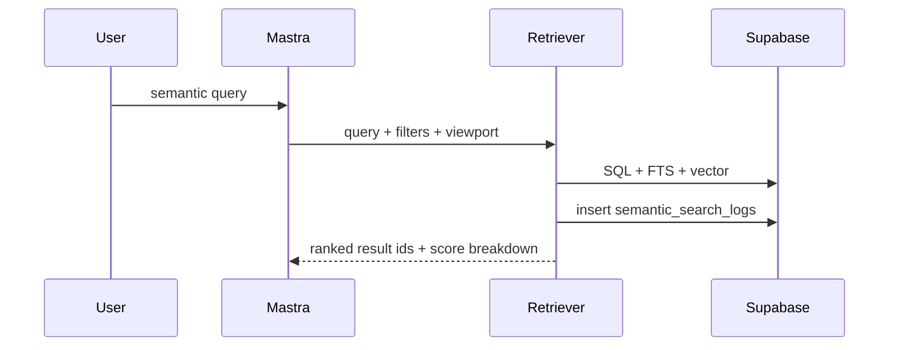

# VEC-006 - Search logs + observability

## Purpose

Store enough search telemetry to debug why semantic retrieval picked a result, without storing private text or leaking user memory.

## User story

As **Sofia**, I need to know why Camila saw a bad rental or cafe result, so that I can tune SQL filters, embeddings, and ranking weights with evidence.

## Real-world example

Camila asks "quiet Laureles cafe with outlets." A loud brunch spot ranks first. The log should show whether the issue came from vector similarity, missing structured tags, stale source text, or a reranker weight.

## Flow

## Log fields

| Field | Purpose |
|---|---|
| `query_text` | Redacted or sampled user query. |
| `query_hash` | Stable lookup without storing full private text. |
| `domain` | cafe, coffee_tour, rental, event, restaurant, neighborhood. |
| `filters_jsonb` | SQL filters applied. |
| `viewport_jsonb` | Map viewport bias if used. |
| `candidate_ids` | IDs before rerank. |
| `result_ids` | IDs shown to user. |
| `scores_jsonb` | semantic/FTS/trust/freshness/map/personalization breakdown. |
| `latency_ms` | Performance. |
| `model` | Embedding model used. |
| `created_at` | Audit timeline. |

## Goals

1. Add logging table or finish it if VEC-002 creates it.
2. Add a server-only logging helper.
3. Capture vector, FTS, SQL, trust, and final scores.
4. Redact or hash private data.
5. Link logs to eval runs where relevant.

## Success criteria

1. A semantic search writes exactly one log row per user query or eval query.
2. Logs include result IDs and score breakdown.
3. Logs never expose private user memory to anon users.
4. RLS blocks anon reads.
5. A failed eval can be traced to a log row.

## Out of scope

- Full analytics dashboard.
- Datadog/Sentry integration.
- Gorse/collaborative filtering.

## Notes

This task turns ranking from a black box into an inspectable system. It is required before serious personalization.
