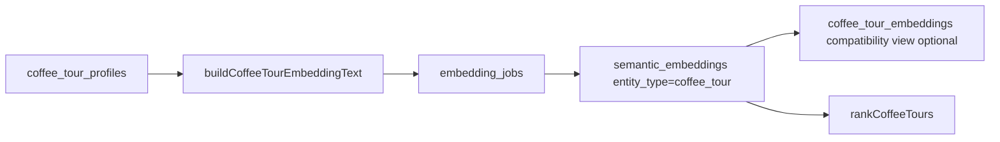

# VEC-007 - Coffee-tour vector compatibility

## Purpose

Connect the existing CTI-011 coffee-tour embeddings plan to the shared semantic V1 layer, so mdeai does not create another isolated vector table unless it is only a compatibility view.

## User story

As a **Tourist**, I want "authentic social-impact coffee tour near Medellin" to find the right tours by meaning, while exact facts like price, pickup, duration, and place ID still come from SQL and Places.

## Real-world example

Query:

```text
beginner-friendly social impact coffee tour with local family story
```

Correct behavior:

- vector search matches social-impact/authenticity chunks,
- SQL filters out unverified or inactive tours,
- ranking boosts verified operator/source confidence,
- card explains why the tour fits,
- map pin appears only when place identity is grounded.

## Compatibility flow



## Goals

1. Reuse `semantic_embeddings` for coffee-tour chunks.
2. Create `coffee_tour_embeddings` only as a view or compatibility adapter if CTI code needs it.
3. Use VEC-004 builder output, not raw tour JSON.
4. Use VEC-005 eval queries before marking semantic ranking better than SQL-only.
5. Keep CTI-011 honest: Phase B semantic capability, not Phase A proof.

## Success criteria

1. Coffee-tour semantic rows are stored with `entity_type='coffee_tour'`.
2. Query and document embeddings use the same model/dimension contract from VEC-003.
3. At least 10 coffee-tour eval queries pass.
4. SQL rank fallback still works if embedding generation fails.
5. Places facts remain grounded and are not copied from embeddings.
6. Any compatibility view is documented as a view, not source of truth.

## Out of scope

- Full cafe intelligence schema.
- OpenClaw crawler implementation.
- WhatsApp handoff.
- User taste personalization.

## Notes

This task prevents CTI-011 from becoming a second vector architecture. Coffee tours should be the first proof that the shared semantic layer works.
