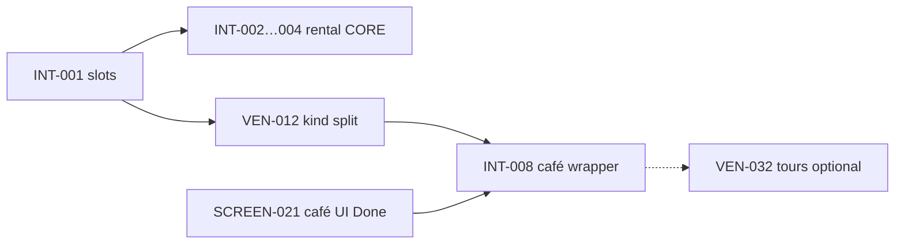

# Venues ↔ Intelligence (INT) crosswalk

**Intelligence program:** [`../intelligence/tasks/INDEX.md`](../intelligence/tasks/INDEX.md) · [`../intelligence/agent-plan.md`](../intelligence/agent-plan.md)

## Three “café” concepts (not duplicates)

| Concept | Tasks | What it is |
|---------|-------|------------|
| **A. Café Places (chat map)** | SCREEN-021, CAF-A5 ✅, DATA-003, VEN-012 | `search-grounded-places` → café cards on `/chat` |
| **B. Coffee tour product** | VEN-032…051, OCL-013 | DB `coffee_tours*`, `searchCoffeeTours` — **tours**, not cafés |
| **C. Chat intelligence layer** | INT-001, INT-008 | Shared `cafe_search` slots + Gemini clarify |

**Rule:** INT-008 does **not** replace CTI or SCREEN-021. It wires **reasoning** before existing tools run.

## Overlap matrix

| Venues task | Intelligence task | Relationship |
|-------------|-------------------|--------------|
| VEN-011 nightlife intent | INT-001 slots | INT extracts; VEN implements tool routing |
| VEN-012 grounded kind split | INT-008 | **VEN-012 first** (fix cafe vs nightclub); INT-008 adds Gemini clarify |
| post-mvp `025-ven-mastra-concierge-instructions` | INT-001, INT-003 | Venue prompt slice; defer until INT CORE (not `mvp/025` RLS) |
| VEN-028 working memory venue slots | INT-010 | INT-010 = global schema; VEN-028 = venue/booking fields |
| VEN-009/010 restaurant UI | INT-005 (future) | INT = slots; VEN = cards/panels |
| VEN-044 embeddings | INT-016, VEC-001…003 | CTI = **catalog** embeddings; INT = **user memory** |
| VEN-049 tour query chips | VEN-029 filter chips | Similar UX; **different surfaces** — do not merge |
| DATA-006 golden queries | INT-005 regression | Share café hero strings; one eval doc can reference both |

## Recommended sequencing

| When | Work |
|------|------|
| **Now (P0)** | INT-002…004 + RE-017/018 (rentals) — blocks all verticals |
| **Venue MVP** | DATA → VEN-009…014 → VEN-015…024 → VEN-025…031 hardening → VEN-031 E2E |
| **After INT-001 + VEN-012** | INT-008 café intelligence |
| **Parallel optional** | VEN-032…043 coffee tours — does not block venue booking MVP |

## Consolidation verdict

| Question | Answer |
|----------|--------|
| Merge coffee tours into café INDEX? | **No** — VEN-032…051 ([`tasks/mvp/mvp-index.md`](./tasks/mvp/mvp-index.md#phase-7--coffee-tours-32-43-optional)) |
| Merge INT-008 into VEN-012? | **No** — different layers; link dependencies |
| Merge VEN-025 into INT-001? | **Partial** — VEN-025 stays but **depends on INT-001** |
| Delete duplicate CAFE-001? | **Archived** — [`archive/CAFE-001-*`](./archive/); canonical **DATA-009** + **VEN-015** |
| Rename CAF-A5? | **Optional alias `CAF-005`** in index only; file name can stay |

## Additional tasks needed?

| ID | Needed? | Notes |
|----|---------|-------|
| **VEN-042** café Gemini clarify hook | **No** — use **INT-008** |
| **CAF-008** booking schema | **Superseded** — use **VEN-015** |
| **INT-021** restaurant/venue wrapper | **Later** — INT-018 cross-domain covers partial |
| New CTI folder `tasks-intelligent/` | **No** — files live in `mvp/` + `post-mvp/`; fix links only |
