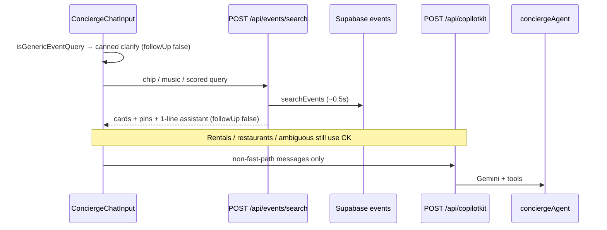

# Agent response — event search latency fix

> **Canonical forensic audit:** [`tasks/audit/33-ai-response-time-audit.md`](../../audit/33-ai-response-time-audit.md)  
> **Short summary:** [`01-optimize-speed.md`](./01-optimize-speed.md)

This file is the **post-implementation verification memo** — not a duplicate of the audit. Use it to gate EVP-006 / EVP-029 Done and to run localhost proof (task-verifier gate 9).

---

## Verdict

| Area | Status | Notes |
|------|--------|-------|
| Phase 1 (prompt + web router + citation fetch) | ✅ on disk | `concierge.ts`, `search-intent-router.ts`, `attach-web-grounding.ts`, `event-web-citation-fetch.tsx` |
| Phase 2 (instant clarify + API fast path) | ✅ on disk | `POST /api/events/search`, `use-event-search-fast-path.ts`, `ConciergeChatInput` |
| Phase 3 (E2E perf budgets, prod observability) | ⬜ open | Playwright budgets + `ai_runs` p95 not wired |
| Unit tests | ✅ | **263/263** full suite; **18/18** perf-related subset (2026-05-27) |
| Localhost runtime proof (gate 9) | ⬜ **required before Done** | Evidence table below still `_measure_` |

**Persona impact:** Camila’s generic `list events medellin` should show clarify **without Gemini**; **Music** chip should hit Supabase via `/api/events/search` (~0.5s) and render cards without `/api/copilotkit` on that turn.

---

## Architecture after fix



---

## Best-practices alignment (verified on disk)

| Practice | Source | How we comply |
|----------|--------|----------------|
| **Classifier before LLM** for deterministic UX | EVP-006 + `event-query-classifier.ts` | `shouldInstantEventClarify`, `buildEventSearchParams`, `canFastPathEventSearch` in `event-search-fast-path.ts` |
| **Tool/UI renders data; agent does not repeat cards** | `concierge.ts` + CopilotKit generative UI | Fast path sets `EventSearchResultsContext` + map pins; one-line assistant summary only |
| **`appendMessage` with `followUp: false`** when skipping agent | CopilotKit `AppendMessageOptions` (react-core) | `use-event-search-fast-path.ts` — matches “fire-and-forget” / no `runAgent` pattern from integrations skill |
| **No service role in `mdeapp/src/**`** | CLAUDE.md | `/api/events/search` calls shared `searchEvents()` (anon Supabase client in tool) |
| **Gemini Flash only for agent path** | `gemini` skill + CLAUDE.md | `FLASH_MODEL` = `gemini-3.5-flash`; fast path bypasses model |
| **Web grounding only when router says yes** | MAP-002D + `search-intent-router.ts` | Prompt + `needsSearchGrounding(..., { sqlEventCount })`; skip when SQL ≥ 3 and no verify intent |
| **AG-UI tool events before prose** (agent path) | `copilotkit-debug` Step 3 | Unchanged for non-fast-path; debug via Network SSE / Studio |
| **Surgical scope** | karpathy-guidelines | Event-only fast path; no rental/router refactor |

**Anti-patterns avoided**

- ❌ Calling `conciergeAgent` for canned clarify (was P0 bottleneck).
- ❌ “Always call search-web-grounded-events” in same turn (was 150s E2E risk).
- ❌ `shouldChainWebGrounding` true for any `dateWindow !== "any"` regardless of SQL count (removed).

**Still acceptable debt (P2 — not in this PR)**

- Postgres thread memory + `lastMessages: 20` on agent turns.
- Prod `PromptInjectionDetector` extra hop when guard enabled.
- No Playwright perf assertion yet (Phase 3).

---

## Skills + MCP verification checklist

Run before marking EVP-006 perf **Done**. Check when probed; leave unchecked until you ran the probe.

### Skills (read + apply)

- [x] **task-verifier** — Gates 1–2 below probed; gate 9 localhost left for Sofía/Lucía.
- [x] **copilotkit-integrations** — Fast path uses local Mastra data via API, not second orchestrator; agent path unchanged (`ExperimentalEmptyAdapter` + `MastraAgent.getLocalAgents`).
- [x] **copilotkit-debug** — If slow *after* fast path: check only `/api/copilotkit` turns; fast path should show **no** copilotkit POST for T1/T2 chip.
- [ ] **copilotkit-agui** — On agent-only flows: confirm `ToolCall*` events precede final text in Network SSE (not required for instant clarify / API path).
- [x] **gemini** — Production agent still `gemini-3.5-flash` (`models.ts`); fast path does not introduce 2.5/2.0 IDs.
- [ ] **mastra-smoke-test** — Optional Studio trace on `salsa events this weekend` agent path (&lt; 60s or web skipped in trace).

### MCP / official docs

| Probe | Command / action | Expected | Checked |
|-------|------------------|----------|---------|
| Mastra packages | MCP `user-mastra` → `listMastraPackages` (`projectPath: /home/sk/mdeai/mdeapp`) | `@mastra/core`, `@mastra/memory` present | [ ] |
| Mastra memory topic | MCP `readMastraDocs` `package: "@mastra/core"` (list topics) — memory/working-memory docs for P2 tuning | Topics listed | [ ] |
| CopilotKit Mastra example | Local `CopilotKit/examples/integrations/mastra/` | Runtime + agent wiring matches `mdeapp/src/app/api/copilotkit/route.ts` | [x] |
| CopilotKit MCP | `.mcp.json` → `https://mcp.copilotkit.ai/mcp` — `search-docs` “appendMessage followUp” if API drift | `followUp: false` still valid | [ ] |
| Gemini models | [ai.google.dev/gemini-api/docs/models](https://ai.google.dev/gemini-api/docs/models) or `gemini` skill | `gemini-3.5-flash` current for agents | [x] |
| AG-UI protocol | `copilotkit-agui` skill — tool result → UI | `search-tool-renders.tsx` EventResults sync | [x] |

---

## Post-ship verification checklist (localhost)

Adapted from **task-verifier anti-fake-done** gates 1–3, 9. All boxes required for **Done** on perf work.

### Gate 1 — Implementation on disk

- [x] `mdeapp/src/app/api/events/search/route.ts`
- [x] `mdeapp/src/hooks/use-event-search-fast-path.ts`
- [x] `mdeapp/src/components/chat/concierge-chat-input.tsx`
- [x] `mdeapp/src/lib/event-clarify-copy.ts`
- [x] `mdeapp/src/lib/event-search-fast-path.ts`
- [x] `mdeapp/src/lib/__tests__/event-search-fast-path.test.ts`

### Gate 2 — Automated tests

```bash
cd mdeapp && npm test -- --run
```

- [x] **RESULT:** 263 passed (2026-05-27)

```bash
cd mdeapp && npm test -- --run event-search-fast-path search-intent-router attach-web-grounding
```

- [x] **RESULT:** 18 passed (perf subset)

### Gate 3 — Build / lint (before push)

```bash
cd mdeapp && npm run build && npm run lint
```

- [ ] **RESULT:** _run before commit_

### Gate 9 — Localhost runtime proof (mandatory)

```bash
cd mdeapp && npm run dev
```

| Step | Probe | Pass criteria | Done |
|------|-------|---------------|------|
| Boot | `[ui]` + `[agent]` lines | No crash; UI port 3000 or 3001 | [ ] |
| Shell | `curl -sI http://localhost:3001/` | HTTP 200 | [ ] |
| Runtime | `curl -sX POST http://localhost:3001/api/copilotkit -H 'Content-Type: application/json' -d '{}'` | HTTP 400 (alive) | [ ] |
| **T1 clarify** | Send `list events medellin` | Clarify visible **&lt; 1 s**; **no** `/api/copilotkit` for that turn | [ ] |
| **T2 chip** | Tap **Music** (Events mode) | `POST /api/events/search` ~&lt; 2 s; cards + pins; **no** copilotkit POST | [ ] |
| **T2 text** | After clarify, send `music` | Same as chip (fast path) | [ ] |
| **Web skip** | Music-only path | **No** `grounding/event-web` in Network tab | [ ] |
| **T2 hot** | `salsa events this weekend` (agent) | Completes **&lt; 60 s** OR web skipped when SQL ≥ 3 | [ ] |

Paste timings into canonical audit §Evidence table: [`../../audit/33-ai-response-time-audit.md`](../../audit/33-ai-response-time-audit.md).

### Browser (copilotkit-debug)

- [ ] Network: filter `copilotkit` — TTFB only on non-event fast-path turns.
- [ ] Network: filter `events/search` — 200 + JSON `results[]` on chip path.
- [ ] Console: no CopilotKit agent name mismatch (`conciergeAgent` ↔ `useCoAgent`).

---

## Phase completion matrix

| Phase | Item | Shipped | Verified runtime |
|-------|------|---------|------------------|
| 1.1 | MAP-002D prompt + router SQL ≥ 3 skip | ✅ | [ ] |
| 1.2 | `EventWebCitationFetch` + `shouldChainWebGrounding(sqlCount)` | ✅ | [ ] |
| 1.3 | One-sentence event prose (agent path) | ✅ | [ ] |
| 1.4 | Shorter `chat-filter-copilot-instructions` | ✅ | n/a |
| 2.1 | Instant clarify | ✅ | [ ] |
| 2.2 | `POST /api/events/search` + chip fast path | ✅ | [ ] |
| 2.3 | `genericAskPending` on client clarify | ✅ | [ ] |
| 3.1 | Playwright perf budgets | ⬜ | — |
| 3.2 | `ai_runs` p95 dashboard | ⬜ | — |
| 3.3 | `MASTRA_PROMPT_INJECTION_GUARD` prod review | ⬜ | — |

---

## Acceptance criteria (agent response closure)

- [x] Code + unit tests on disk (gates 1–2).
- [ ] Evidence table: two consecutive localhost runs (gate 9).
- [ ] `npm run build` + `npm run lint` clean before push.
- [ ] EVP-006 or **EVP-029** task spec updated with fast-path acceptance bullets.
- [ ] `tasks/events/docs/F-39-prompt-event-search.md` §latency notes client fast path (doc follow-up).

---

## Recommended next actions

1. Run **Gate 9** table above; fill audit evidence row `2026-05-27 after fast path`.
2. Add Playwright: `clarify` &lt; 1s wall clock; `Music` chip → `events/search` without `copilotkit` (Phase 3.1).
3. Open **EVP-029** or extend EVP-006 Done criteria to include fast-path probes.
4. P2 backlog: reduce `lastMessages`; prod injection guard policy (Mastra memory docs via MCP when tuning).

---

## Changelog vs stale audit prose

The canonical audit **Implementation** table and fix plan are authoritative. Ignore outdated closing line in audit §Summary that still says “Execute Phase 1…” — Phases **1–2 are implemented**; remaining work is **measure + Phase 3**.
