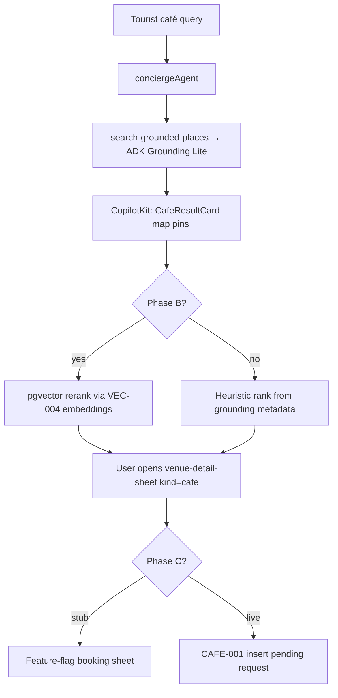

# SCREEN-021 — Cafe Listings + Map + Booking Request

> **Places group 005:** [005-008-places-README.md](../tasks/mvp/wireframes/005-008-places-README.md) · Wire: [005-wire-cafe-listings-map-booking.md](005-wire-cafe-listings-map-booking.md) · Venue sheet (rentals only): [006-scr-venue-detail-sheet.md](006-scr-venue-detail-sheet.md)

## 1. Purpose

Ship a Mindtrip-style **chat-first café discovery** surface on `/`: ranked result cards, map pin sync, venue sheet for café detail, and honest booking/request CTAs — **without** duplicating the ADK Grounding Lite path that already returns pins today.

## 2. Goals

**Phase A (start now — no vector dependency):**

- Ranked `CafeResultCard` list in the center column from existing `search-grounded-places` output.
- Extend `VenueDetailTarget` with `kind: "cafe"` for legacy paths — **primary detail UX is `CafeDetailPanel` in right column** (not `VenueDetailSheet`).
- Pin highlight on card hover/focus via existing F50 map state.
- Trust/source labels from grounding attribution + Places timestamps where available.
- Booking drawer UI with **feature-flag stub** (no DB write).
- **Rich-card dedup:** one listing surface — suppress generic Map results when cards render (`rich-card-results.ts`).

**Phase A.5 (Mindtrip detail UX — see wireframe + `screenshots/mindtrip/cafe/`):**

- Right column mode: map **or** `CafeDetailPanel` on card click (desktop — close restores map); bottom sheet on mobile.
- Tabs: Overview · Reviews · Location.
- `getPlaceDetails` enrichment on open (server + field mask) for hours, phone, website, photo gallery.
- “You might want to ask” prompts → inject chat, answer in center column, **panel stays open**.
- “More from this search” sibling rail (same grounding result set — not vector similar yet).
- Coffee intelligence blocks — **summary/Places only**, honest confidence labels (no invented Wi-Fi).

**Phase B (after VEC-004 + VEC-005):**

- Semantic fit / work-friendly scores from `semantic_embeddings` rerank.
- Golden-query regression: e.g. "quiet cafe in Laureles with fast WiFi".

**Phase C (after CAFE-001):**

- Persist booking requests to Supabase with RLS.
- Status chip: pending / confirmed / needs_user.

## 3. Features (user value)

| Persona | Value |
|---------|--------|
| **Tourist** | Compare cafés on map + list; open detail; request table or get directions |
| **Camila** | See work/brunch fit signals before opening a place |
| **Patricia** | (Phase C) Ops queue for booking requests — OpenClaw drafts deferred Phase 2+ |

## 4. Workflows — files to touch

### Phase A

| Area | Action |
|------|--------|
| UI | `CafeResultCard.tsx`, extend `search-tool-renders.tsx` generative café block |
| UI | `CafeDetailPanel.tsx`, `usePlaceDetails`, `/api/places/detail` — right column swap |
| UI | `CafeBookingSheet.tsx` — stub only |
| Map | Reuse `ChatMap` + F50 `focusPin`; optional pin rank labels |
| Mastra | **Extend** `search-grounded-places` — do **not** add `searchCafes` |
| Mastra | Optional server tool `getPlaceDetails` via `google-places-client.ts` for drawer enrichment (`X-Goog-FieldMask`) |
| CopilotKit | `useCopilotAction` mirrors: `openCafeDetail`, `requestCafeBooking` (`available: "disabled"` + `render`) |
| Tests | `CafeResultCard.test.tsx`, `e2e/screens/SCREEN-021-cafe-listings.spec.ts` |

### Phase B

| Area | Action |
|------|--------|
| Mastra | Rerank hook after grounding results using VEC-004 builders + pgvector RPC |
| Tests | Wire VEC-005 golden café queries into CI or manual gate |

### Phase C

| Area | Action |
|------|--------|
| Supabase | Migration from [CAFE-001](../../../archive/CAFE-001-booking-requests-schema.md) (archived) → **DATA-009** + **VEN-015** |
| Mastra | `requestCafeBooking` tool → insert row (service-role carve-out path only) |

## 5. User journeys

1. Tourist: "quiet cafe in Laureles with fast WiFi" → ranked cards + pins → Details → booking stub.
2. Camila: taps **Food & cafés** chip → sends scoped message → same flow.
3. Mobile: List/Map segmented control + bottom sheet preview (reuse `map-mobile-sheet.tsx` patterns).

## 6. Agents

| Agent | Key | Tool / pattern |
|-------|-----|----------------|
| `conciergeAgent` | `conciergeAgent` in `useCoAgent` **must match** `Mastra({ agents: { conciergeAgent } })` | `search-grounded-places` (discovery); Phase B rerank in tool or workflow step |

Do **not** register a separate café agent.

## 7. Integrations

| Layer | Owner | Phase 1 rule |
|-------|-------|----------------|
| **Discovery** | ADK Grounding Lite (`invokeAdkGrounding`) | Keep — MAP-002 Done |
| **Detail enrichment** | Places API New via `google-places-client.ts` | Field mask required on every call |
| **Map UI** | `ChatMap` + `mapId` on parent `<Map>` | Required for `AdvancedMarker` |
| **Vector** | `semantic_embeddings` | Phase B only — after VEC-002/004/005 |
| **Booking DB** | `cafe_booking_requests` | Phase C — CAFE-001 |
| **OpenClaw enrichment** | Draft only | **Phase 2+** — out of SCREEN-021 MVP |

## 8. Summary

**Current disk (2026-05-27):** Phase A + **A.5 shipped** — `CafeResultCard`, `CafeDetailPanel` (tabs, ask prompts, sibling rail, `getPlaceDetails`), map/detail column toggle, booking stub. **Open:** Phase B vector rerank, Phase C CAFE-001 persistence.

**Implementation order:** ~~Phase A~~ → ~~Phase A.5~~ → Phase B → CAFE-001 → Phase C.

## 9. Definition of Done

### Phase A.5 Done

- [x] Right column toggles map ↔ `CafeDetailPanel` on card click.
- [x] Tabs: Overview · Reviews · Location.
- [x] `getPlaceDetails` enrichment on open (field mask).
- [x] “You might want to ask” → chat; panel stays open.
- [x] “More from this search” sibling rail.
- [x] Playwright Phase A.5 pass (`tasks/testing/evidence/2026-05-27/SCREEN-021-phase-a5-RESULTS.md`).

### Phase A Done

- [x] Café query returns **ranked** `CafeResultCard` list (not only inline chat prose).
- [x] Cards show source/trust labels (grounding attribution; no fake "open now" without verify).
- [x] Map pins highlight on card hover/focus.
- [x] Details opens `CafeDetailPanel` (`data-testid="cafe-detail-panel"`) — cafés do **not** use `venue-detail-sheet`.
- [x] Booking CTA opens sheet with direct / request states (request = stub; no DB write).
- [x] Mobile List/Map mode usable (no overlapping CTAs).
- [x] `npm run floor` exit 0; Playwright `SCREEN-021-cafe-listings.spec.ts` pass; evidence file committed.

### Phase B Done (separate flip)

- [ ] VEC-005 golden café queries pass after rerank enabled.
- [ ] Fit/work scores on cards sourced from semantic layer (documented in evidence).

### Phase C Done (separate flip)

- [ ] CAFE-001 migration applied; RLS verified.
- [ ] Request booking creates pending row; UI shows status chip.

## 10. Tests

```bash
cd mdeapp && npm test && npm run lint && npm run typecheck && npm run build
npm run verify:console && npm run floor && npm run smoke:map-pins
PW_SKIP_WEBSERVER=1 npx playwright test e2e/screens/SCREEN-021-cafe-listings.spec.ts --project=chromium
# Baseline regression (already shipped):
npx playwright test e2e/maps-grounding.spec.ts
```

**Negative:** café query must **not** hit `/api/events/search` fast-path (PR #7 classifier).

**Evidence:** `tasks/evidence/SCREEN-021-evidence.md` + `tasks/testing/evidence/2026-05-27/` + `mdeapp/tmp/screenshots/SCREEN-021/`.

**Rollback:** disable café ranked UI via feature flag; grounding cards remain default.

---

## Runtime proof

> `SCREEN-TESTING-STANDARD.md` §7. Phase A Done requires dev restart + Browser + Playwright + evidence.

```bash
lsof -ti :3001 | xargs -r kill -9
rm -rf mdeapp/.next
cd mdeapp && npm run dev
curl -s -o /dev/null -w "SCREEN-021 -> %{http_code}\n" --max-time 15 -L http://localhost:3001/
```

| Step | Action | Pass |
|------|--------|------|
| 1 | Navigate to `http://localhost:3001/` | 200 |
| 2 | Ask "quiet cafe in Laureles with fast WiFi" | Ranked café cards visible |
| 3 | Click Details on card | `data-right-column-mode="detail"` + `cafe-detail-panel` |
| 4 | Close panel | Map column restores |
| 5 | Open booking | `data-testid="cafe-booking-sheet"` visible |
| 6 | Console | 0 critical errors |
| 7 | Network | No `/api/events/search` on café query |

---

## Agent workflow (corrected — matches disk)



---

## Do not do

- Do not add parallel tools `searchCafes` / `rankCafeResults` unless router requires them — extend `search-grounded-places`.
- Do not call Places API from the browser.
- Do not block list on map failure (list remains usable).
- Do not create `/cafes` catalog before chat mode works.
- Do not wire OpenClaw canonical writes in Phase A–B.
- Do not claim instant reservation without partner integration.
