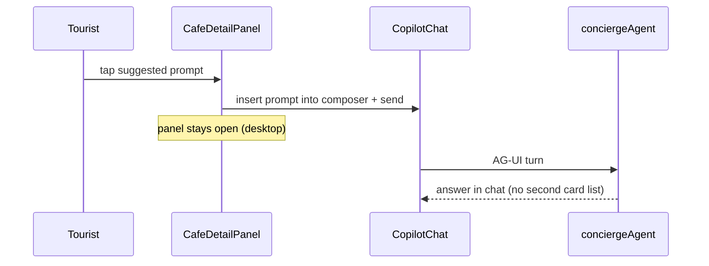
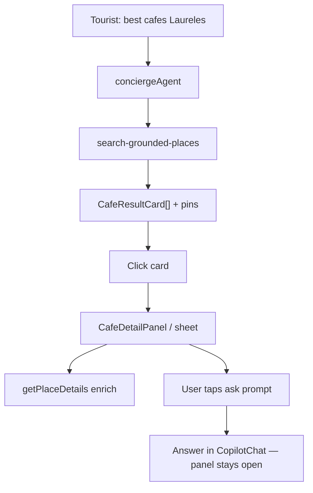

# Wireframe: Cafe Listings + Map + Booking

> **Places group 005:** [005-008-places-README.md](../tasks/mvp/wireframes/005-008-places-README.md) · Build spec: [005-scr-cafe-listings-map-booking.md](005-scr-cafe-listings-map-booking.md)

**Persona:** Tourist, Camila  
**Surface:** `/` chat-first only — **no** standalone `/cafes` catalog in Phase 1  
**Audit:** [`37-screen-coffee.md`](../audit/37-screen-coffee.md)  
**Playwright:** `mdeapp/e2e/screens/SCREEN-021-cafe-listings.spec.ts` · `e2e/rich-card-dedup.spec.ts`

## Mindtrip reference screenshots

Use these as UX targets (not pixel copies):

| File | What it shows | mdeai takeaway |
|------|----------------|----------------|
| [`01-cafe.png`](../../screenshots/mindtrip/cafe/01-cafe.png) | List + map split; ranked cards with photo, rating, 2-line blurb, save/+ trip on image | Card density + map pin labels; intro paragraph scopes neighborhood |
| [`02-cafe.png`](../../screenshots/mindtrip/cafe/02-cafe.png) | Card click → **right detail column** replaces map; photo grid; Overview tab; address/website/phone/hours grid | Target: right panel stays open; structured facts grid; gallery |
| [`02a-cafe.png`](../../screenshots/mindtrip/cafe/02a-cafe.png) | Full scroll: Reviews tab, Location mini-map, **Similar / Nearby / Restaurants / Things to do** image rails | Defer heavy rails to Phase A.5; start with similar cafés from same search set |
| [`03-cafe.png`](../../screenshots/mindtrip/cafe/03-cafe.png) | Reviews tab: aggregate score + Google source + community snippet | Reviews tab = Places rating + link out; no fake community reviews |
| [`04-cafe.png`](../../screenshots/mindtrip/cafe/04-cafe.png) | **“You might want to ask”** → user taps → answer appears **in center chat** while detail panel stays open | Core interaction to ship in Phase A.5 |

## Current mdeai state (2026-05-27)

| Feature | Status | Notes |
|---------|--------|-------|
| Ranked `CafeResultCard` in chat | ✅ Phase A | Match #N, photo, rating, badges, Directions/Reviews/Details/Request |
| Map pin sync (F50) | ✅ | Hover/select card ↔ pin |
| Rich-card dedup rule | ✅ | No Map results strip when cards show |
| `CafeDetailPanel` right column | ✅ Phase A.5 | Tabs, gallery, facts grid, ask prompts, sibling rail |
| `getPlaceDetails` enrichment | ✅ | `/api/places/detail` + field mask on open |
| `VenueDetailSheet` for cafés | ❌ by design | Use `CafeDetailPanel` — see [006-wire-venue-detail](006-wire-venue-detail.md) |
| Booking request DB | ❌ Phase C | Stub sheet only |
| Vector rerank / intelligence scores | ❌ Phase B | VEC-004/005 |

## Architecture (disk truth)

```text
LEFT NAV          CENTER CHAT                    RIGHT (desktop)
ChatNavRail       Query bar + CopilotChat          ChatMapPanel
                  CafeResultCard[] (generative)    OR (Phase A.5) CafeDetailPanel
                  EventResultsPanel (citations)    replaces map when café selected
                  [no Map results when cards]      MapMobileSheet (mobile)
```

| Layer | Implementation |
|-------|----------------|
| Discovery | ADK Grounding Lite → `search-grounded-places` |
| List UI | `CafeResultCard` via `search-tool-renders.tsx` + `RichCardResultsRegistrar` |
| Detail enrichment | **Phase A.5:** server `getPlaceDetails` on open (`/api/places/detail` or server action) + field mask |
| Detail UI | Extend `VenueDetailSheet` **or** new `CafeDetailPanel` in map column (prefer panel swap — see below) |
| Booking | `CafeBookingSheet` stub → Phase C `cafe_booking_requests` |
| Vector rerank | Phase B — VEC-004/005 only |

### Right column: map **or** detail (NOT “remove the map”)

**Clarification:** “Swap map column for `CafeDetailPanel`” means the **same right-hand slot** toggles between two views — it does **not** delete the map from the product.

| Right-column mode | When | User exit |
|-------------------|------|-----------|
| **Map** (default after search) | Pins for all cafés in result set; Filter control | — |
| **Detail** (`Entity sheet`) | User clicks café **name** on a card | **Close (×)** or toggle back to Map |

**Live Mindtrip check (2026-05-27, `suggest best cafes in Laureles Medellin`):**

1. Search returns ranked cards in **center chat** + map pins (right column on wide layout; narrow layout uses **Map / Chat** pill toggle).
2. Click **Pergamino | Cafe - Laureles** → URL gains `?ref=re-…`; right column becomes **Entity sheet** (detail panel), not a center-modal.
3. Detail panel: photo grid, Save/+ trip, Directions/Listen/Share, **Overview | Reviews | Location** tabs, address/website/phone/hours, venue-specific “You might want to ask”, Pros/Cons review summary, similar/nearby rails.
4. **Close (×)** or **Map** pill → map returns with labelled pins (`$$ Pergamino | Cafe - Laureles`, etc.).

Center chat + card list **stay visible** while detail is open (desktop 3-column). Ask prompts in chat still work; detail panel also has its own “Ask Mindtrip” bar.

### Right panel vs sheet (mdeai recommendation)

| Option | Pros | Cons |
|--------|------|------|
| **A — Right column mode toggle** (recommended) | Matches Mindtrip; chat + cards stay visible; map returns on close | Requires `ChatMapPanel` ↔ `CafeDetailPanel` state in `rental-ui-context` |
| **B — Wide sheet over map** | Smaller diff; reuses `VenueDetailSheet` | Feels modal; not how Mindtrip does it |

**Phase A.5 default:** Option A — `selectedCafeDetail` toggles right column between `<ChatMap>` and `<CafeDetailPanel>`.

## Mindtrip → mdeai gap fixes (prioritized)

### P0 — Phase A.5 (Mindtrip parity, no vector)

1. **Detail panel in right column** — card click sets `venueDetail` + shows `CafeDetailPanel` in the map slot (desktop); close restores map; mobile keeps bottom sheet.
2. **Tabs:** `Overview` | `Reviews` | `Location` (`data-testid="cafe-detail-tab-*"`).
3. **Overview content** (Places-backed only):
   - Photo gallery (1 hero + thumbs from `photos[]` via proxy)
   - Rating line, type, price
   - Editorial paragraph = existing grounding `summary` (label: “From search summary”)
   - Facts grid: address, website, phone, hours (from `getPlaceDetails`)
   - Trust row: Google-verified, Place ID, field mask version, checked-at
   - CTAs: Directions, Request visit, Maps
4. **Reviews tab** — aggregate rating + “View on Google” (`reviewsUrl`); no invented review text.
5. **Location tab** — embedded map pin + address + directions link (reuse map focus, not second full Maps embed if costly).
6. **“You might want to ask”** — 3–4 prompts generated from **place name + primaryType + user query** (template first; optional Gemini in tool). Click → `sendConciergeMessage(prompt)` + keep panel open.
7. **Similar cafés rail** — other rows from **same** `search-grounded-places` result set (images when `photoName` present). Label: “More from this search” — not “Similar” until Phase B vector.

### P1 — Coffee intelligence (honest labels)

Show only when data supports it; otherwise hide section.

| Block | Source | UI label |
|-------|--------|----------|
| Best for (work/brunch/date/…) | Gemini bullet from concierge turn **if** tied to query keywords | “Best for” |
| Coffee quality signals | Grounding summary + Places types | “Coffee notes” |
| Work-friendly | Query mentioned work/WiFi/laptop **or** summary contains signals | “Work-friendly” + confidence chip (Low/Med — heuristic, not score) |
| Noise / seating / Wi-Fi | **Do not invent** — show only if summary mentions | Optional sub-bullets |
| Best time to visit | `openNow` + hours only | “Hours” |
| What to order | Hide unless summary mentions menu items | |
| Not ideal for | Opposite of “Best for” from same summary | |
| Why recommended | Grounding `summary` + rank | “Why #N” |

**Rule:** If Places returns no phone/website/hours, show “Not available from Google” — never fabricate.

### P2 — Phase B (after VEC-004/005)

- Semantic fit scores on cards (Work: 82 → real embedding score)
- “Similar cafés” from pgvector neighbors
- Golden-query regression (quiet café Laureles WiFi)

### P3 — Phase C

- `cafe_booking_requests` persistence + status chip on card

## Card improvements (vs Mindtrip 01)

```text
+-- CafeResultCard (current + Phase A.5 polish) -------------------+
| [photo 96px]  Match #1 · Rituales Compañía de Café    ★ 4.7 (1.6k)|
|               Cafe · $$ · Closed                                   |
|               "Specialty coffee, courtyard vibe, laptop-friendly     |
|                before lunch."                    [2 lines max]     |
|               Google-verified · Place ID · Checked 2026-05-27      |
|               [Directions] [Reviews]     [Details] [Request]         |
+--------------------------------------------------------------------+
```

| Mindtrip | mdeai Phase A.5 tweak |
|----------|------------------------|
| Save / + Trip on image | Defer Save/+Trip to SCREEN-011 Saved / Trips |
| “Mentioned by …” social | Out of scope Phase 1 |
| Rank implicit in list order | Keep explicit **Match #N** until vector scores replace |
| Neighborhood in title row | Add `formattedAddress` neighborhood chip when present |

## Desktop: list + map (default)

```text
+----------+----------------------------------------+---------------------------+
| NAV      | CENTER                                 | RIGHT                     |
|          | ☕ Best cafés in Laureles              | [Map — ChatMapPanel]      |
|          | Intro (assistant prose, 1–2 sentences) |  pins (1)(2)(3)           |
|          | +-- CafeResultCard #1 ----------------+ |                           |
|          | +-- CafeResultCard #2 ----------------+ |                           |
|          | Ask anything...                        |                           |
+----------+----------------------------------------+---------------------------+
```

**Dedup rule:** When `grounded-card` count > 0 → hide `results-column` (Map results strip). Cards are the only list.

## Desktop: detail panel open (Phase A.5 target)

```text
+----------+----------------------------------------+---------------------------+
| NAV      | CENTER (unchanged)                     | CafeDetailPanel           |
|          | … cards still visible in chat scroll   | [← Back to map] Save*     |
|          |                                        | [gallery: 1 large + 3]    |
|          | User message: "What sets the coffee    | Rituales · ★4.7 · Cafe $$ |
|          |  at Rituales apart…?"                  | [Overview|Reviews|Location|
|          | Assistant answer below (new turn)      |                           |
|          |                                        | Overview:                 |
|          |                                        | · description (summary)   |
|          |                                        | · facts grid              |
|          |                                        | · Coffee intelligence*    |
|          |                                        | · You might want to ask   |
|          |                                        |   > What to order?     >  |
|          |                                        | · More from this search   |
|          |                                        |   [card][card][card]      |
+----------+----------------------------------------+---------------------------+
* Save deferred; intelligence blocks optional/honest
```

## Mobile

```text
[Chat + cards full width]
[Open map (N)] FAB
Tap card → MapMobileSheet OR CafeDetailBottomSheet (full height 85vh)
Tabs stack vertically; similar rail horizontal scroll
Ask prompts → inject chat; sheet stays open (collapsed to 40vh) optional
```

## “You might want to ask” — interaction spec



| Step | Implementation |
|------|----------------|
| Render | `CafeAskPrompts` — 3–4 buttons `data-testid="cafe-ask-prompt"` |
| Click | `sendConciergeMessage(text)` from shared chat helper |
| Context | Prefix: `About ${title}: ${prompt}` |
| Agent | Existing `conciergeAgent` — no new agent |
| Dedup | Answer prose only; do not re-render full card list for follow-ups |

**Default prompts (template):**

1. What sets the coffee at {title} apart in Medellín?
2. Is {title} good for working on a laptop?
3. What should I order at {title}?
4. When is the best time to visit {title}?

Hide #3 if summary has no menu signal.

## Required components

### Phase A ✅

| Component | Status |
|-----------|--------|
| `CafeResultCard` | Shipped |
| `RichCardResultsRegistrar` | Shipped |
| `VenueDetailSheet` café body | Minimal |
| `CafeBookingSheet` | Stub |

### Phase A.5 (next)

| Component | Purpose |
|-----------|---------|
| `CafeDetailPanel` | Right-column Mindtrip detail (desktop) |
| `CafeDetailTabs` | Overview / Reviews / Location |
| `CafePhotoGallery` | Places photos via proxy |
| `CafeFactsGrid` | address, website, tel, hours |
| `CafeAskPrompts` | Suggested questions → chat |
| `CafeRelatedRail` | Sibling cards from same tool result |
| `usePlaceDetails` hook | Fetch enriched details on open (server) |
| `/api/places/detail` | Thin route wrapping `getPlaceDetails` + mask |

### Phase B+

| Component | Purpose |
|-----------|---------|
| `CafeIntelligenceBlock` | Best for / work / why recommended with vector scores |
| `CafeSimilarRail` | pgvector neighbors |

## Data contract extensions (`CafeVenueDetail`)

```ts
// Extend rental-ui-context CafeVenueDetail — Phase A.5
websiteUri?: string;
nationalPhoneNumber?: string;
regularOpeningHours?: { weekdayDescriptions: string[] };
photoNames?: string[];           // gallery
siblingResults?: CafeSibling[];  // same search, excluding self
lastSearchQuery?: string;        // for ask prompts
askPrompts?: string[];
// Coffee intelligence — optional strings from grounded summary only
bestFor?: string[];
workFriendlyNote?: string;
whyRecommended?: string;
```

Enrichment flow:

```text
Card click → open panel with card payload (instant)
          → parallel GET /api/places/detail?placeId=… (field mask)
          → merge into panel state (hours, phone, website, photos)
```

## Agent workflow



## Tests (acceptance)

```bash
cd mdeapp
npm run typecheck
npm run verify:console
PW_SKIP_WEBSERVER=1 npx playwright test e2e/screens/SCREEN-021-cafe-listings.spec.ts --project=chromium
npx playwright test e2e/rich-card-dedup.spec.ts -g cafés --project=chromium
npm run floor
```

| Check | Pass criteria |
|-------|----------------|
| Card click | `cafe-detail-panel` or `venue-detail-sheet` + `data-venue-kind=cafe` |
| Tabs | Overview/Reviews/Location switch without closing panel |
| Ask prompt | Prompt appears in chat; assistant reply; panel still visible |
| Similar rail | ≥1 sibling card when search returned ≥2 |
| Dedup | `results-column` count 0 when grounded cards visible |
| JSON | No raw tool JSON in `.copilotKitAssistantMessage` |
| Mobile | Bottom sheet; no horizontal overflow |

## Do not do

- Standalone `/cafes` page before chat flow proves value
- Duplicate list surfaces (cards + Map results + source lists)
- Real booking DB writes in Phase A/A.5
- pgvector “semantic ranking” claims before VEC-005
- Invent phone, hours, Wi-Fi, or review quotes not in Places/summary
- Browser-side Places API calls
- Community reviews UI without real data source

## Implementation order

| Order | Deliverable |
|------:|-------------|
| 1 | ✅ Phase A — cards, pins, stub sheet, dedup |
| 2 | ✅ Phase A.5 — detail panel swap, tabs, enrichment, ask prompts, sibling rail |
| 3 | Phase B — vector scores + similar cafés |
| 4 | CAFE-001 + Phase C — booking persistence |
