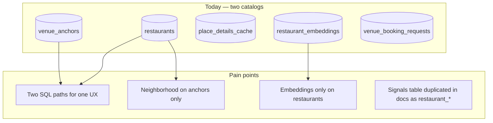
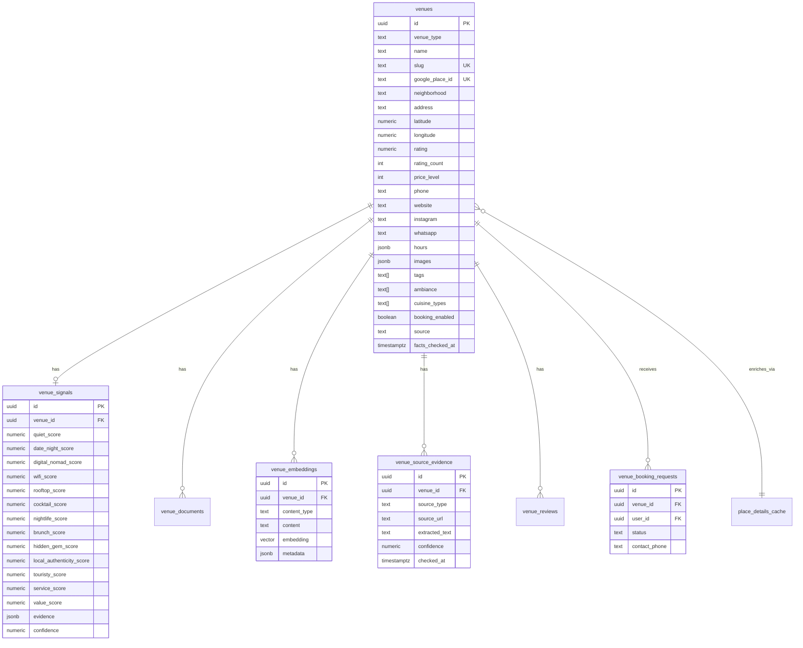
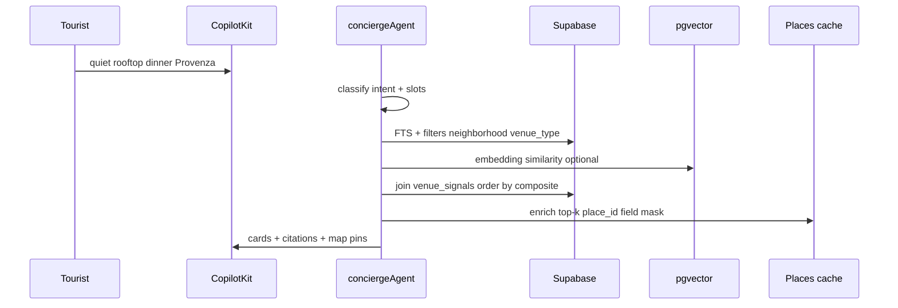
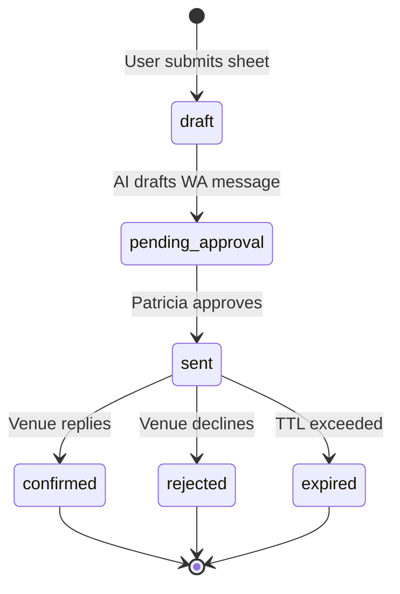
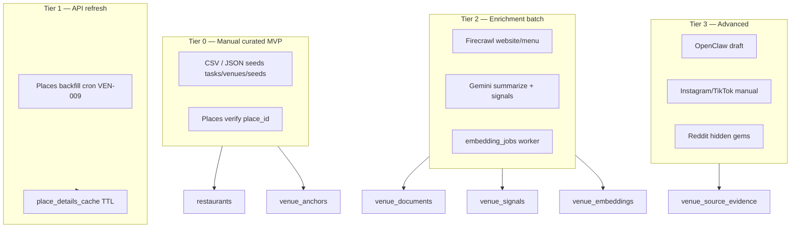
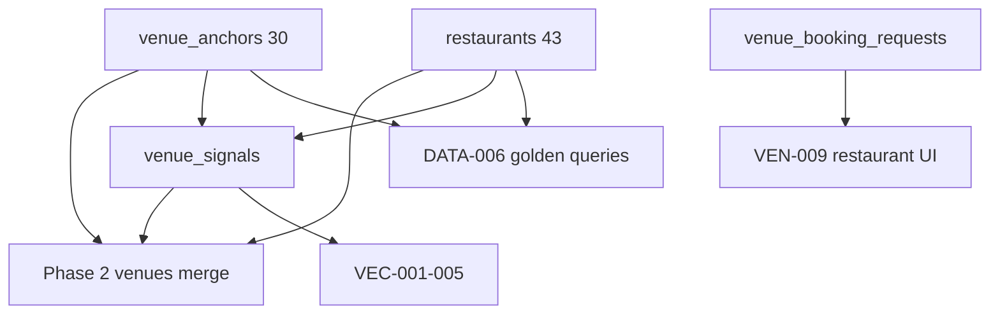

# Unified venue intelligence — production data strategy

## Executive verdict

| Question | Answer |
|----------|--------|
| Is **one unified `venues` table** the right **target** architecture? | **Yes** — for AI-native discovery, maps, booking, and grounding. |
| Should we **migrate now** (Phase 1 MVP exit)? | **No** — live Supabase already ships **43 restaurants + 30 venue_anchors** with tools, golden queries, and embeddings wired. Big-bang migration blocks EVT/PAY gates. |
| Is [`24-restaurants.md`](../restaurants/24-restaurants.md) best practice? | **74/100 — good catalog audit, wrong scope.** Intelligence layer naming should be **`venue_*`**, not `restaurant_*`, and must cover **all kinds** (cafe, restaurant, nightclub, later gym/spa/attraction). |
| Best MVP path | **Unified intelligence layer + dual catalog bridge** → migrate catalog to `venues` in Phase 2. |

**Competitive moat:** Google Maps = *where things are*. mdeai = *where you should go tonight and why* — that requires **`venue_signals` + evidence + embeddings**, not three duplicate catalog tables.

---

## 1. Architecture audit (live disk + Supabase 2026-05-31)

### What exists today

| Table | Rows (live) | Role | Tool / surface |
|-------|------------:|------|----------------|
| `public.restaurants` | 43 | Restaurant catalog (100% `google_place_id`) | `search-restaurants` |
| `public.restaurant_embeddings` | 43 | Vector rerank (restaurants only) | Phase B semantic |
| `public.venue_anchors` | 17 café + 13 nightclub | Curated anchors (`kind` = cafe \| nightclub) | `search-grounded-places` |
| `public.place_details_cache` | 57 valid | Places New detail cache (all kinds) | `/api/places/detail`, panels |
| `public.places_search_cache` | varies | Text search cache | Maps proxy |
| `public.venue_booking_requests` | 0 | WA booking ledger (**already polymorphic**) | VEN-015+ |
| `public.saved_places` | — | User saves | Trips / favorites |

**No separate `cafes` or `nightclubs` tables** — good. Fragmentation is **two-catalog**, not three:

```text
restaurants          ← full restaurant rows + FTS + embeddings
venue_anchors        ← lightweight curated rows (cafe | nightclub)
place_details_cache  ← shared Google facts layer
```

### App / maps / AI (mdeapp)

| Layer | State |
|-------|--------|
| Maps pins | Single `MapContext` — category = grounded \| rental \| event |
| Cards | `CafeResultCard` (grounded), restaurant/nightlife panels planned (VEN-009–013) |
| Grounding | ADK / `search-grounded-places` for café + nightlife discovery |
| SQL search | `search-restaurants` → `restaurants` only |
| Booking UI | Café stub (Phase A); `venue_booking_requests` schema live |
| Embeddings | Restaurants only; no anchor embeddings yet |

### Confirmed schema gaps (vs your target + `24-restaurants.md`)

| Gap | Live evidence | Severity |
|-----|---------------|----------|
| No `neighborhood` on `restaurants` | Column absent; parsed from `address` in tool code | High |
| `price_level` NOT NULL | Blocks rows when Places omits price | High |
| `hours_of_operation` NOT NULL | Same | Medium |
| No `venue_signals` | Intelligence queries impossible in SQL | Critical (moat) |
| No `venue_source_evidence` | AI cannot cite provenance | High |
| No `venue_documents` | Raw text scattered / missing | High |
| Embeddings restaurant-only | Cafés/nightlife = grounding-only | Medium |
| Auto-embed trigger risk | `24-restaurants.md` flags `trigger_ai_embed()` | Medium |
| `event_venues` ≠ tourist venues | Event venue join table — **do not merge** with place catalog | Info |

---

## 2. Duplicate / fragmented tables — problems



| Problem | Persona impact |
|---------|----------------|
| Tourist: “quiet café then dinner then club” | Three tool hops; no unified rank |
| Camila: saves a café vs restaurant | Different FK shapes in booking row |
| Patricia: ops dashboard | Two seed pipelines, two id spaces |
| Sofía: new vertical (gym, spa) | Debate *which* table again |

**Do not add** `cafes`, `nightclubs`, or `gyms` tables. **Do** converge intelligence satellites under `venue_*` now, catalog under `venues` later.

---

## 3. Target canonical architecture



### `venue_type` enum (target)

```text
cafe | restaurant | nightclub | bar | rooftop | lounge | speakeasy
coworking_cafe | brunch | gym | spa | attraction | shopping | live_music
```

Use **`tags[]`** for cross-cutting facets (`rooftop`, `date-night`, `wifi`, `salsa`) — do not explode types.

### Out of scope for `venues`

| Entity | Keep separate | Why |
|--------|---------------|-----|
| `events` | Yes | Ticket commerce, Stripe, MVP ledger |
| `apartments` | Yes | Rental domain, different RLS |
| `coffee_tours` | Optional product vertical | Packaged tours ≠ static venue |
| `event_venues` | Yes | Event host venue link, not discovery catalog |

---

## 4. MVP vs advanced

### MVP (Phase 1 — ship with current catalogs)

**Principle:** *Unified intelligence, dual catalog bridge.*

| Ship | Defer |
|------|-------|
| `venue_signals` (polymorphic FK) | Full `venues` migration |
| `venue_source_evidence` | Instagram/TikTok auto-crawl |
| `venue_documents` + job queue | Vision AI on photos |
| Patch `restaurants` (nullable price, neighborhood) | PostGIS geography column |
| Extend `venue_anchors` metadata for signals join | User taste vectors |
| `venue_booking_requests` + WA outbox (VEN-015–023) | Instant booking fiction |
| Hybrid search: FTS + optional vector (restaurants first) | Cross-kind vector in one query |
| Golden queries (DATA-006) green | 500+ venue inventory |

### Advanced (Phase 2–3)

| Capability | Depends on |
|------------|------------|
| Single `venues` table + migration views | MVP signals populated |
| Unified `search-venues` Mastra tool | VEC-001–005 evals |
| Cross-kind semantic: “cocktail dinner before nightlife” | `venue_embeddings` all kinds |
| User preference memory / taste vectors | INT-010, auth |
| Hidden gem detector | Reddit + evidence pipeline |
| Vision: rooftop / crowd / lighting scores | Gemini multimodal batch |
| Neighborhood summaries as documents | Firecrawl/OpenClaw |

---

## 5. Intelligent signal system

### Signal catalog

| Signal | Example query | Primary sources |
|--------|---------------|-----------------|
| `quiet_score` | quiet café to work in Laureles | Reviews, tags, hours, nomad lists |
| `digital_nomad_score` | laptop-friendly café | WiFi mentions, outlets, noise |
| `wifi_score` | strong wifi café | Evidence text, tags |
| `date_night_score` | romantic dinner skyline | Ambiance, price, photos |
| `rooftop_score` | best rooftop dinner tonight | Places types, photos, tags |
| `cocktail_score` | cocktail-heavy dinner | Menu/evidence, bar tags |
| `nightlife_score` | hidden local salsa bar | Anchor tags, events proximity |
| `brunch_score` | local brunch strong coffee | Hours, menu, reviews |
| `hidden_gem_score` | not touristy authentic | touristy inverse + Reddit |
| `local_authenticity_score` | local vs expat hangout | Language, review geo |
| `touristy_score` | avoid trap restaurants | Review density, maps popularity |
| `service_score` | value + service | Review summary |
| `value_score` | dinner under $100 | price_level + reviews |

### MVP DDL — polymorphic (works with **both** catalogs today)

```sql
-- migration: YYYYMMDD_venue_signals_mvp.sql
CREATE TABLE public.venue_signals (
  id uuid PRIMARY KEY DEFAULT gen_random_uuid(),

  -- Bridge until public.venues exists
  venue_kind text NOT NULL CHECK (venue_kind IN (
    'restaurant', 'cafe', 'nightclub', 'bar', 'rooftop', 'gym', 'spa', 'attraction'
  )),
  restaurant_id uuid REFERENCES public.restaurants(id) ON DELETE CASCADE,
  venue_anchor_id uuid REFERENCES public.venue_anchors(id) ON DELETE CASCADE,

  quiet_score numeric(4,3),
  date_night_score numeric(4,3),
  digital_nomad_score numeric(4,3),
  wifi_score numeric(4,3),
  rooftop_score numeric(4,3),
  cocktail_score numeric(4,3),
  nightlife_score numeric(4,3),
  brunch_score numeric(4,3),
  hidden_gem_score numeric(4,3),
  local_authenticity_score numeric(4,3),
  touristy_score numeric(4,3),
  service_score numeric(4,3),
  value_score numeric(4,3),

  evidence jsonb NOT NULL DEFAULT '{}'::jsonb,
  source text NOT NULL DEFAULT 'ai_enriched',
  confidence numeric(4,3) NOT NULL DEFAULT 0.5,

  created_at timestamptz NOT NULL DEFAULT now(),
  updated_at timestamptz NOT NULL DEFAULT now(),

  CONSTRAINT venue_signals_one_parent CHECK (
    (restaurant_id IS NOT NULL)::int + (venue_anchor_id IS NOT NULL)::int = 1
  ),
  CONSTRAINT venue_signals_restaurant_kind CHECK (
    restaurant_id IS NULL OR venue_kind = 'restaurant'
  ),
  CONSTRAINT venue_signals_anchor_kind CHECK (
    venue_anchor_id IS NULL OR venue_kind IN ('cafe', 'nightclub', 'bar', 'rooftop')
  )
);

CREATE UNIQUE INDEX venue_signals_restaurant_uidx
  ON public.venue_signals (restaurant_id) WHERE restaurant_id IS NOT NULL;
CREATE UNIQUE INDEX venue_signals_anchor_uidx
  ON public.venue_signals (venue_anchor_id) WHERE venue_anchor_id IS NOT NULL;

ALTER TABLE public.venue_signals ENABLE ROW LEVEL SECURITY;
CREATE POLICY venue_signals_public_select ON public.venue_signals FOR SELECT USING (true);
CREATE POLICY venue_signals_service_write ON public.venue_signals
  FOR ALL USING (auth.role() = 'service_role');
```

**Phase 2:** add `venue_id uuid REFERENCES venues(id)`, backfill, drop polymorphic columns.

---

## 6. Semantic / vector search flow



### MVP vector rules

1. **Keep** `restaurant_embeddings` — do not drop during bridge.
2. **Add** `venue_embeddings` with same polymorphic FK as signals OR `content_type` + parent id.
3. **No** synchronous embed trigger on row update — use `embedding_jobs` queue:

```text
catalog row change → embedding_jobs (pending) → edge worker → venue_embeddings
```

4. **Dimension:** verify live column (768 vs 1536) via VEC-002 before new indexes.
5. **Hybrid query pattern:**

```sql
SELECT v.*, ts_rank(v.fts_content, query) AS fts_score,
       1 - (e.embedding <=> $1) AS vec_score,
       s.date_night_score, s.rooftop_score
FROM restaurants v
LEFT JOIN restaurant_embeddings e ON e.restaurant_id = v.id
LEFT JOIN venue_signals s ON s.restaurant_id = v.id
WHERE v.is_active
  AND ($2::text IS NULL OR v.address ILIKE '%' || $2 || '%')
ORDER BY (0.4 * vec_score + 0.3 * fts_score + 0.3 * s.rooftop_score) DESC
LIMIT 10;
```

Phase 2 replaces `restaurants` with `venues` in this query.

---

## 7. Grounding / evidence architecture

```mermaid
flowchart LR
  subgraph sources [Ingestion sources]
    GP[Google Places]
    WEB[Website / menu]
    RD[Reddit / blogs]
    IG[Instagram manual]
    TA[Tripadvisor]
  end

  subgraph store [Evidence store]
    E[venue_source_evidence]
    D[venue_documents]
    PDC[place_details_cache]
  end

  subgraph ai [AI layer]
    SUM[Review summarization]
    SIG[venue_signals]
    EMB[venue_embeddings]
  end

  GP --> PDC
  GP --> E
  WEB --> D
  RD --> E
  sources --> E
  E --> SUM
  D --> EMB
  SUM --> SIG
  PDC --> Cards
  E --> Copilot citations
```

### Rules (non-negotiable)

| Rule | Implementation |
|------|------------------|
| Google owns geo facts | lat/lng, hours, phone from Places / cache only |
| AI never canonical source | `source = 'ai_enriched'` not `ai_generated` as SoT |
| Every card claim traceable | ≥1 `venue_source_evidence` or Places cache hit |
| Grounding Lite for discovery | SQL catalog for curated; ADK for long-tail |
| Field mask on every Places call | `X-Goog-FieldMask` (cost + LESSONS) |

### `venue_source_evidence` (same polymorphic FK pattern as signals)

```sql
CREATE TABLE public.venue_source_evidence (
  id uuid PRIMARY KEY DEFAULT gen_random_uuid(),
  venue_kind text NOT NULL,
  restaurant_id uuid REFERENCES public.restaurants(id) ON DELETE CASCADE,
  venue_anchor_id uuid REFERENCES public.venue_anchors(id) ON DELETE CASCADE,
  source_type text NOT NULL, -- google | website | menu | reddit | instagram | tripadvisor | tiktok
  source_url text,
  source_title text,
  extracted_text text,
  confidence numeric(4,3) DEFAULT 0.5,
  checked_at timestamptz DEFAULT now(),
  created_at timestamptz DEFAULT now(),
  CONSTRAINT venue_evidence_one_parent CHECK (
    (restaurant_id IS NOT NULL)::int + (venue_anchor_id IS NOT NULL)::int = 1
  )
);
```

---

## 8. Booking + WhatsApp workflow

**Already aligned** — `venue_booking_requests` is polymorphic (`venue_kind`, `restaurant_id`, `venue_anchor_id`, `place_id`).



| Status | UX |
|--------|-----|
| `draft` | Sheet saved, not sent |
| `pending_approval` | Admin queue (Patricia) |
| `sent` | `wa_outbox` dispatched |
| `confirmed` / `rejected` / `expired` | Status chips in UI |

**Medellín reality:** no fake OpenTable instant confirm. WhatsApp handoff is the product.

Tasks: VEN-015 (schema ✅) → VEN-016 tool → VEN-021 persist → VEN-023 outbox.

---

## 9. Ingestion architecture



| Source | MVP | Method |
|--------|-----|--------|
| Google Places | P0 | Seed verify + cache cron |
| Website/menu | P1 | Firecrawl → `venue_documents` |
| Tripadvisor | P2 | Manual evidence rows |
| Reddit | P2 | Firecrawl search → evidence |
| Instagram | P2 | Manual URL + screenshot evidence |
| TikTok/Reels | P3 | Trend tags only |
| WhatsApp | P0 | Booking flow only (not scrape) |

**Neighborhood priority seed order:** Provenza → El Poblado → Laureles → Envigado → Manila → Astorga → Centro.

---

## 10. Neighborhood intelligence

Store **`neighborhood`** as first-class column on all catalog rows (patch `restaurants`; already on `venue_anchors`).

Optional Phase B:

```sql
CREATE TABLE public.neighborhood_profiles (
  slug text PRIMARY KEY,        -- provenza, laureles, ...
  display_name text NOT NULL,
  summary text,                 -- AI-generated, evidence-linked
  centroid_lat numeric,
  centroid_lng numeric,
  tags text[] DEFAULT '{}',
  updated_at timestamptz DEFAULT now()
);
```

Embed neighborhood summaries into `venue_documents` for queries like “where should I stay for nightlife” — not MVP.

---

## 11. Ranking system

**Composite score (MVP heuristic, Phase B learned weights):**

```text
score = w1 * signal_match
      + w2 * vector_similarity
      + w3 * fts_rank
      + w4 * google_rating_norm
      + w5 * time_of_day_fit
      - w6 * touristy_penalty
```

| Factor | MVP source |
|--------|------------|
| Vibe match | `venue_signals.*_score` vs query slots |
| Quality | `rating`, `rating_count` |
| Popularity | inverse hidden_gem / touristy |
| Local vs tourist | `local_authenticity_score - touristy_score` |
| Time-of-day | `hours` + `brunch_score` / `nightlife_score` |

Agent layer (INT-001 slots) extracts weights; SQL/Mastra tool executes — **do not rank in LLM prose alone**.

---

## 12. AI enrichment pipeline

```text
1. Ingest     → Places + seed CSV
2. Evidence   → venue_source_evidence rows
3. Document   → venue_documents (reviews, menus, blurbs)
4. Summarize  → Gemini → intelligence_summary (on catalog row)
5. Signalize  → Gemini structured output → venue_signals
6. Embed      → embedding_jobs → venue_embeddings
7. Evaluate   → DATA-006 golden queries + VEC-004 human labels
```

| Detection | MVP approach |
|-----------|--------------|
| Rooftop | Places types + tags + photo alt text in evidence |
| Nightlife | `venue_anchors.kind` + tags |
| Hidden gem | Low review count + high local_authenticity |
| WiFi/nomad | Review snippets + manual tags for café seeds |
| Vision | Phase 3 — batch Gemini image classify |

---

## 13. Review of `24-restaurants.md`

| Section | Verdict |
|---------|---------|
| Scores (74/100) | Fair for **catalog-only**; drops to ~55/100 for **system** without signals |
| `google_place_id` unique | ✅ Correct |
| `restaurant_signals` proposal | ✅ Right idea — **rename to `venue_signals`** + polymorphic FK |
| `restaurant_source_evidence` | ✅ → `venue_source_evidence` |
| `restaurant_documents` | ✅ → `venue_documents` |
| Separate embedding table | ✅ Already have `restaurant_embeddings`; extend pattern |
| Nullable `price_level` | ✅ **Do immediately** on live table |
| Add `neighborhood` | ✅ **Do immediately** — anchors already have it |
| Avoid auto-embed trigger | ✅ Use `embedding_jobs` |
| `ai_generated` source rename | ✅ Use `ai_enriched`; Places = `google_places` |

**Change for unified strategy:** replace every `restaurant_*` intelligence table name with `venue_*` and one polymorphic parent FK until `venues` migration lands.

---

## 14. Migration recommendations

### Phase 1 — safe patches (no catalog merge)

| Migration | Action |
|-----------|--------|
| `venue_signals` | Create polymorphic table |
| `venue_source_evidence` | Create polymorphic table |
| `venue_documents` | Create polymorphic table |
| `embedding_jobs` | Create queue table |
| `restaurants_patch_neighborhood` | ADD `neighborhood`, backfill from address segment |
| `restaurants_patch_nullable` | `price_level`, `hours_of_operation` nullable |
| `restaurants_contact` | ADD whatsapp, instagram, booking_method, booking_url |

### Phase 2 — unified catalog

```text
1. CREATE venues
2. INSERT FROM restaurants (venue_type=restaurant)
3. INSERT FROM venue_anchors (venue_type=kind)
4. ADD venue_id to signals/evidence/embeddings/bookings
5. CREATE VIEW restaurants_v1 AS SELECT * FROM venues WHERE venue_type='restaurant'
6. Point search tools at venues + views
7. Deprecate direct restaurant/anchor writes
```

### Naming cleanup

| Deprecated doc name | Canonical |
|--------------------|-----------|
| `restaurant_signals` | `venue_signals` |
| `CAFE-001` booking | `VEN-015` / `venue_booking_requests` |
| Three-table pitch in old notes | This doc |
| `ai_generated` source enum | `ai_enriched` |

---

## 15. MVP implementation plan (ordered)

| # | Task | Owner surface | Verify |
|---|------|---------------|--------|
| 1 | Patch `restaurants` nullable + neighborhood | DATA | SQL spot-check 43 rows |
| 2 | Migration `venue_signals` + seed top 20 restaurants | DATA / VEN | Golden query R3 rooftop |
| 3 | Migration `venue_source_evidence` + 1 Google row per seed | DATA | Citation in card |
| 4 | `embedding_jobs` + disable sync embed trigger | VEC | Job completes, no write stall |
| 5 | VEN-009 restaurant card + panel | UI | SCREEN-008 |
| 6 | VEN-015–021 booking persist | UI + Mastra | Playwright booking sheet |
| 7 | VEN-023 WA outbox | Edge | Admin queue row |
| 8 | VEC-004 eval 20 queries | QA | DATA-006 extended |
| 9 | Optional `search-venues` tool (read view) | Mastra | Cross-kind chat query |

**Do not block MVP exit on Phase 2 `venues` merge.**

---

## 16. Dependency analysis



| Blocker | Blocks |
|---------|--------|
| MAP-005 Places proxy | DATA-007 cache audit |
| PAY / EVT MVP gates | Large venue migration |
| VEC eval | Production vector rerank flag |

---

## 17. Production risks

| Risk | Mitigation |
|------|------------|
| Big-bang `venues` migration breaks `search-restaurants` | Phase 2 only; views during transition |
| AI hallucinated hours/phone | Places cache + evidence required |
| Embed trigger on hot path | Job queue only |
| Dual catalog confusion | Document in DATA-002; polymorphic FKs |
| Cost blowout Places API | Field masks + cache TTL |
| Touristy recommendations | Explicit `touristy_score` + eval set |
| Nightclub vs `events` | DATA-002 contract — never mix |

---

## 18. Scalability

| Scale | Approach |
|-------|----------|
| &lt;500 venues | Postgres + pgvector HNSW per content type |
| 500–5k | Partition embeddings by `venue_type`; read replicas |
| 5k+ | Consider dedicated vector index or regional shards — **not Phase 1** |

---

## 19. Example queries → system path

| Query | Intent | MVP path |
|-------|--------|----------|
| quiet café to work from in Laureles | café + nomad | grounded + `venue_signals` on anchor |
| best rooftop dinner tonight | restaurant + rooftop | `search-restaurants` + signals + hours |
| hidden local salsa bar | nightlife | `venue_anchors` nightclub + nightlife_score |
| gym with day pass near Provenza | gym | **Phase 2** — add to `venues` |
| cocktail dinner before nightlife | cross-kind | Phase 2 unified rank; MVP = sequential tools |
| romantic dinner skyline view | date + rooftop | restaurant signals + FTS |
| local brunch strong coffee | brunch + café | anchor tags + brunch_score |

---

## 20. Related files

| Doc | Use |
|-----|-----|
| [`24-restaurants.md`](../restaurants/24-restaurants.md) | Catalog audit — fold intelligence naming into this plan |
| [`docs/01-architecture.md`](../docs/01-architecture.md) | UI/tool layer cake |
| [`../../data/supabase-plan.md`](../../data/supabase-plan.md) | M1–M3 migrations (live) |
| [`../../data/tasks-data/data-002-three-kind-contract.md`](../../data/tasks-data/data-002-three-kind-contract.md) | Café / restaurant / nightclub routing |
| [`../seeds/golden-queries-venues.json`](../seeds/golden-queries-venues.json) | Eval set |

---

## Summary

**Your unified `venues` architecture is correct as the north star.** mdeai already avoided the worst anti-pattern (three duplicate tables) but still runs a **two-catalog bridge** that is **good enough for MVP** if we add a **shared intelligence layer** (`venue_signals`, `venue_source_evidence`, `venue_documents`, `venue_embeddings`) with polymorphic FKs today and **merge catalogs in Phase 2**.

[`24-restaurants.md`](../restaurants/24-restaurants.md) is a solid **catalog** review — adopt its fixes (neighborhood, nullable price, job-queue embeddings) and **generalize every `restaurant_*` intelligence table to `venue_*`** so cafés and nightlife get the same AI moat as restaurants.
