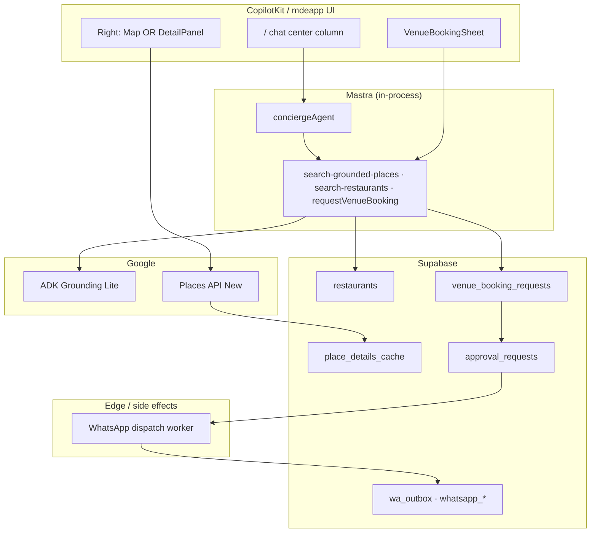
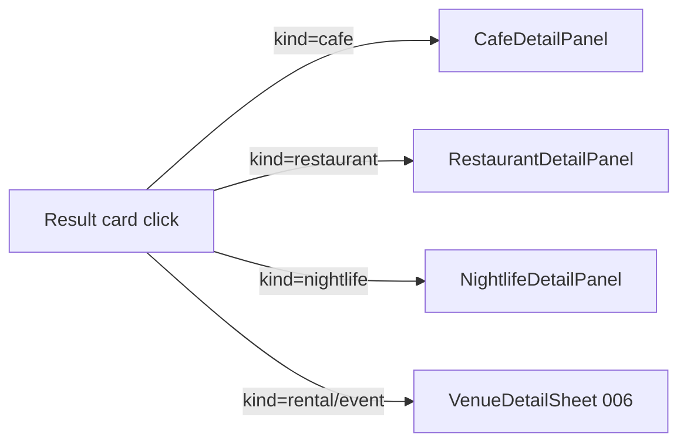

# Venues — architecture

## Executive summary

Venues on `/` is a **single chat surface** with three reusable vertical patterns (café, restaurant, nightlife). **Google** owns geo facts; **Supabase** owns user rows and booking requests; **Mastra** orchestrates tools; **CopilotKit** renders cards and detail panels; **Edge** owns WhatsApp side effects.

---

## Layer cake

```text
(7) OpenClaw     — draft enrichment, WA text proposals (Patricia approves)
(6) Patricia     — /admin/bookings approval queue (Phase C+)
(5) CopilotKit   — cards, detail panels, booking sheet, map column
(4) Mastra       — conciergeAgent, search-grounded-places, search-restaurants
(3) ADK + Places — Grounding Lite discover · Places New enrich (field mask)
(2) Supabase     — restaurants, caches, venue_booking_requests, wa_outbox
(1) Maps JS      — ChatMap, AdvancedMarker, mapId (MAP-001, F50)
```

---

## System diagram



---

## Detail panel routing (invariant)



**Rule:** Never route café/restaurant/nightlife through `VenueDetailSheet`.

---

## Data ownership

| Data type | Source of truth | Never from LLM alone |
|-----------|-----------------|----------------------|
| lat/lng, place_id, hours, phone | Places / ADK grounding | ✅ |
| Address, photos, open_now | Places detail + cache | ✅ |
| Restaurant catalog rows | `public.restaurants` | ✅ |
| Vibe / similarity rank | pgvector (Phase B) | After VEC-005 evals |
| Booking status | `venue_booking_requests.status` | ✅ |
| WhatsApp message body (sent) | Patricia-approved draft | ✅ |

---

## Cross-pillar boundaries

| Pillar | Folder | Overlap with venues |
|--------|--------|---------------------|
| **Maps** | `tasks/maps/` | Pins, Places, ADK — consumed, not reimplemented |
| **Events** | `tasks/events/` | EventCard → 006 sheet; EVP-036 nearby after show |
| **Trips** | `tasks/trips/` | Stripe checkout for tickets — not dinner requests |
| **Vector** | `tasks/vector/` | VEC-001→005 before café/restaurant Phase B rerank |

---

## Coffee tours (optional vertical)

Prompt packs: [`../cafes/listings/`](../cafes/listings/) · OpenClaw: [`../openclaw/OCL-013-mvp-coffee-tour-crawler.md`](../openclaw/OCL-013-mvp-coffee-tour-crawler.md)

Tours are **Phase 2+** — reuse café card pattern + CTI agent roadmap; not blocking 007/008.

---

## Related

- [`02-booking-whatsapp.md`](./02-booking-whatsapp.md)
- [`05-maps-places-adk.md`](./05-maps-places-adk.md)
- [`../notes-venues.md`](../notes-venues.md) — events ↔ venues
