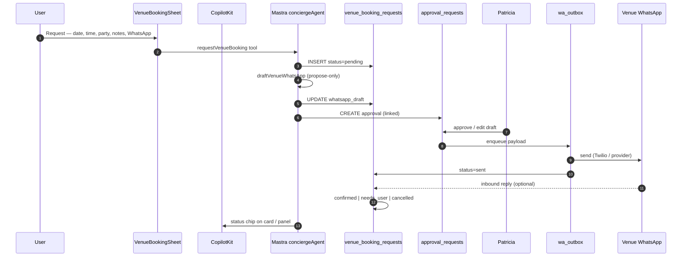

# Booking + WhatsApp plan

## Design principle

**Honest request booking** — Colombia has no OpenTable/Resy. User submits intent; mdeai drafts WhatsApp; **Patricia approves** before send; status updates when venue/human confirms. **Never show "Confirmed"** until `status = confirmed`.

**Not in scope Phase 1:** instant table assignment ([`../drafts/071-restaurant-reservations-schema.md`](../drafts/071-restaurant-reservations-schema.md)), Stripe deposits, owner slot calendars.

---

## User stories

| Persona | Story | Success |
|---------|-------|---------|
| **Sarah** | Quiet café 3h — may **request** group seating later | Request row optional; discovery first |
| **Carlos** | Dinner for 4 via WhatsApp | `venue_booking_requests` + approved WA message |
| **Tourist** | Club table / bottle service request | Same flow, `venue_kind=nightlife` |
| **Patricia** | Review draft before any outbound WA to venue | `approval_requests` linked |
| **Roberto** | After event — nearby bars | EVP-036 → venues tools, **not** this booking table |

---

## Booking flow (sequence)



---

## UI copy rules

| status | User-visible copy |
|--------|-------------------|
| `pending` | "Request received — we'll review shortly" |
| `approved` | (internal — not shown) |
| `sent` | "Message sent to the venue via WhatsApp" |
| `needs_user` | "The venue has a question — check your chat" |
| `confirmed` | "The venue confirmed your request" |
| `cancelled` | "Request cancelled" |

---

## Schema decision: `public.bookings` vs new table

### Audit (2026-05-27)

| Table | Purpose | venue_kind | Status enum | Fit |
|-------|---------|------------|-------------|-----|
| `public.bookings` | Generic ledger (apartment, restaurant, event, tour) | via `booking_type` | pending, confirmed, completed, cancelled, no_show | Missing `sent`, `needs_user`; assumes confirmable inventory |
| CAFE-001 draft | `cafe_booking_requests` | cafe only | pending, confirmed, needs_user, cancelled | Too narrow |
| drafts 071/072 | `restaurant.reservations` | partner SaaS | seated, no_show, etc. | Phase 3 only |

**Decision (VEN-001):** Add **`venue_booking_requests`** — request-only workflow for café | restaurant | nightlife.

- Do **not** INSERT into `public.bookings` for WhatsApp requests until product unifies ledgers (Phase 3+).
- Link optional: `metadata.restaurant_id`, `metadata.booking_id` if promoted later.

### Proposed columns (summary)

```sql
-- venue_kind: cafe | restaurant | nightlife
-- status: pending | approved | sent | confirmed | needs_user | cancelled
-- google_place_id, venue_name, requested_date, requested_time, party_size
-- contact_whatsapp, notes, whatsapp_draft, approval_request_id
```

Full SQL: [`prd-venues.md`](./prd-venues.md) §6.2 · Task: **VEN-001**.

---

## Mastra vs Edge

| Step | Owner | Why |
|------|-------|-----|
| Validate form | Mastra tool | Same process as `/api/copilotkit` |
| INSERT request | Mastra tool (F13 carve-out) or edge `venue-booking-request` | RLS + audit |
| Draft WA text | Mastra agent step | Propose-only; no send |
| Patricia approve | Admin UI → edge/API | Updates `approval_requests` |
| Send message | **Edge worker** + `wa_outbox` | Service role, idempotency |
| Inbound reply | Edge webhook → `whatsapp_messages` | Optional Mastra thread for `needs_user` |

**mde-whatsapp skill:** Twilio template/session for outbound — not OpenClaw gateway for Patricia path.

**Mastra WhatsApp guide:** Use channel adapter pattern for **inbound** concierge; venue outbound stays Patricia-gated.

---

## CopilotKit surfaces

| Component | Task |
|-----------|------|
| `VenueBookingSheet` | VEN-004 — fork `CafeBookingSheet` |
| `useCopilotAction` `requestVenueBooking` | `available: "disabled"` + render mirror |
| Status chip on detail panel | Phase C — reads Supabase row |

---

## AI booking assist (suggest, not auto-book)

| Feature | Phase | Safe? |
|---------|-------|-------|
| Pre-fill party size from chat memory | C+ | ✅ |
| Draft WA message in Spanish/English | C | ✅ propose-only |
| Suggest date/time from Places hours | C+ | ✅ label "based on listed hours" |
| Auto-send without Patricia | Never | ❌ |
| Claim table is held | Never | ❌ |

---

## Related tasks

| ID | Title |
|----|-------|
| VEN-001 | Schema + RLS |
| VEN-004 | Form + Mastra tool |
| VEN-005 | Draft + approval + outbox |
| VEN-007 | Admin queue |
| VEN-010/011 | Phase 3 partner reservations (071/072) |
