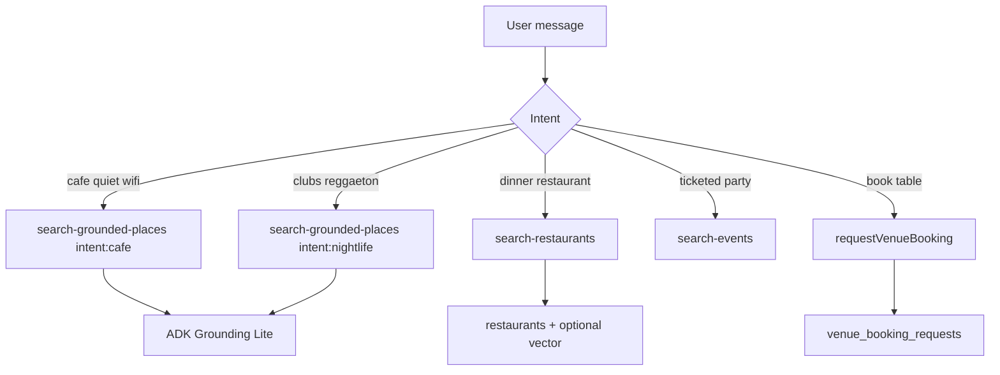

# Agents + tools + CopilotKit

## Agent map

| Agent | When | Model |
|-------|------|-------|
| `conciergeAgent` | Default `/` chat — cafés, restaurants, nightlife, attractions | `gemini-3.5-flash` |
| `hostEventAgent` | `/host/event/new` only | same |
| `rentalAgent` | `/rentals`, rental intent on `/chat` | same |

**Rule:** Venue discovery tools live on **conciergeAgent** only — not hostEventAgent.

---

## Tool routing



---

## Tool inventory

| Tool | Status | Intent / input | Output |
|------|--------|----------------|--------|
| `search-grounded-places` | ✅ cafe | `intent: cafe \| nightlife` | Places-backed cards |
| `search-restaurants` | ✅ partial | filters, query | DB + Places merge |
| `search-events` | ✅ | nightlife **events** only | EventCard — not clubs |
| `requestVenueBooking` | ❌ VEN-004 | place_id, party, datetime | row id + status |
| `draftVenueWhatsApp` | ❌ VEN-005 | booking_request_id | draft text (no send) |

---

## CopilotKit generative UI

| Tool | Card | Detail panel | Booking |
|------|------|--------------|---------|
| cafe | `CafeResultCard` ✅ | `CafeDetailPanel` ✅ | stub → VEN-004 |
| restaurant | ❌ VEN-002 | ❌ | — |
| nightlife | ❌ VEN-003 | ❌ | — |

**Pattern (copilotkit skill):**

```tsx
useCopilotAction({
  name: "requestVenueBooking",
  available: "disabled",
  render: ({ args, status }) => <VenueBookingSheet ... />,
});
```

Agent tool name **must match** Mastra registry key and `useCoAgent` / action name.

---

## Working memory (Phase C+)

Extend concierge working memory with optional slots:

```ts
lastVenueKind: "cafe" | "restaurant" | "nightlife" | null;
lastPlaceId: string | null;
lastBookingRequestId: string | null;
```

Sync: agent Zod schema ↔ `src/lib/types.ts` ↔ (W4) `packages/types`.

---

## Nightlife disambiguation

| User says | Route |
|-----------|-------|
| "reggaeton club Provenza" | `search-grounded-places` intent:nightlife |
| "electronic party Saturday tickets" | `search-events` |
| "bar with live music" | nightlife intent; card shows `place_type` |

---

## Mastra implementation notes

- Tools in `src/mastra/tools/` — one file per domain tool.
- Places calls: always `X-Goog-FieldMask` (mde-maps).
- No service-role in tools except F13 carve-out paths for `ai_runs` / approved server writes.
- Smoke: `mastra-smoke-test` after adding `requestVenueBooking`.

---

## Related specs

- [`../archive/005-scr-cafe-listings-map-booking.md`](../archive/005-scr-cafe-listings-map-booking.md)
- [`../007-scr-nightlife-listings-map.md`](../007-scr-nightlife-listings-map.md)
- [`../008-scr-restaurant-listings-map.md`](../008-scr-restaurant-listings-map.md)
- [`02-booking-whatsapp.md`](./02-booking-whatsapp.md)
