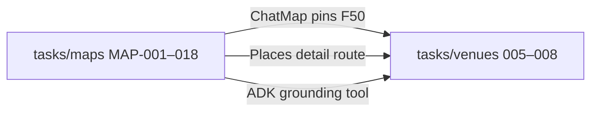
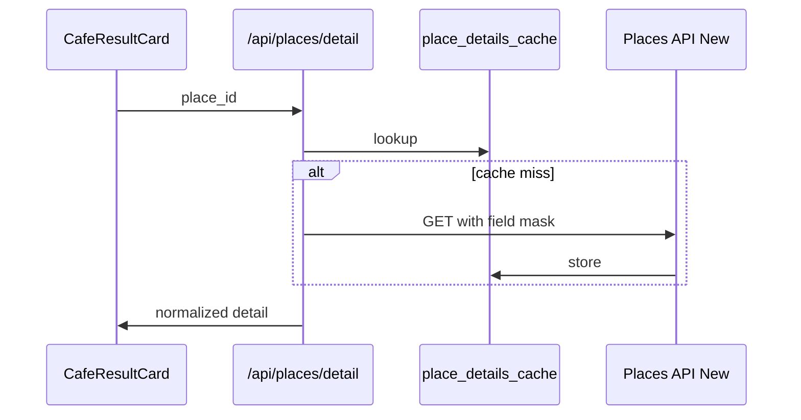

# Maps ↔ Venues

## Relationship

**`tasks/maps/`** ships platform map infrastructure. **`tasks/venues/`** adds vertical UX (cards, detail panels, booking) on top — **no duplicate MAP foundation**.



Full notes: [`../notes-venues.md`](../notes-venues.md) § Maps ↔ Venues.

---

## MAP tasks consumed by venues

| MAP | Status | Venues use |
|-----|--------|------------|
| MAP-001 Map shell | Done | ChatMap column |
| MAP-002 AdvancedMarker | Done | Café pins ✅ |
| MAP-003 Places autocomplete | Done | Host wizard; optional venue search |
| MAP-004 Detail cache | Done | `/api/places/detail` |
| MAP-005 Field masks | Done | Cost control — mandatory |
| MAP-010 Grounding tool | Done | `search-grounded-places` |
| MAP-018 Pin sync F50 | Done | Card ↔ map highlight |

**Venues does not add MAP-019+** unless new map primitive needed (e.g. nightlife cluster styling → small MAP task).

---

## Places API rules (mde-maps)

Every Places API New call:

```http
X-Goog-FieldMask: places.id,places.displayName,places.formattedAddress,...
```

- Detail route: minimal mask for tabs (hours, phone, website, photos).
- Search: never request photos on list endpoint if cost-sensitive.

Every `<AdvancedMarker>`: parent `<Map mapId={...}>` required.

---

## ADK grounding (Phase 2 sidecar)

**Skill:** `google-agents-cli-adk-code` · **Path:** `services/adk-grounding/` (Phase 2 — not blocking MVP UI).

| Use | Tool |
|-----|------|
| Café / nightlife discover | ADK Grounding Lite via Mastra wrapper |
| Structured DB restaurants | `search-restaurants` not ADK |
| Event venues (Roberto) | `event_venues` + Places — events pillar |

ADK returns grounded snippets; Mastra normalizes to card schema shared with Places path.

---

## Detail panel data flow



---

## Nightlife vs events map pins

| Pin type | Source | Color / icon |
|----------|--------|--------------|
| Club / bar (place) | Grounding | nightlife pin set (VEN-003) |
| Ticketed event | `events` table | EventCard — different layer |

Do not mix event lat with Places club search on same click handler without `kind` discriminator.

---

## Roberto cross-sell (EVP-036)

After event publish/view — "nearby cafés/bars" calls **concierge tools**, not event_venues sheet. Map column reuses ChatMap; pins from grounding.

---

## Related

- [`../../maps/INDEX.md`](../../maps/INDEX.md)
- [`01-architecture.md`](./01-architecture.md)
- [`03-agents-tools-copilotkit.md`](./03-agents-tools-copilotkit.md)
