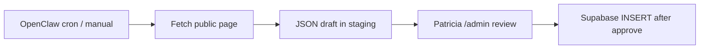

# OpenClaw — venues automation

## Scope boundary

| OpenClaw **does** | OpenClaw **does not** |
|-------------------|------------------------|
| Draft listing copy from public web | Send WhatsApp to venues |
| Propose hours/phone for Patricia review | INSERT production rows without approval |
| Coffee tour crawl (OCL-013+) | Replace Places lat/lng |
| Enrich `restaurants` **draft** JSON | Bypass RLS with service role in mdeapp |

**Runtime:** Hostinger VPS — see `mde-hostinger` / `open-claw` skills. Product app stays on Vercel + Supabase.

---

## Safe job pattern

Staging table or `metadata.openclaw_draft` on existing row — never overwrite `google_place_id` from crawl alone.

---

## OCL task index

| ID | Title | Phase |
|----|-------|-------|
| OCL-013 | Coffee tour crawler MVP | 2 |
| OCL-014 | Restaurant hours backfill propose | 2 |
| OCL-015 | WhatsApp template A/B drafts | 3 |
| OCL-016 | Venue photo caption enrichment | 2 |

Specs: [`../openclaw/`](../openclaw/)

Research PRD (2026-05-08): [`../openclaw/openclaw-restaurant-1.md`](../openclaw/openclaw-restaurant-1.md) — reference only; execution follows OCL-* numbered specs.

---

## VEN-008 alignment

**VEN-008** = wire OpenClaw output into admin review UI — not autonomous publish.

Acceptance:

1. OpenClaw writes draft artifact (file or webhook to edge).
2. Admin lists pending drafts.
3. Approve merges into `restaurants` or discards.

---

## vs mde-whatsapp

| Layer | Skill |
|-------|-------|
| Patricia-approved outbound to venue | `mde-whatsapp` + `wa_outbox` |
| OpenClaw gateway channels | `open-claw` — **no** production venue messaging in Phase 1 |

---

## Related

- [`02-booking-whatsapp.md`](./02-booking-whatsapp.md)
- [`04-supabase-seeds-vectors.md`](./04-supabase-seeds-vectors.md)
