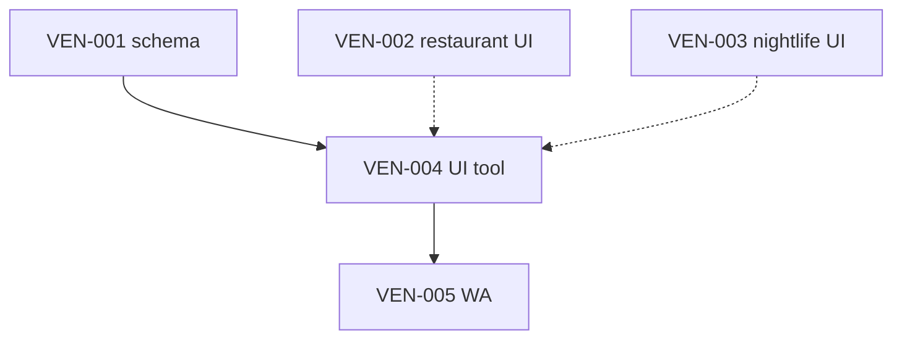

# Risks + blockers

## Active blockers

| ID | Blocker | Impact | Mitigation |
|----|---------|--------|------------|
| B1 | No `venue_booking_requests` table | Booking stub only | VEN-001 |
| B2 | `wa_outbox` empty / no send worker | WA path untested | VEN-005 + mde-whatsapp Twilio |
| B3 | Restaurant/nightlife UI missing | 008/007 specs not implemented | VEN-002, VEN-003 |
| B4 | Vector rerank unvalidated | Premature semantic search | VEC-001→005 before flag |
| B5 | Patricia admin queue not built | Cannot approve drafts | VEN-007 |

---

## Architecture risks

| Risk | Likelihood | Severity | Mitigation |
|------|------------|----------|------------|
| False "Confirmed" UX | Medium | High | Separate request table; copy rules in 02 |
| LLM-invented addresses | Low | High | Places/ADK only for geo |
| Service-role leak in mdeapp | Low | Critical | F13 hook; edge for WA send |
| CopilotKit agent name mismatch | Medium | Medium | `source-command-copilotkit-check` |
| Places cost blowout | Medium | Medium | Field masks MAP-005 |
| Nightlife routed to events | Medium | Medium | Intent table in 03 |

---

## Spec conflicts (resolved)

| Conflict | Resolution |
|----------|------------|
| CAFE-001 vs VEN-001 | VEN-001 unified table supersedes cafe-only |
| 071/072 vs Phase 1 WA | Defer to VEN-010/011 Phase 3 |
| `public.bookings` vs requests | Separate tables Phase 1 |
| 006 sheet vs detail panels | 006 = rental/event only |
| `tasks/venues/drafts/venues/` vs place discovery | Event B2B — link only |
| `007-wire-nightlife-explorer.md` stub | Use `007-wire-nightlife-listings-map` |

---

## Operational risks

| Risk | Owner | Note |
|------|-------|------|
| Venue never replies on WA | Patricia | `needs_user` + manual follow-up |
| Twilio template rejection | Sofía | Pre-register templates |
| OpenClaw crawl ToS | Legal | Public pages only; draft review |
| Stale `restaurants` rows | VEN-009 cron | google_place_id backfill |

---

## Dependency risks

VEN-004 can ship café booking first; restaurant/nightlife panels improve UX but are not hard deps for schema.

---

## Related

- [`02-booking-whatsapp.md`](./02-booking-whatsapp.md)
- [`10-status-audit.md`](./10-status-audit.md)
- [`../notes-venues.md`](../notes-venues.md)
