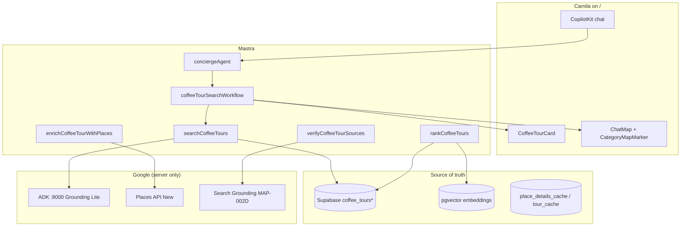

# Coffee Tour Intelligence — roadmap

> **North star:** A Tourist (or nomad) asks *“best authentic coffee farm tour near Medellín”* on `/` → ranked **verified** tour cards + ☕ map pins + “why recommended” — not a Google clone and not hallucinated URLs.

**Spec source:** [`docs/08-cafe-prompt.md`](./docs/08-cafe-prompt.md) or [`08-cafe-prompt.md`](./08-cafe-prompt.md) (full architect brief).  
**Listing research:** [`../listings/cafes/`](../listings/cafes/) — seed data + prompts already drafted.  
**Executable tasks:** [`tasks/INDEX.md`](./tasks/INDEX.md) — **VEN-032/B** + VEN-033–020 with skills + MCP per [`index-skills.md`](../../index-skills.md). **Audit:** [`tasks/audit/31-agent-tasks.md`](../../audit/31-agent-tasks.md).

---

## Executive summary

| Layer | Today | Gap |
|-------|--------|-----|
| **Chat + map UI** | ✅ CopilotKit 1.55.2, `GroundedPlaceCard`, `CategoryMapMarker`, MAP-031 copy | No tour-specific card or `coffee_tour` category |
| **Geo discovery** | ✅ `search-grounded-places` → ADK Grounding Lite → Places enrich (MAP-018) | Tours not distinguished from cafés in agent routing |
| **Canonical DB** | ⚠️ `tourist_destinations` (23 rows) — generic attractions | No `coffee_tours*` tables, no tour embeddings |
| **Semantic rank** | ⚠️ pgvector on legacy project (3 HNSW indexes) | No `coffee_tour_embeddings` pipeline in mdeapp |
| **Web verify** | ⚪ MAP-002D / GS-* not shipped | Needed for booking URLs, Instagram, blogs |

**Recommendation:** Ship in **three phases** — (A) curated Supabase + SQL rank, (B) hybrid pgvector + Places/Search enrich, (C) compare/save/trip actions. Reuse MAP-030 pin/overlay pattern; do **not** fork a second map stack.

**MVP seed set (verified targets):** La Sierra / Urban Coffee Tour, La Casa Grande, Corazón de León, Expedition Colombia, Proyecto Renacer, Café Atardecer — per [`05a-coffee-tours.md`](../listings/cafes/05a-coffee-tours.md).

---

## Source documents (read order)

| Doc | Role |
|-----|------|
| [`08-cafe-prompt.md`](./08-cafe-prompt.md) | Full requirements (tools, schema, scoring, UI) |
| [`07-cafe-plan.md`](./07-cafe-plan.md) | Short architecture + table sketch |
| [`05a-coffee-tours.md`](../listings/cafes/05a-coffee-tours.md) | Top-10 ranked draft + score weights |
| [`05-coffee-tours.md`](../listings/cafes/05-coffee-tours.md) | JSON-shaped listing payloads |
| [`06-coffee-tours.md`](../listings/cafes/06-coffee-tours.md) | Production dataset + SQL migration draft |
| [`prompt-tours.md`](../listings/cafes/prompt-tours.md) | Research/scrape prompt for humans or Firecrawl |
| [`plan/competitors/10-tripAI.md`](../../plan/competitors/10-tripAI.md) | Mindtrip-style hybrid search pattern |

---

## Current setup audit (mdeapp + sidecar)

### What already exists (reuse)

| Area | Location | Reuse for tours |
|------|----------|-----------------|
| Concierge agent | `mdeapp/src/mastra/agents/concierge.ts` | Extend intent + tool routing; add `lastCoffeeTourQuery` working memory |
| Grounded places tool | `search-grounded-places.ts` + ADK `search_grounded_places` | **Phase A:** query suffix `"coffee farm tour"` / `"coffee tour Medellín"` |
| Places enrich | MAP-018B sidecar + `normalize-tool-output.ts` | Same field masks; tour-specific `primaryType` filter |
| Generative UI | `search-tool-renders.tsx` → `GroundedPlaceCard` | Template for `CoffeeTourCard` (extra fields: duration, best_for, score) |
| Map pins | `CategoryMapMarker` ☕ + `SelectedPlaceOverlayCard` | Add glyph `tour` or reuse `grounded` with `meta.tour=true` until MAP-030 extends categories |
| Map context | `MapContext` + F50 `panToPin` + F50b `locationBias` | Distance boost uses `mapUi.viewport` |
| Places client | `MAP-004` `@googlemaps/places` + `/api/places/photo` | Details for `place_id` on canonical rows |
| Cache | `place_details_cache` (MAP-018E) | Extend or parallel `coffee_tour_cache` for API responses |
| Auth / RLS pattern | Supabase legacy + F08 | New tables: RLS on user interaction tables only |

### What is missing

| Gap | Owner task |
|-----|------------|
| `coffee_tour` Mastra intent + tools | VEN-036–007 |
| Supabase core schema + RLS | **VEN-032** → VEN-033 |
| Logs/cache tables | **VEN-041** (after 001A) |
| Seed ≥3 verified `place_id` tours | VEN-034 |
| `rankCoffeeTours` before tool | **VEN-035** → VEN-036 |
| `CoffeeTourCard` + map pins | VEN-038–008 |
| Dedicated smoke + evidence | VEN-040–010 |
| Search Grounding verifier (MAP-002D) | VEN-045 (Phase B; GS-001) |
| Embedding pipeline (server-only) | **VEN-044** (Phase B — not Phase A) |
| Agent prompt: tours ≠ cafés | VEN-036 (blocking routing tests) |
| OpenClaw crawler | **OCL-013-mvp** — VEN-019-ARCHIVED cancelled |

### pgvector today

- Legacy Supabase project has vector indexes (PRD: 3 tables) — **not wired in mdeapp** for tours.
- **Rule:** factual fields (rating, lat, `place_id`, URLs) from Places/DB only; embeddings only for **vibe text** and **intent matching** ([`08-cafe-prompt.md`](./08-cafe-prompt.md) §6).

---

## Architecture



**Invariant:** Gemini never invents coordinates, ratings, review counts, hours, or URLs — tools + DB only ([`CLAUDE.md`](../../CLAUDE.md) + MAP-018).

---

## CopilotKit interaction model

### User asks

Examples: *“Find me the best authentic coffee farm tour near Medellín”*, *“social impact coffee tour La Sierra”*, *“English-speaking farm tour with pickup”*.

### Routing (Phase A — minimal)

| Step | Behavior |
|------|----------|
| 1 | `conciergeAgent` detects tour intent (keywords: `coffee tour`, `farm tour`, `coffee farm`, `finca`, `cafetero`) |
| 2 | Call **`searchCoffeeTours`** (not generic `search-restaurants`) |
| 3 | Tool returns ranked rows + pin payloads |
| 4 | `useCopilotAction` / disabled tool render mirrors tool → **`CoffeeTourCard`** list |
| 5 | `ToolPinsSync` merges pins into `MapContext` (`category: grounded`, `meta.listingType: coffee_tour`) |
| 6 | Agent prose: ≤2 sentences (same rule as grounded cafés — MAP-018) |

### Actions (phased)

| Action | Phase | Mechanism |
|--------|-------|-----------|
| Open map | A | `panToPin` / Maps URL from row |
| Website / Directions / Reviews | A | MAP-019 CTAs from `googleMapsLinks` |
| Save | B | `saveCoffeeTour` → `coffee_tour_user_interactions` |
| Compare | B | `compareCoffeeTours` → `CoffeeTourCompareDrawer` |
| WhatsApp | B | `phone` from Places — `wa.me` link only if verified |

### Intent chips (query bar)

Extend `ChatQueryBar` with tour intents (mirror F39 event chips):

| Chip | Filters / vector boost |
|------|----------------------|
| Authentic farm | `authenticity_score` + embedding “real farm hands-on” |
| Social impact | `social_impact` tag + La Sierra boost |
| Beginner-friendly | `best_for` contains beginner |
| Near Poblado / Laureles | `locationBias` + neighborhood filter |
| English tour | `languages` array |
| Sunset tour | name/summary match atardecer |

---

## Data model (Supabase)

**Canonical DDL draft:** [`06-coffee-tours.md`](../listings/cafes/06-coffee-tours.md) (adjust RLS before apply).

| Table | Purpose |
|-------|---------|
| `coffee_tours` | Canonical listing — facts from Places + human curation |
| `coffee_tour_sources` | Provenance: website, IG, GetYourGuide, blog URL |
| `coffee_tour_profiles` | AI narrative: `ai_summary`, `best_for`, `farm_story` — **not** trusted as facts |
| `coffee_tour_embeddings` | `content_text` + `vector(1536)` — vibe only |
| `coffee_tour_rank_signals` | Precomputed score components + `final_score` |
| `coffee_tour_user_interactions` | save/compare/view — RLS per `auth.uid()` |
| `coffee_tour_search_logs` | Patricia ops — query, filters, result ids |
| `coffee_tour_cache` | Optional raw API snapshots (TTL) |

**Embed this text, not raw JSON facts:**

```text
Authentic community-focused coffee farm tour in Barrio La Sierra with hands-on harvesting, coffee tasting, cable car access, Medellín hillside views, local family guides, social impact story, beginner-friendly.
```

**Do not embed:** `place_id`, rating numbers alone, URLs (stale risk).

---

## Mastra tools (contracts summary)

| Tool | Read/write | Source of truth | Phase |
|------|------------|-----------------|-------|
| `searchCoffeeTours` | Read | SQL + optional ADK discovery → merge | A |
| `enrichCoffeeTourWithPlaces` | Read | Places Details by `place_id` | A |
| `verifyCoffeeTourSources` | Read | MAP-002D Search Grounding | B |
| `rankCoffeeTours` | Read | SQL signals + vector + intent boosts | A/B |
| `saveCoffeeTour` | Write | `coffee_tour_user_interactions` | B |
| `compareCoffeeTours` | Read | 2–3 ids from DB | B |
| `getNearbyCoffeeTourContext` | Read | `mapUi.viewport` + haversine | B |

**`searchCoffeeTours` input (sketch):**

```ts
{
  query: string;
  neighborhood?: string;
  intent?: "authentic_farm" | "social_impact" | "beginner" | "english" | "sunset" | "budget";
  locationBias?: { latitude: number; longitude: number };
  limit?: number; // default 5
}
```

**Output:** `{ tours: CoffeeTourCardDTO[], pins: MapPin[], attribution?: GroundingAttribution }` — align with `normalize-tool-output` shape.

---

## Scoring (mdeai Coffee Tour Score /100)

From [`05a-coffee-tours.md`](../listings/cafes/05a-coffee-tours.md) + [`07-cafe-plan.md`](./07-cafe-plan.md):

| Component | Weight | Source |
|-----------|--------|--------|
| Rating + review confidence | 25 | Places `rating`, `userRatingCount` |
| Authenticity / farm experience | 20 | Human + AI profile (bounded) |
| Source verification | 15 | `coffee_tour_sources.trust_score` |
| Social impact / local story | 15 | Curator flags |
| Distance / viewport fit | 10 | F50b viewport |
| Language fit | 5 | `languages[]` vs user hint |
| Price / duration fit | 5 | Structured fields if known |
| Booking / availability confidence | 5 | Search verify + `openNow` |

**Below 70:** show card with “limited verification” badge. **Below 55:** seed only, do not surface in chat until verified.

---

## UI plan

| Component | Path (proposed) | Notes |
|-----------|-----------------|-------|
| `CoffeeTourCard` | `mdeapp/src/components/copilot/coffee-tour-card.tsx` | Extends grounded card + score badge |
| `CoffeeTourScoreBadge` | same folder | `/100` + tooltip factors |
| `CoffeeTourSourceBadges` | same | “Official site”, “GetYourGuide”, etc. |
| Map pin | Reuse `CategoryMapMarker` | New glyph `tour` (☕→🌄 or keep ☕ + subtitle) |
| Overlay | Reuse `SelectedPlaceOverlayCard` | `meta.summary` = why recommended |
| `CoffeeTourCompareDrawer` | `mdeapp/src/components/copilot/coffee-tour-compare.tsx` | Phase B |
| Detail page | `mdeapp/src/app/tours/[slug]/page.tsx` | Phase C — SEO + share |

**Card fields:** name, ★ + count, neighborhood, tour type, why recommended, best_for, price/duration if known, confidence, CTAs (Map, Website, WhatsApp, Save, Compare).

---

## Implementation roadmap (ordered tasks)

### Phase A — Curated tours in chat (MVP, ~2 weeks)

| ID | Task | Files / surface | Acceptance | Effort | Risk |
|----|------|-----------------|------------|--------|------|
| **VEN-032** | Core migration: `coffee_tours` + sources + profiles + RLS | `mdeapp/supabase/migrations/` | RLS on; advisors clean; **no** logs/embed in same file | 3h | Med |
| **VEN-041** | Logs + cache tables | second migration | After 001A; before VEN-042 evidence | 1h | Low |
| **VEN-033** | Types + Zod: `CoffeeTour`, `CoffeeTourSearchFilters` | `src/lib/types/coffee-tour.ts` | Vitest parse fixtures | 2h | Low |
| **VEN-034** | Seed tours from `05a` / `06` | `scripts/seed-coffee-tours.mjs` | **≥3 verified `place_id`** before VEN-038+ | 3h | **High** if IDs missing |
| **VEN-035** | `rankCoffeeTours` SQL (no vector in Phase A) | `rank-coffee-tours.ts` | Score &lt;55 hidden; &lt;70 limited badge; Vitest | 3h | Low |
| **VEN-036** | `searchCoffeeTours` tool + routing | `concierge.ts`, tool file | **After VEN-035**; “coffee tour” → tool only; blocking Vitest | 4h | Med |
| **VEN-037** | Places enrich by `place_id` | MAP-018B client | Only rows with verified `place_id` | 2h | Med |
| **VEN-038** | CopilotKit: `CoffeeTourCard` + tool render | `search-tool-renders.tsx`, `coffee-tour-card.tsx` | Vitest render; pins sync like grounded | 5h | Med |
| **VEN-039** | Map pins + `meta.listingType=coffee_tour` | `ChatMap`, markers | Not café `grounded` only; ≥3 pins | 2h | Low |
| **VEN-040** | Smoke: `smoke:coffee-tours` | `scripts/smoke-coffee-tours.mjs` | Tour routing + score gates + ≥3 cards/pins | 2h | Low |
| **VEN-042** | Evidence + Done | `tasks/notes/CTI-A-evidence.md` | 001A/B migrated; **no** semantic search claim | 1h | Low |

**Phase A verify:**

```bash
cd mdeapp
npm test -- src/lib/types/coffee-tour src/components/copilot/coffee-tour
npm run smoke:coffee-tours
SMOKE_GROUNDING_QUERY="best coffee farm tour in medellin" npm run smoke:grounding-attribution  # optional overlap check
npm run floor
```

---

### Phase B — Hybrid search + verify (~1.5 weeks)

| ID | Task | Depends | Acceptance |
|----|------|---------|------------|
| **VEN-044** | `coffee_tour_embeddings` + embed job (server) | VEN-032 | pgvector skill; **Phase B** — not Phase A MVP |
| **VEN-045** | `verifyCoffeeTourSources` via MAP-002D | GS-001, MAP-002D | booking URL + IG verified or marked unknown |
| **VEN-046** | ADK discovery merge: Grounding Lite finds candidates → upsert staging | MAP-002 | Duplicates deduped by `place_id` |
| **VEN-047** | `saveCoffeeTour` + Saved nav hook | F08 auth | RLS: user sees own saves only |
| **VEN-048** | `CoffeeTourCompareDrawer` + `compareCoffeeTours` | VEN-038 | 2–3 tours side-by-side |
| **VEN-049** | Query bar intent chips (tours) | SCREEN-003 | Chips inject Copilot instructions |

---

### Phase C — Product depth (post-MVP)

| ID | Task | Notes |
|----|------|-------|
| **VEN-043** | `/tours/[slug]` detail page | Stripe-free; share OG later MAP-023 |
| **VEN-050** | `coffeeTourSearchWorkflow` (extract from concierge) | Cleaner than monolithic agent |
| **VEN-019-ARCHIVED** | ~~OpenClaw~~ **Cancelled** | Canonical: [`OCL-013-mvp`](../../openclaw/tasks/OCL-013-mvp-coffee-tour-crawler.md) |
| **VEN-051** | WhatsApp handoff templates | Colombia channel Phase 2 |

---

## When to use which Google surface

| Need | Use | Not |
|------|-----|-----|
| NL “coffee farm tour La Sierra” | ADK Grounding Lite | Gemini guessing |
| `place_id`, rating, photos, hours | Places Details (MAP-004 masks) | Search snippets |
| Booking page, blog, IG handle | Search Grounding (MAP-002D) | Places alone |
| Ranked list in chat | Supabase + `rankCoffeeTours` | Raw ADK-only |
| Map pins | Normalized `MapPin[]` | Client Places JS |

---

## Risks and mitigations

| Risk | Mitigation |
|------|------------|
| Tours confused with cafés | Separate tool + intent; agent rule in `concierge.ts` |
| Hallucinated URLs | Search verify + `source_confidence`; show “unverified” |
| Duplicate operators (Urban vs La Sierra names) | Curator `slug` + `place_id` unique |
| API cost | `place_details_cache` + `coffee_tour_cache`; limit 5 cards |
| AGPL / scrape pollution | Human seed first; Firecrawl only via `prompt-tours.md` workflow |
| MAP-002D not ready | Phase A works on SQL seed without web verify |

---

## Dependencies (do not start until)

| Dependency | Status | Blocks |
|------------|--------|--------|
| MAP-002 + ADK sidecar | ✅ | VEN-036 discovery path |
| MAP-004 + 018 enrich | ✅ | VEN-037 |
| MAP-030/031 map UX | ✅ | VEN-039 |
| F48–F50 + F50b | ✅ | Pins + bias |
| MAP-002D + GS-001 | ⚪ | VEN-045 only |
| F09 Vitest | ✅ | All CTI tests |

---

## Final recommendation

1. **Start VEN-032 → 001B → 002 → 003** this week: core schema + **≥3 verified `place_id`** seeds (La Sierra, La Casa Grande, Corazón de León, …).
2. **Ship VEN-035 → 004 → 005 → 007–010** as one PR: SQL rank + tool + cards — **no pgvector** (VEN-044) in Phase A.
3. **Parallel content:** run [`prompt-tours.md`](../listings/cafes/prompt-tours.md) or manual curation to fill `06-coffee-tours.md` gaps (Artisan = low confidence until verified).
4. **Defer** compare/save/detail page until Phase A smoke is green on localhost.

**Success looks like:** `list best coffee farm tours in medellin` → 5 tour cards, ☕/tour pins on map, MAP-031-style results strip, agent does not list tour names in prose, `npm run smoke:coffee-tours` passes.

---

## Evidence (when Done)

`tasks/notes/CTI-A-evidence.md` — localhost boot, smoke output, screenshot, Vitest count.

---

## Related indexes

- **CTI tasks:** [`tasks/INDEX.md`](./tasks/INDEX.md)
- Maps: [`tasks/maps/INDEX.md`](../maps/INDEX.md)
- Agents: [`tasks/agent/`](./) (this folder)
- Listings research: [`tasks/listings/cafes/`](../listings/cafes/)
- Grounding Search: [`tasks/grounding-search/tasks/INDEX.md`](../grounding-search/tasks/INDEX.md)
- OpenClaw crawler: [`tasks/agent/openclaw/100-openclaw-plan.md`](./openclaw/100-openclaw-plan.md) · VEN-019-ARCHIVED
