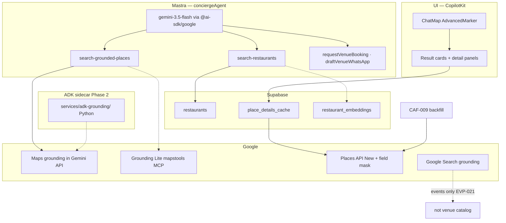

# Gemini · Maps · ADK — venues routing (café · restaurant · nightclub)

**Task spine:** [`../tasks/index-tasks.md`](../tasks/index-tasks.md) · **Maps platform:** [`../../maps/INDEX.md`](../../maps/INDEX.md)

Golden rule (mde-maps): **Places owns facts** · **Grounding owns discover** · **pgvector owns vibe** · **never invent hours/address from LLM alone**.

---

## Stack layers (what to use when)



| Layer | Product | Venues use | Dev-only? |
|-------|---------|------------|-----------|
| **Gemini model** | `gemini-3.5-flash` | All Mastra agents + tool loops | No |
| **Function calling** | AI SDK tools | Mastra tools → CopilotKit renders | No |
| **Structured output** | JSON schema on 2nd call | Normalize card payloads after grounding | Core |
| **Embeddings** | `gemini-embedding-001` @ 768d | Restaurant rerank (VEC-005) | Advanced |
| **Maps grounding** | `tools: [{ googleMaps: {} }]` | Café + nightclub **discover** | Core |
| **Grounding Lite** | `mapstools.googleapis.com` | Optional runtime `search_places` | Advanced |
| **Places API New** | `@googlemaps/places` + mask | Seeds, detail tabs, CAF-009 | Core |
| **Maps JS + markers** | `@vis.gl/react-google-maps` | Pins F50, `mapId` required | Core (shipped) |
| **Google Search grounding** | Gemini web search tool | **Not** café/restaurant inventory — events ([EVP-021](../../events/EVP-021-mvp-google-search-grounding.md)) | Out of scope |
| **ADK** | Python Agent + tools | Phase 2 sidecar; not in-process Mastra | Advanced |

---

## By venue kind

### Café

| Need | Core (Phase 1) | Advanced (Phase 2+) | Task |
|------|----------------|----------------------|------|
| Discover "quiet WiFi Laureles" | Maps grounding via `search-grounded-places` `intent:cafe` | + pgvector rerank after evals | CAF-A5 ✅ · VEC-005 |
| Filter bar-lounge noise | `normalizeCafeGroundingQuery` + row filter | ML ranker | shipped in tool |
| Detail hours/phone/photos | `/api/places/detail` + cache | generativeSummary at seed (if CO coverage) | CAF-007 · CAF-009 |
| Curated anchors | — | CAF-003 CSV + cache warm | CAF-003 |
| Map pins | AdvancedMarker + F50 sync | Cluster MAP-009 | MAP-001 ✅ |
| Booking WA draft | Gemini text in `draftVenueWhatsApp` | — | CAF-011 |
| ADK | — | Sidecar duplicate of grounding tool | **VEN-GEM-010** |

### Restaurant

| Need | Core | Advanced | Task |
|------|------|----------|------|
| Discover / filter | `search-restaurants` → Supabase catalog | Hybrid semantic + Places | CAF-004 · VEC-005 |
| Card + detail UI | Places merge on row | Menu OCR OpenClaw | RST-001 |
| Seed place_id | Places Text Search + field mask | Batch generativeSummary | CAF-004 · CAF-009 |
| Map pins | Same ChatMap; `kind=restaurant` | Custom pin icon | RST-001-W |
| Booking | Shared `venue_kind=restaurant` | Partner reservations | CAF-008+ |

**Do not** use Maps grounding as primary restaurant path when catalog rows exist — grounding supplements gaps only.

### Nightclub / bar

| Need | Core | Advanced | Task |
|------|------|----------|------|
| Discover "reggaeton Provenza" | `search-grounded-places` **`intent:nightlife`** (new) | Anchor seed + cache | NGT-001 · CAF-005 |
| vs ticketed party | Route to `search-events` | — | agent prompt |
| Detail panel | Places detail (same as café) | Live "open now" bias | NGT-002 |
| Map pins | Nightlife pin styling | Cluster dense Provenza | NGT-001-W |
| Booking bottle/table | `venue_kind=nightlife` | — | CAF-008+ |

**Exclude** from nightlife intent: cafés (`intent:cafe` filter already excludes clubs from café queries — mirror for nightlife).

---

## Gemini features → tasks

### Core MVP

| Feature | Implementation | Maps to |
|---------|----------------|---------|
| **Agent model** | `google("gemini-3.5-flash")` in `conciergeAgent` | All CAF-010+ |
| **Tool calling** | Mastra tools registered on agent | CAF-010, NGT-001, RST-001 (render only) |
| **Maps grounding discover** | Existing wrapper in `search-grounded-places` | CAF-A5 ✅, NGT-001 |
| **Places detail** | `getPlaceDetails` + minimal field mask | CAF-007, CAF-009 |
| **Structured card schema** | Zod normalize tool output → CopilotKit | RST-001, NGT-002 |
| **Working memory** | `lastVenueKind`, `lastPlaceId` | CAF-012 |
| **WA draft copy** | Single-turn `generateContent` propose-only | CAF-011 |
| **Kill switch** | `MAPS_GROUNDING_DAILY_LIMIT=0` → Supabase fallback | ops runbook |
| **Attribution** | Grounding chips + Maps ToS on cards | MAP-002 ✅ |

### Advanced

| Feature | Implementation | Maps to | Notes |
|---------|----------------|---------|-------|
| **Embeddings rerank** | `gemini-embedding-001` + pgvector | VEC-003→005 | After CAF-006 evals |
| **Grounding Lite MCP** | Live `search_places` at `mapstools.googleapis.com` | **VEN-GEM-020** | Fallback if Gemini Maps quota hit |
| **Sequential grounding → JSON** | Call 1 grounded · Call 2 structured (no maps tool) | **VEN-GEM-021** | mde-maps March 2026 pattern |
| **generativeSummary** | Places mask at **seed** time only | CAF-009 | EN/US/IN coverage — verify CO |
| **Google Search grounding** | Web citations | **EVP-021** only | Menus/news — not place_id SoT |
| **ADK Python sidecar** | `services/adk-grounding/` HTTP → Mastra | **VEN-GEM-030** | google-agents-cli-adk-code |
| **Live API voice** | Gemini Live | Phase 3 | Tourist hands-free — defer |
| **Interactions API** | Stateful steps | Phase 3 | Deep Research venue guides — defer |
| **Autocomplete session tokens** | MAP-010 | Host wizard + venue search bar | Post-MVP |
| **Directions / Routes CTAs** | MAP-011, MAP-019 | Detail panel "Get directions" | Advanced |
| **Neighborhood intel** | MAP-012 | "What's Provenza like tonight?" | Advanced |

---

## Suggested new task IDs (Gemini/Maps band)

Add under `tasks/venues/tasks/` when ready — **after** CAF-001–009 data spine.

| ID | Layer | Title | Phase | Depends |
|----|-------|-------|-------|---------|
| **VEN-GEM-001** | TOOLS | Nightlife intent + filters in `search-grounded-places` | Core | CAF-005 (= NGT-001) |
| **VEN-GEM-002** | TOOLS | Restaurant tool: optional vector flag | Advanced | VEC-005 |
| **VEN-GEM-003** | AGENT | Concierge routing matrix (café/restaurant/nightlife/event) | Core | CAF-012 |
| **VEN-GEM-004** | TOOLS | Structured output normalizer (grounding → card Zod) | Core | RST-001, NGT-002 |
| **VEN-GEM-010** | ADK | Spike: ADK grounding vs in-process Mastra latency | Advanced | MAP-010 |
| **VEN-GEM-020** | TOOLS | Grounding Lite fallback path | Advanced | VEN-GEM-001 |
| **VEN-GEM-021** | TOOLS | Two-step grounding + JSON cards | Advanced | VEN-GEM-004 |
| **VEN-GEM-030** | ADK | Production sidecar + Mastra HTTP bridge | Advanced | VEN-GEM-010 |
| **VEN-GEM-040** | UI | Detail panel Maps CTAs (directions, reviews link) | Advanced | MAP-019 |
| **VEN-GEM-050** | DATA | generativeSummary backfill at seed (if CO eligible) | Advanced | CAF-009 |

---

## Agent + tool matrix (conciergeAgent)

| User intent | Tool | Gemini feature | Google API |
|-------------|------|----------------|------------|
| Quiet café WiFi | `search-grounded-places` | Maps grounding + function call | Maps via Gemini |
| Dinner Italian Poblado | `search-restaurants` | Function call + DB read | Places on detail |
| Reggaeton club tonight | `search-grounded-places` `intent:nightlife` | Maps grounding | Maps via Gemini |
| Party with tickets | `search-events` | Function call | Supabase events |
| Book table | `requestVenueBooking` | Function call → DB | — |
| Draft WA to venue | `draftVenueWhatsApp` | `generateContent` text | — |

**Model verify before ship:** gemini-api-docs-mcp — use `gemini-3.5-flash`, not deprecated 2.x.

---

## Maps / markers checklist (all kinds)

| Rule | Skill ref | Task |
|------|-----------|------|
| Parent `<Map mapId={...}>` | mde-maps | MAP-001 ✅ |
| `<AdvancedMarker>` per pin | mde-maps | MAP-002 ✅ |
| Pin sync card ↔ map | F50 | CAF-A5 ✅ |
| `data-testid="map-pin"` | MASTRA-045 | Playwright |
| Per-kind pin merge (`category`) | maps-js-api | RST-001-W, NGT-001-W |
| Field mask on every Places call | mde-maps | CAF-004, CAF-009 |
| Medellín bias `6.2442, -75.5812` | mde-maps | all grounding |
| No `GOOGLE_PLACES_API_KEY` in VITE_ | security | env audit |

---

## ADK — when to use (google-agents-cli-adk-code)

| Use ADK | Don't use ADK |
|---------|---------------|
| Isolated Python sidecar for grounding experiments | In-process Mastra tool (Phase 1) |
| Multi-agent venue ops (scrape + verify + propose) | CopilotKit UI wiring |
| Callbacks / state for long crawl jobs | Simple `requestVenueBooking` insert |
| Deploy to Cloud Run separately | `/api/copilotkit` hot path |

**Phase 1 path:** Mastra + `@ai-sdk/google` + existing grounding wrapper.  
**Phase 2 path:** `VEN-GEM-030` — ADK agent exposes HTTP tool Mastra calls; Patricia still approves outbound WA.

```text
Camila (/chat) → Mastra conciergeAgent → [in-process grounding]
Patricia (ops) → OpenClaw / ADK sidecar → draft rows → admin approve → Supabase
```

---

## Core vs advanced summary

| | Core (ship with CAF-010–018, RST-001, NGT-001) | Advanced |
|---|--------------------------------------------------|----------|
| **Gemini** | 3.5-flash, tool calling, WA draft text | Embeddings, Interactions, Live |
| **Maps** | Grounding discover, Places detail, markers F50 | Grounding Lite, Routes CTAs, MAP-012 |
| **Data** | CAF-001–009 seeds + cache | generativeSummary, OpenClaw enrich |
| **ADK** | — | Sidecar VEN-GEM-030 |
| **Search** | — | EVP-021 web only (events) |

---

## Implementation order (Gemini/Maps slice)

1. **CAF-001–005** — data inventory + seeds (Places verify, no grounding changes)  
2. **NGT-001 / VEN-GEM-001** — nightlife intent (mirror café filter pattern)  
3. **RST-001 / NGT-002** — cards + detail (Places detail API only)  
4. **VEN-GEM-004** — structured normalize if card schema drifts  
5. **CAF-009** — Places batch backfill (server `@googlemaps/places`)  
6. **VEC-005** — embedding rerank flag on `search-restaurants`  
7. **VEN-GEM-010 → 030** — ADK spike → sidecar  

---

## Related

- [`03-agents-tools-copilotkit.md`](./03-agents-tools-copilotkit.md)
- [`05-maps-places-adk.md`](./05-maps-places-adk.md)
- [`../tasks/INDEX.md`](../tasks/INDEX.md) (numbering + tracks)
- [`../../maps/MAP-018-mindtrip-grounded-place-cards.md`](../../maps/MAP-018-mindtrip-grounded-place-cards.md)

*Verify models + Maps SKUs via MCP before implementation.*
