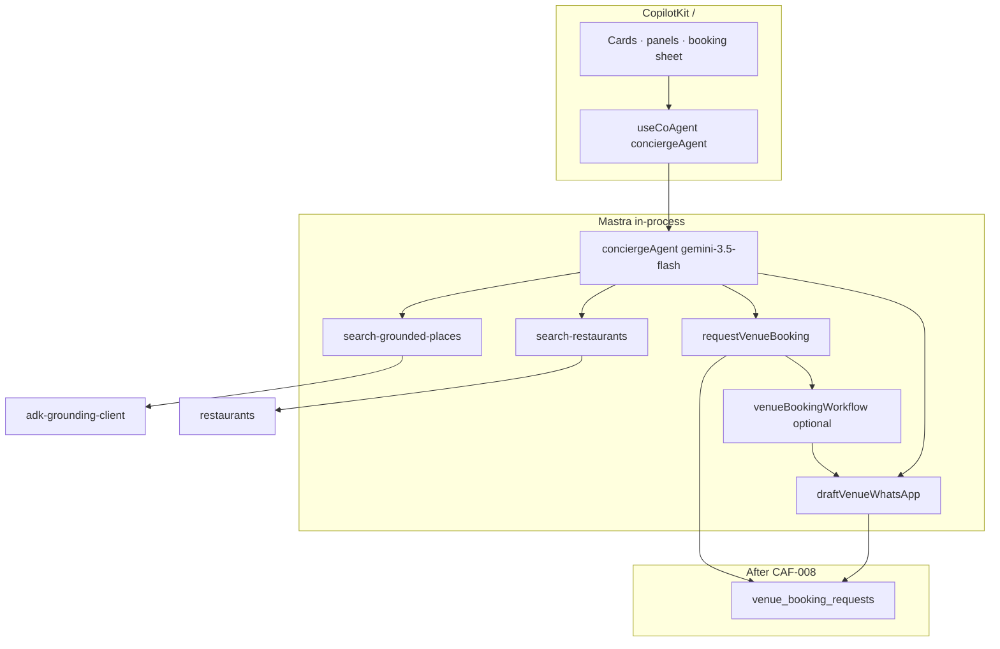

# Mastra — venues routing (café · restaurant · nightclub)

**Task spine:** [`../tasks/index-tasks.md`](../tasks/index-tasks.md) · **Platform:** [`../../mastra/INDEX.md`](../../mastra/INDEX.md) · **Gemini/Maps:** [`11-gemini-maps-adk-venues-routing.md`](./11-gemini-maps-adk-venues-routing.md)

**MCP before coding:** `searchMastraDocs` / `readMastraDocs` on `user-mastra` with `projectPath: /home/sk/mdeai/mdeapp`. Embedded docs: `node_modules/@mastra/core/dist/docs/`.

**Pattern 1 law:** `conciergeAgent` key = `useCoAgent({ name: "conciergeAgent" })` = CopilotKit agent prop. Venues ship on **`conciergeAgent` only** — no `venueAgent` in Phase 1.

---

## Shipped today (mdeapp)

| Component | Status | Venues note |
|-----------|--------|-------------|
| `conciergeAgent` | ✅ default `/` | Instructions cover café grounding; not nightlife/booking |
| `search-grounded-places` | ✅ `intent:cafe` | Uses `invokeAdkGrounding` + quota + café filters |
| `search-restaurants` | ✅ | Supabase catalog + fallback |
| `search-events` | ✅ | Ticketed parties — **not** clubs |
| `conciergeRoutingWorkflow` | ✅ | Deterministic classify; **no** `venue_place` / `nightlife_place` intent |
| Working memory | ✅ | Rentals/events/mapUi — **no** venue booking slots |
| Postgres storage / `ai_runs` | ✅ F13, MASTRA-004 | Audit new tools with `withAudit` |
| `hostEventAgent` / `rentalAgent` | ✅ | Out of scope for place discovery |

---

## Architecture



| Use **Agent** | Use **Workflow** |
|---------------|------------------|
| Open-ended chat, tool pick, prose rules | Booking pipeline: validate → insert → draft WA → await approval |
| Multi-turn memory | Patricia HITL suspend/resume (Advanced) |
| CopilotKit streaming | Cron/batch N/A |

---

## Agent map (venues)

| Agent | Role | Phase |
|-------|------|-------|
| **`conciergeAgent`** | All venue discover + book on `/` | Core |
| `evaluationAgent` | Golden query regression (CAF-006) | Advanced |
| `conciergeRoutingWorkflow` | Optional deterministic pre-route | Advanced |
| ~~venueAgent~~ | **Do not add** — splits CopilotKit mount | — |

### conciergeAgent — tool routing (target)

| User intent | Tool | Kind |
|-------------|------|------|
| Quiet café / WiFi / coffee | `search-grounded-places` `intent:cafe` | café |
| Dinner / cuisine / restaurant | `search-restaurants` | restaurant |
| Reggaeton club / bar Provenza | `search-grounded-places` `intent:nightlife` | nightclub |
| Party tickets / festival | `search-events` | event |
| Book table / request seating | `requestVenueBooking` | all |
| (internal) after booking row | `draftVenueWhatsApp` | workflow step |

### Working memory extensions (MSV-004)

Add to `conciergeWorkingMemorySchema`:

```ts
lastVenueKind: z.enum(["cafe", "restaurant", "nightlife"]).optional(),
lastPlaceId: z.string().optional(),
lastVenueName: z.string().optional(),
lastBookingRequestId: z.string().optional(),
lastGroundedPlaceResults: z.array(z.object({
  placeId: z.string().optional(),
  title: z.string(),
})).optional(),
```

Sync: agent Zod ↔ `src/lib/types.ts` ↔ CopilotKit state readers.

---

## Tools inventory

| Tool | Core/Adv | Task | Depends |
|------|----------|------|---------|
| `search-grounded-places` café | ✅ shipped | — | CAF-A5 |
| `search-grounded-places` nightlife | **Core** | **MSV-001** | CAF-005, NGT-001 |
| `search-restaurants` | ✅ shipped | **MSV-011** vector flag | VEC-005 |
| `requestVenueBooking` | **Core** | **MSV-002** | CAF-008 |
| `draftVenueWhatsApp` | **Core** | **MSV-003** | MSV-002 |
| `normalizeVenueToolOutput` | **Core** | **MSV-006** | MASTRA-046 pattern |
| Places detail | Not Mastra — `/api/places/detail` | — | CAF-007 |

**Tool rules (mastra skill + mdeai-concierge):**

- `createTool` in `src/mastra/tools/` — verify signature via embedded docs
- Zod input/output on every tool
- `withAudit` wrapper on writes (MASTRA-004)
- No coordinates/prices from LLM — tool output only
- Grounding quota: `incrementAndCheckGroundingQuota`

---

## Workflows

| Workflow | Core/Adv | Purpose | Task |
|----------|----------|---------|------|
| `venueBookingWorkflow` | **Core** | Steps: validate → insert `venue_booking_requests` → `draftVenueWhatsApp` → return pending | **MSV-007** |
| `venueBookingWorkflow` + **suspend** | Advanced | Pause until Patricia approves; resume with `approval_request_id` | **MSV-010** |
| Extend `conciergeRoutingWorkflow` | Advanced | Add `cafe_place`, `nightlife_place` deterministic intents | **MSV-014** |

**MSV-007 sketch (verify APIs via Mastra MCP):**

```ts
// createWorkflow({ id: 'venue-booking-workflow', ... })
// .then(validateBookingStep)
// .then(insertRequestStep)      // Supabase insert
// .then(draftWhatsAppStep)      // Gemini text, no send
// .commit()
```

**Advanced HITL:** Mastra `suspend()` in step after draft; Patricia admin resumes with edited draft — mirrors CopilotKit HITL for Roberto events, but booking approval is **Patricia ops**, not user chat.

---

## MSV task register

### Core MVP

| ID | Title | Layer | Maps to | Depends |
|----|-------|-------|---------|---------|
| **MSV-001** | Nightlife intent + filters in `search-grounded-places` | TOOL | NGT-001, VEN-GEM-001 | CAF-005 |
| **MSV-002** | `requestVenueBooking` tool | TOOL | CAF-010 | CAF-008 |
| **MSV-003** | `draftVenueWhatsApp` tool (propose-only) | TOOL | CAF-011 | MSV-002 |
| **MSV-004** | Working memory venue slots | AGENT | CAF-012 | MSV-002 |
| **MSV-005** | Concierge instructions: restaurant/nightlife/booking rules | AGENT | CAF-012 | MSV-001 |
| **MSV-006** | `normalizeVenueToolOutput` + card kind discriminator | WIRE | RST-001, NGT-002 | MASTRA-046 |
| **MSV-007** | `venueBookingWorkflow` (validate → insert → draft) | WORKFLOW | CAF-010–011 | MSV-002, MSV-003 |
| **MSV-008** | Vitest: venue tools + agent tool list | TEST | CAF-018 | MSV-001–003 |

### Advanced

| ID | Title | Layer | Depends |
|----|-------|-------|---------|
| **MSV-010** | Booking workflow suspend/resume (Patricia) | WORKFLOW | MSV-007, CAF-016 |
| **MSV-011** | `search-restaurants` semantic rerank flag | TOOL | VEC-005, CAF-006 |
| **MSV-012** | `evaluationAgent` + CAF-006 golden queries | AGENT | CAF-006 |
| **MSV-013** | Optional MCPClient → Maps Grounding Lite | TOOL | VEN-GEM-020 |
| **MSV-014** | `conciergeRoutingWorkflow` venue intents | WORKFLOW | MSV-001 |
| **MSV-015** | `withAudit` + `ai_runs` on venue tool writes | OBS | MASTRA-004 |

---

## Implementation order (Mastra slice)

After **CAF-008** schema:

1. **MSV-001** — nightlife intent (parallel with CAF-005 data)  
2. **MSV-002** → **MSV-003** → **MSV-007** — booking tool chain  
3. **MSV-004** + **MSV-005** — memory + instructions  
4. **MSV-006** — before **RST-001** / **NGT-002** UI if card actions drift  
5. **MSV-008** — Vitest gate  
6. **NGT-002** / **RST-001** — CopilotKit renders (not Mastra)  
7. **MSV-010+** — advanced  

---

## MCP + verification checklist

| Step | Command / tool |
|------|----------------|
| Package versions | `listMastraPackages` (user-mastra) |
| API signature | `searchMastraDocs` query + `projectPath: /home/sk/mdeai/mdeapp` |
| Agent tools list | `conciergeAgent.listTools()` in Vitest |
| Smoke | `mastra-smoke-test` skill — Studio + tool trace |
| Localhost | `npm run dev` + POST `/api/copilotkit` |
| Done gate | `task-verifier` + anti-fake-done #9 |

---

## Cross-platform tasks (do not duplicate)

| ID | Owner | Venues touch |
|----|-------|--------------|
| MASTRA-046 | normalizeToolOutput | MSV-006 extends |
| MASTRA-047 | pin merge | F50 + venue kinds |
| GROUNDING-001 | maps/mastra | MSV-001 grounding |
| F13 | Postgres memory | booking thread persistence |
| CK-* | CopilotKit | disabled actions, panels |

---

## Related

- [`03-agents-tools-copilotkit.md`](./03-agents-tools-copilotkit.md)
- [`02-booking-whatsapp.md`](./02-booking-whatsapp.md)
- [`../tasks/MSV-001-nightlife-grounding-intent.md`](../tasks/MSV-001-nightlife-grounding-intent.md)
- [`../tasks/MSV-002-request-venue-booking-tool.md`](../tasks/MSV-002-request-venue-booking-tool.md)
- [`../tasks/post-mvp/030-ven-mastra-booking-workflow.md`](../tasks/post-mvp/030-ven-mastra-booking-workflow.md)

*Verify Mastra APIs via MCP before implementing workflows — do not trust training data.*
