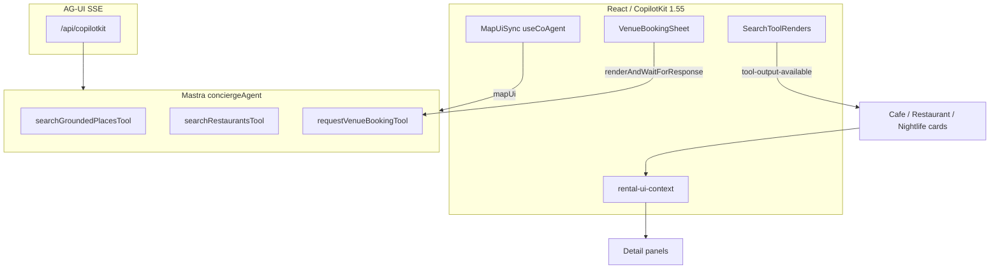

# CopilotKit — venues routing (café · restaurant · nightclub)

**Task spine:** [`../tasks/index-tasks.md`](../tasks/index-tasks.md) · **Mastra tools:** [`12-mastra-venues-routing.md`](./12-mastra-venues-routing.md) · **AG-UI:** Mastra via `@ag-ui/mastra` + `getLocalAgentsWithLogging`

**MCP before coding:** `search-docs`, `search-code`, `search-ag-ui-docs` on `project-0-mdeai-copilotkit`.

**Phase 1 pin:** CopilotKit **1.55.2** — use `@copilotkit/react-core` `useCopilotAction` + `useCoAgent`. Do **not** mix v2 imports (`useRenderTool` from `@copilotkit/react-core/v2`) until Phase 2 migration.

---

## Shipped today

| Surface | Status | File(s) |
|---------|--------|---------|
| Runtime Pattern 1 | ✅ | `src/app/api/copilotkit/route.ts` |
| `conciergeAgent` mount | ✅ | `layout.tsx` / geo-chat-shell |
| `SearchToolRenders` | ✅ | `search-tool-renders.tsx` |
| Café cards | ✅ | `CafeResultCard` in grounded render |
| Café detail column | ✅ | `CafeDetailPanel` + `rental-ui-context` |
| Café booking stub | ✅ | `cafeBookingTarget` state (no Mastra persist) |
| Restaurant tool render | 🟡 | `GenericResults` + `PlaceResultCard` — not SCREEN-023 |
| Nightlife UI | ❌ | Grounded render hardcodes `kind: "cafe"` |
| Booking generative UI | ❌ | No `requestVenueBooking` render |
| HITL booking | ❌ | Roberto pattern exists (`renderAndWaitForResponse`) |

---

## AG-UI tool name law (critical)

From [`mastra-tool-action-names.ts`](../../../mdeapp/src/platform/copilot/mastra-tool-action-names.ts):

| Layer | Example |
|-------|---------|
| Mastra `tools: { … }` registry key | `searchGroundedPlacesTool` |
| `createTool` id | `search-grounded-places` |
| `useCopilotAction({ name })` | **Register BOTH** registry key + legacy id |

```tsx
useCopilotAction({ name: "searchGroundedPlacesTool", available: "disabled", render }, []);
useCopilotAction({ name: "search-grounded-places", available: "disabled", render }, []);
```

New booking tool (MSV-002): expect `requestVenueBookingTool` + `request-venue-booking` — verify on disk before CKV-006.

---

## Architecture



---

## Generative UI patterns by feature

### 1. Discovery cards (disabled tool render)

**Pattern:** `useDisabledToolRender` wrapper (existing) — agent executes tool; UI only renders.

| Kind | Component | Task |
|------|-----------|------|
| Café | `CafeResultCard` | ✅ CAF-A5 |
| Restaurant | `RestaurantResultCard` | **CKV-001** |
| Nightclub | `NightlifeResultCard` or kind-aware card | **CKV-003** |

MCP ref: [Tool Rendering](https://docs.copilotkit.ai/integrations/ag2/generative-ui/tool-rendering) — AG-UI streams tool events; CopilotKit renders.

### 2. Detail panel (app state, not tool render)

**Pattern:** `rental-ui-context` — `openCafeDetail` / future `openRestaurantDetail` / `openNightlifeDetail`.

| Kind | Panel | Right column |
|------|-------|--------------|
| Café | `CafeDetailPanel` | ✅ |
| Restaurant | `RestaurantDetailPanel` | **CKV-002** |
| Nightclub | `NightlifeDetailPanel` | **CKV-004** |

**Rule:** Never route café/restaurant/nightlife through `VenueDetailSheet` (rental/event only).

### 3. Booking (HITL)

**Pattern:** Mirror Roberto [`host-event-copilot-bridge.tsx`](../../../mdeapp/src/components/host/host-event-copilot-bridge.tsx):

```tsx
useCopilotAction({
  name: "requestVenueBookingTool", // verify registry key
  available: "disabled",
  renderAndWaitForResponse: ({ args, respond, status }) => (
    <VenueBookingSheet args={args} status={status} onSubmit={(v) => respond?.(v)} />
  ),
});
```

Also register legacy `request-venue-booking` id if AG-UI streams it.

User submits → `respond(payload)` unblocks agent → MSV-002 persists row.

**Not** Patricia approval in chat — admin queue (**CAF-017**). Optional **CKV-024** `useCoAgentStateRender` for status chip only.

### 4. Shared state (`useCoAgent`)

| State | Hook | Task |
|-------|------|------|
| `mapUi` pins/viewport | `map-ui-sync.tsx` | extend pin kinds **CKV-021** |
| Working memory | Mastra thread memory | MSV-004 |
| Filter chips | `chat-filter-copilot-instructions.tsx` | **CKV-010** |

MCP ref: [Mastra shared state](https://docs.copilotkit.ai/integrations/mastra/shared-state)

### 5. Pins + normalize

| File | Venues change |
|------|---------------|
| `normalize-tool-output.ts` | `grounded` → split `cafe` / `nightlife` pin category **CKV-021** |
| `ToolPinsSync` | `mergePinsByCategory` per kind |
| F50 | Card click ↔ map highlight |

---

## CKV task register

### Core MVP

| ID | Title | Kind | Maps to | Depends |
|----|-------|------|---------|---------|
| **CKV-001** | `RestaurantResultCard` + search-tool-renders | restaurant | RST-001 | CAF-004 |
| **CKV-002** | `RestaurantDetailPanel` + context | restaurant | RST-001 | CKV-001 |
| **CKV-003** | Grounded render kind split (café vs nightlife) | nightclub | NGT-002, MSV-001 | MSV-001 |
| **CKV-004** | `NightlifeDetailPanel` + mobile sheet | nightclub | NGT-002 | CKV-003 |
| **CKV-005** | `VenueBookingSheet` component | all | CAF-013 | — |
| **CKV-006** | `requestVenueBooking` disabled + `renderAndWaitForResponse` | all | CAF-014, MSV-002 | CKV-005, MSV-002 |
| **CKV-007** | Unified `VenuePlaceDetail` types in context | all | CKV-002, CKV-004 | — |
| **CKV-008** | Booking status chips on detail panels | all | CAF-015 | CKV-006 |
| **CKV-009** | `mastra-tool-action-names` booking keys | all | CKV-006 | MSV-002 |
| **CKV-010** | Filter chips + instructions for nightlife | all | MSV-005 | MSV-001 |
| **CKV-011** | Vitest card + render tests | all | RST-002, NGT-003 | CKV-001–004 |
| **CKV-012** | Playwright SCREEN-021/022/023 | all | CAF-018 | CKV-006+ |

### Advanced

| ID | Title | Notes |
|----|-------|-------|
| **CKV-020** | `useCopilotReadable` venue booking draft for agent | Optional context |
| **CKV-021** | Map pin category `nightlife` + marker glyph | mde-maps |
| **CKV-022** | AG-UI event trace checklist (copilotkit-debug) | Sofía ops |
| **CKV-023** | `RichCardResultsRegistrar` per venue kind | Dedup |
| **CKV-024** | `useCoAgentStateRender` booking status | Read-only chip |
| **CKV-030** | Migrate to CopilotKit v2 `useRenderTool` | Phase 2 only |

---

## Implementation order (CopilotKit slice)

```
MSV-001 → CKV-003 → CKV-004 → NGT-003 Playwright
CAF-004 → CKV-001 → CKV-002 → RST-002
MSV-002 → CKV-005 → CKV-006 → CKV-009 → CKV-008 → CKV-012
```

Parallel: **CKV-010** with MSV-005.

---

## Debug checklist (copilotkit-debug)

| Symptom | Check |
|---------|-------|
| Tool runs, no cards | `useCopilotAction` name mismatch — grep registry + id |
| Cards, no pins | `normalizeToolOutput` / missing lat-lng |
| Wrong panel opens | `groundedDetailTarget` kind hardcoded `cafe` |
| Booking stuck | `renderAndWaitForResponse` without `respond()` |
| Agent 404 | `useCoAgent({ name: "conciergeAgent" })` vs `mastra.agents` key |

Use AG-UI Inspector (VS Code extension per MCP docs) for event trace.

---

## File touch map

| File | CKV tasks |
|------|-----------|
| `components/copilot/search-tool-renders.tsx` | 001, 003, 006 |
| `components/chat/rental-ui-context.tsx` | 002, 004, 007 |
| `components/cafe/cafe-detail-panel.tsx` | 008 (pattern) |
| `components/restaurant/*` | 001, 002 (new) |
| `components/nightlife/*` | 003, 004 (new) |
| `components/venues/venue-booking-sheet.tsx` | 005, 006 (new) |
| `platform/copilot/mastra-tool-action-names.ts` | 009 |
| `platform/maps/normalize-tool-output.ts` | 021 |
| `components/copilot/map-ui-sync.tsx` | 021 |
| `components/chat/chat-map-panel.tsx` | 002, 004 |
| `components/chat/map-mobile-sheet.tsx` | 002, 004 |

---

## Related

- [`03-agents-tools-copilotkit.md`](./03-agents-tools-copilotkit.md)
- [`../tasks/mvp/009-ven-restaurant-result-card.md`](../tasks/mvp/009-ven-restaurant-result-card.md)
- [`../tasks/mvp/012-ven-grounded-kind-split.md`](007b-ven-grounded-kind-split.md)
- [`../tasks/mvp/018-ven-booking-copilot-action.md`](../tasks/mvp/018-ven-booking-copilot-action.md)
- [`../../core/F50-copilotkit-map-ui-state.md`](../../core/F50-copilotkit-map-ui-state.md)

*Verify tool registry names on disk after MSV-002 lands.*
