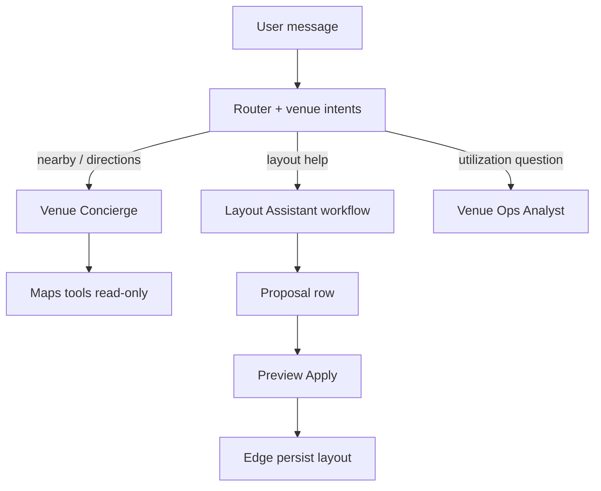

# Venue agents — Mastra architecture

**PRD:** [venue-management-prd-v1.md](./venue-management-prd-v1.md) · **Maps:** [venue-maps-integration.md](./venue-maps-integration.md) · **Routing:** [mastra-routing](../../../.claude/skills/mastra-routing/SKILL.md)

Package: `my-mastra-app/`. Register only after venue tables/columns exist.

---

## 1. Agent catalog

| Agent | ID | Responsibility | Must NOT |
|-------|-----|----------------|----------|
| **Venue Concierge** | `venue-concierge` | Directions, nearby POI, parking narrative | Book room, change venue row |
| **Venue Intake Coach** | `venue-intake-coach` | Wizard field hints, capacity warnings | Auto-create venue without confirm |
| **Layout Assistant** | `venue-layout-agent` | Zone proposals (theater/banquet) | Write `event_venue_layouts` |
| **Venue Ops Analyst** | `venue-ops-analyst` | Explain utilization, suggest dates | Change bookings |
| **Event Orchestrator** | extends `router` | `venue_help`, `nearby_dining` intents | Replace ticket router |
| **Sponsor Venue Fit** | `sponsor-venue-agent` | Read Hermes scores, draft outreach | Checkout |

**Not separate monolith** — extend existing `router` + `concierge` per mastra-routing rules.

---

## 2. Workflows

| Workflow | Steps | Trigger |
|----------|-------|---------|
| `venue-discovery-workflow` | resolve place_id → enrich cache → format card | Chat “venue near Poblado” |
| `venue-layout-proposal-workflow` | load event meta → Gemini structured layout → validate schema | Host clicks “Suggest layout” |
| `venue-availability-explain-workflow` | read blocks + bookings → natural language | “Why can't I book Saturday?” |
| `nearby-attendee-workflow` | venue lat/lng → Nearby Search → format 5 cards | Event detail AI panel |

Align with EVT-044 implementation — workflow calls same tools as UI.

---

## 3. Tools (typed, Zod)

| Tool | R/W | Backend |
|------|-----|---------|
| `get-venue` | R | `event_venues` + places_cache join |
| `list-organizer-venues` | R | RLS scoped |
| `search-places-autocomplete` | R | Edge proxy Places (New) |
| `get-nearby-pois` | R | PLACES-016 / cache |
| `propose-layout` | W proposal row | `venue.agent_proposals` table (mirror contest pattern) |
| `get-event-venue-context` | R | events ⋈ venues |

**Forbidden tools (CI static scan):** `insert-venue-booking`, `update-venue-booking`, raw `supabase.from('event_venue_bookings').insert`.

---

## 4. Memory (concierge extension)

```typescript
// Illustrative — thread scoped
lastVenueId?: string;
lastEventVenueQuery?: string;
lastNearbyResults?: string[]; // place_ids only, not full POI blobs
```

No storage of full layout JSON in memory — refetch on turn.

---

## 5. Orchestration diagram



---

## 6. Approval gates

| Action | Gate |
|--------|------|
| Layout persist | User Apply + edge Zod |
| Booking hold | Edge 041 only |
| WA venue reminder | OpenClaw + campaign_approvals |
| Sponsor outreach | Paperclip optional |

---

## 7. Audit

- All agent runs → `ai_runs` (`agent_name`, tokens, status).  
- Proposals → `venue.agent_proposals` (or shared `agent_proposals` with `domain=venue`).  
- Applied layouts → `audit_log` with `source=edge:venue-layout-apply`.

---

## 8. MASTRA backlog (proposed IDs)

| ID | Title | Depends |
|----|-------|---------|
| MASTRA-090 | Venue router intents + smoke | EVT-039 |
| MASTRA-091 | `nearby-attendee-workflow` | EVT-044, PLACES-016 |
| MASTRA-092 | `venue-layout-proposal-workflow` | 040 schema |
| MASTRA-093 | Venue concierge memory keys | MASTRA-089 pattern |
| MASTRA-094 | Layout schema eval + no-booking-mutation scan | MASTRA-011 |

_File YAML under `tasks/mastra/tasks/` when scheduled._

---

## 9. Hermes + Paperclip + OpenClaw

| System | Venue role |
|--------|------------|
| **Hermes** | `venue_utilization_score`, `sponsor_foot_traffic_proxy` |
| **Paperclip** | Approve layout proposals at scale (enterprise) |
| **OpenClaw** | Execute WA “how to get there”, ops digests — [venue-automation-strategy.md](./venue-automation-strategy.md) |
