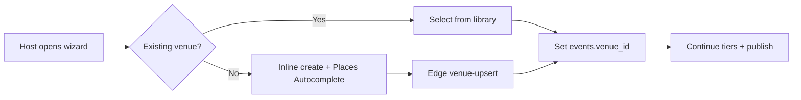

# Venue operational workflows

**PRD:** [venue-management-prd-v1.md](./venue-management-prd-v1.md)

All workflows respect **propose-only** AI and **edge-owned** writes.

---

## 1. Venue onboarding (organizer)



| Step | Owner | Acceptance |
|------|-------|------------|
| Autocomplete | Edge + Maps | `place_id` + lat/lng stored |
| RLS | Postgres | Only organizer sees draft venues |
| Denormalize | Edge | `events.address` copied for legacy filters |

---

## 2. Event-to-venue binding

- One **primary** venue per event (MVP).  
- Multi-venue festivals: Phase 4 — use `event_stakeholders` + child events pattern.  
- Contest finals: `vote.contests.event_id` → event → venue_id.

---

## 3. Venue approval (future B2B)

| State | Meaning |
|-------|---------|
| `inquiry` | External client request |
| `hold` | Tentative block on 041 |
| `confirmed` | Contract + deposit |
| `cancelled` | Released hold |

**MVP:** Internal organizer only — skip public approval.

---

## 4. Booking workflow (Phase 2 — task 041)

1. Organizer selects venue + layout + time range.  
2. Edge checks `event_venue_bookings` with `EXCLUDE USING gist`.  
3. Conflict → 409 with conflicting event ids.  
4. Success → hold row + optional Mastra **proposal** for staffing.  
5. Human confirms → `confirmed`.  

**AI:** May suggest alternate slots — never INSERT booking.

---

## 5. Availability workflow (038)

- Blocks: `open`, `blocked`, `maintenance`.  
- iCal import (RRULE) — Phase 2b.  
- Published events auto-block window on confirm.

---

## 6. Staff assignment (037 + ticket staff links)

| System | Scope |
|--------|-------|
| `event_venue_staff` | AV, catering, security **venue** roster |
| `event-staff-link-generator` | **Event** door scan JWT (034 / EVT-023) |

Do not merge — Roberto uses event staff link, not venue HR record.

---

## 7. QR check-in at venue

Uses **ticket spine** (not venue module):

`buyer → order → attendee → QR → ticket-validate → event_check_ins`

Venue module supplies **display name + map** on scanner UI header.

---

## 8. AI concierge (venue context)

**Trigger:** “¿Dónde queda?” “¿Parqueadero?” “restaurantes cerca”

| Step | System |
|------|--------|
| Load event + venue | Edge read |
| Route intent | Mastra router → maps tools |
| Nearby Search | PLACES-016 / EVT-044 |
| Reply | Concierge + Grounding attribution |

No PII from other attendees.

---

## 9. WhatsApp venue workflows

| Workflow | When | Executor |
|----------|------|------------|
| Event location pin | After ticket purchase | Template (edge) |
| T-24h “how to get there” | Cron | OpenClaw post-approve |
| Venue manager ops alert | Booking confirmed | OpenClaw internal |
| Finals backstage | T-2h | [openclaw-contests](../contests/openclaw-contests.md) |

---

## 10. Sponsor workflows at venue

1. `event_sponsors_link` (031) ties sponsor package to event.  
2. Impression surfaces on event page (049).  
3. Hermes: foot-traffic proxy from check-in count vs capacity.  
4. Sponsor ROI digest — OpenClaw screenshot + email.

---

## 11. Venue analytics workflow

| Report | Cadence | Data |
|--------|---------|------|
| Utilization % | Weekly | booked hours / available |
| Revenue per venue | Per event | `event_orders` sum by `events.venue_id` |
| Check-in rate | Post-event | attendees scanned / sold |

Mastra **narrates**; SQL **computes**.

---

## 12. AI automation workflow (propose → apply)

```text
User asks for layout help
  → Mastra venue-layout-agent → JSON proposal
  → UI preview on map/floor plan
  → User Apply
  → Edge writes event_venue_layouts
  → audit_log row
```

Same pattern for pricing and staffing suggestions (archive 043).
