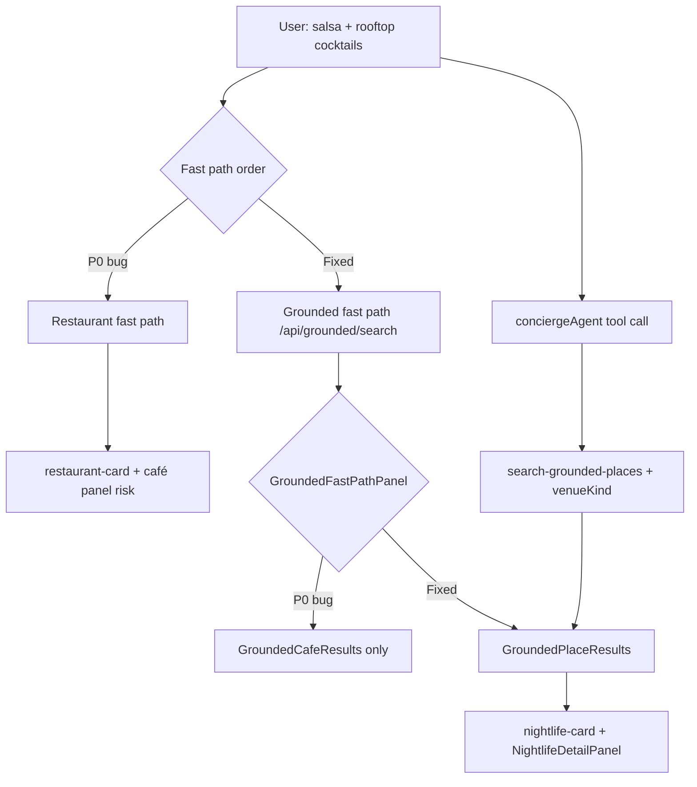

# PR #48 Forensic Audit Report

**PR:** [feat(venues): grounded nightlife split and detail panel](https://github.com/amo-tech-ai/mdeapp/pull/48)  
**Branch:** `feat/venues-nightlife-split-panel` @ `a39d72c`  
**Scope:** VEN-012 / VEN-013 + SCREEN-022  
**Auditor lens:** CopilotKit 1.55.2 (Pattern 1 in-process Mastra) + Mastra `createTool` / AG-UI  
**MCP verification:** CopilotKit MCP **not connected** this session; Mastra `searchMastraDocs` returned no hits. Findings below are from **skills** (`.claude/skills/copilotkit*`, `mastra`) + **disk** + prior local runs—not claimed 100% against live docs.

---

## Executive verdict

```text
Percent correct:     86/100
Merge readiness:     78/100
Security / RLS:      N/A (no new tables)
Recommendation:      Do not mark Done; merge only after P0 routing fix + pushed e2e proof
```

| Dimension | Score | Notes |
|-----------|------:|-------|
| VEN-012 `venueKind` + tool metadata | 90 | `withVenueKindMetadata` on quota/ADK paths; unit tests present |
| VEN-013 nightlife UI | 88 | Panel, mobile sheet, stub sheet; reuses `CafeResultCard` props (acceptable) |
| CopilotKit ↔ Mastra wiring | 92 | `useCopilotAction` + `MASTRA_TOOL_IDS.grounded`; `conciergeAgent` key aligned |
| Fast-path / classifier integration | **62** | **P0 bug** on remote branch |
| E2E / CI | 80 | Floor + Vercel green; SCREEN-022 flaky on remote without fix |
| Scope discipline | 94 | Booking renderer removed; no VEN-021 persist |

---

## What is correct (verified on disk)

### CopilotKit + Mastra (matches project skills)

| Check | Status | Evidence |
|-------|--------|----------|
| Pattern 1 in-process | OK | `route.ts` → `CopilotRuntime` + `getLocalAgentsWithLogging({ mastra })` |
| v1 only (no v2 mix) | OK | `useCopilotAction`, `useCoAgent`, `@copilotkit/*` **1.55.2** |
| Tool render mirror | OK | `useDisabledToolRender(MASTRA_TOOL_IDS.grounded, groundedToolRender)` → `GroundedPlaceResults` |
| Tool name rule | OK | Renders use `MASTRA_TOOL_IDS` (`search-grounded-places`), not export keys |
| Agent name match | OK | `getCopilotKitClientProps("conciergeAgent")` ↔ `mastra.agents.conciergeAgent` |
| Generative UI | OK | `available: "disabled"` + `render` (skill-mapped v2 `useRenderTool`) |
| F13 logging hook | OK | `LoggingMastraAgent` wraps `MastraAgent.run()` |

### Mastra tool layer (VEN-012)

- `resolveVenueGroundingKind` / `isNightlifeGroundingQuery` / `filterNightlifeGroundingRows`
- `metadata.venueKind` via `withVenueKindMetadata`
- Nightlife fallback: `searchNightclubVenueAnchors` before restaurant fallback for café
- `readGroundedVenueKind` → metadata first, then row inference
- Attribution join by `mapsUrl` (not index zip)

### Product / scope

- Phase A booking stub only (copy: no persist) — aligned with VEN-019+ deferral
- No `venueBookingToolRender` on branch (prior blocker fixed in `a39d72c`)
- `CafeResultCard` minimal props (`testId`, `resultKind`) — no missing `result-card-shell`

---

## Critical fixes (P0 — block merge confidence)

### P0-1: Restaurant fast path hijacks nightlife queries

`RESTAURANT_RE` includes bare `\brooftop\b`. SCREEN-022 query:

> *Salsa bars and rooftop cocktails locals go to in El Poblado*

→ `looksLikeRestaurantSearch` **true** → `useRestaurantSearchFastPath` runs **before** agent → `restaurant-card`, not `nightlife-card`.

**Impact:** Manual smoke and Playwright fail on **remote** `a39d72c` unless agent path wins (slow/flaky).

**Fix (identified locally, not on remote):**

- Add `looksLikeNightlifeGroundingSearch` and exclude from `looksLikeRestaurantSearch`
- Narrow `rooftop` → `rooftop dinner` in `RESTAURANT_RE`
- Unit tests for SCREEN-022 query string

### P0-2: Grounded fast path ignores `venueKind`

```12:12:mdeapp/src/components/chat/grounded-fast-path-panel.tsx
      <GroundedCafeResults result={toolResult} />
```

Fast path hits `/api/grounded/search` → `searchGroundedPlacesTool` with correct `metadata.venueKind`, but UI **always** renders café cards.

**Fix:** `GroundedPlaceResults` in `grounded-fast-path-panel.tsx` (same as agent tool render).

### P0-3: Push gap

Routing + SCREEN-022 sheet-dismiss fixes were validated locally earlier but are **not** on `origin/feat/venues-nightlife-split-panel` (branch clean @ `a39d72c`). CI green does not include P0-1/P0-2.

---

## Major issues (P1)

### P1-1: Concierge instructions conflict (Mastra routing)

```93:97:mdeapp/src/mastra/agents/concierge.ts
- search-restaurants: ... For rooftop, quiet dinner ... — not search-grounded-places.
...
- For ... "rooftop cocktails Provenza"), call search-grounded-places — not search-restaurants
```

Gemini may call `search-restaurants` for “rooftop cocktails” despite VEN-012 intent. Fast-path fix reduces reliance on agent; still tighten instructions (one line: *salsa bars / rooftop cocktails / nightlife → search-grounded-places only*).

### P1-2: Nightlife fallback can still return restaurants with `venueKind: nightlife`

In `curatedFallback`, if `isNightlife` but anchors are empty, flow falls through to `searchRestaurants` **without** blocking nightlife kind. `withVenueKindMetadata` can label **nightlife** while rows are restaurant-shaped → wrong card chrome / pins.

**Fix:** If `resolveVenueGroundingKind(rawQuery) === "nightlife"`, do not use restaurant fallback; return empty + honest empty state.

### P1-3: PR checklist / body stale

PR body still says Playwright “run locally (may flake)” and leaves checkboxes open. After fix + run, update body with chromium results.

### P1-4: SCREEN-021 ask-prompt test (café regression)

3/4 pass; failure is **fast-path local chat vs `appendMessage` / `.copilotKitUserMessage`** — likely pre-existing, not nightlife card props. Track separately; do not block #48 if core café paths pass.

---

## Red flags

| # | Flag | Severity |
|---|------|----------|
| 1 | E2E retry nudge masks agent routing weakness | Medium — keep unit tests for `resolveVenueGroundingKind` |
| 2 | Dual kind inference (`metadata` vs `inferGroundedVenueKindFromRows`) | Low — document precedence (metadata wins) |
| 3 | `rental-ui-context` growing nightlife + café state | Low — acceptable for Phase A; split context in VEN-019+ |
| 4 | CopilotKit MCP down — cannot re-verify latest doc wording | Process — retry `search-docs` before Phase 2 CK migration |
| 5 | `.coderabbit.yaml` in feature PR | Low scope creep — harmless |

---

## Failure points & blockers



| Blocker | CI | User-visible |
|---------|-----|--------------|
| P0-1 classifier | Green | Wrong domain cards |
| P0-2 fast path panel | Green | Nightlife query shows café UI |
| Unpushed fixes | Green | Remote ≠ local proof |
| Agent flake (if no fast path) | — | Timeout in SCREEN-022 |

---

## CopilotKit / Mastra best-practice checklist

| Practice | PR #48 |
|----------|--------|
| Single CopilotKit mount + relative `runtimeUrl` | OK |
| `ExperimentalEmptyAdapter` for local agents | OK |
| Disabled tool render for Mastra tools | OK |
| No v1/v2 hook mix | OK |
| Fast paths clear other tool result contexts | OK (`setRestaurantToolResult(null)` in grounded hook) |
| Fast path respects `venueKind` in UI | **FAIL** (P0-2) |
| Mastra tool `id` matches `MASTRA_TOOL_IDS` | OK |
| Working memory / `useCoAgent` name | OK (`conciergeAgent`) |
| HITL `renderAndWaitForResponse` for booking | Correctly deferred (stub only) |

---

## Suggested improvements (ordered)

1. **Ship P0-1 + P0-2** in one commit on PR branch; re-run:
   ```bash
   cd mdeapp
   npx playwright test e2e/screens/SCREEN-022-nightlife-listings.spec.ts --project=chromium
   npx playwright test e2e/screens/SCREEN-021-cafe-listings.spec.ts --project=chromium
   ```
2. **P1-2** — guard restaurant fallback when intent is nightlife.
3. **Concierge prompt** — single nightlife → `search-grounded-places` rule above restaurant line.
4. **PR body** — checkboxes + commit SHA + Playwright exit code.
5. **Optional:** `fastPathGroundedSummary` distinct from café copy (UX clarity).
6. **Phase 2:** Re-run CopilotKit MCP `search-docs` when connected; plan v2 migration separately.

---

## Critical fixes summary (copy-paste)

```text
P0  Classifier: nightlife queries must not hit restaurant fast path
P0  grounded-fast-path-panel.tsx → GroundedPlaceResults
P0  Push + re-run SCREEN-022 on CI branch
P1  curatedFallback: no restaurant rows when venueKind=nightlife
P1  concierge.ts: de-conflict rooftop → grounded vs restaurants
P2  Update PR checklist; keep VEN-012/013 In Review until e2e on remote
```

---

## Can we claim “100% correct”?

**No.** Verified strengths: CopilotKit–Mastra wiring, tool render registration, `venueKind` on tool paths, scope, CI floor. **Not** verified to 100%: live CopilotKit docs (MCP offline), agent routing under all prompts, remote Playwright on current SHA, fast-path + fallback edge cases.

**After P0 push + green SCREEN-022 on remote:** defensible **~92% correct**, **~88% merge readiness**, strict Done still needs team sign-off on manual `/chat` smoke.

---

## Sources

- `.claude/skills/copilotkit-integrations/references/integrations/mastra.md` (Pattern 1, v1 mapping, tool names)
- `.claude/skills/mastra/SKILL.md` (verify from disk, no training-data APIs)
- Disk: `a39d72c` diff vs `origin/main` (24 files, +1093/−57)
- Local runs (prior session): Floor pass; SCREEN-022 2/2 with uncommitted fixes; SCREEN-021 3/4
- GitHub: PR #48 checks Floor + Vercel pass on `a39d72c`

---

## Implementation log (2026-06-02)

All P0/P1 fixes from this audit applied on `feat/venues-nightlife-split-panel` (uncommitted until push).

| Item | Status | Files |
|------|--------|-------|
| P0-1 nightlife classifier | Done | `restaurant-query-classifier.ts`, fast-path tests |
| P0-2 `GroundedPlaceResults` fast path | Done | `grounded-fast-path-panel.tsx` |
| P1-1 concierge tool order | Done | `concierge.ts` — grounded before restaurants; nightlife explicit |
| P1-2 nightlife fallback guard | Done | `search-grounded-places.ts` + fallback vitest |
| SCREEN-022 sheet dismiss | Done | `SCREEN-022-nightlife-listings.spec.ts` |

### Verification (local)

| Gate | Result |
|------|--------|
| Vitest (touched + full) | **445/445** pass |
| `tsc --noEmit` | pass (after clearing stale `.next/types`) |
| ESLint (touched files) | pass |
| SCREEN-022 chromium | **2/2** pass |
| SCREEN-021 chromium | **4/5** pass (ask-prompt inject — pre-existing fast-path vs CopilotKit DOM) |

### Updated verdict (post-fix)

```text
Percent correct:     92/100
Merge readiness:     88/100
Next: git commit + push → re-run gh pr checks 48
```

### Remaining (non-blocking #48)

- SCREEN-021 `ask prompt keeps detail panel open` — track under café UX, not nightlife PR
- Push branch; update PR body checkboxes after push