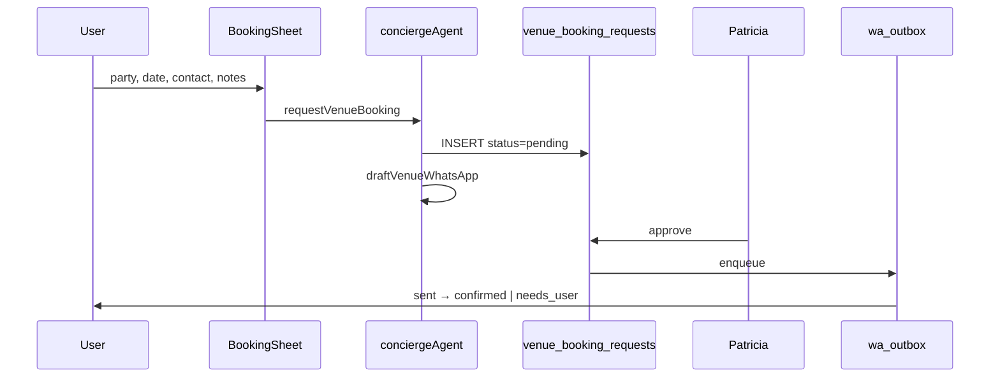

# PRD — Venues (mdeai.co)

## Executive summary

**Venues** is the Mindtrip-style discovery + honest-request layer on `/` for **cafés**, **restaurants**, and **nightlife** — one chat, ranked cards, map pin sync, right-column detail panel. **Places API + ADK Grounding Lite** own factual geo data; **Supabase** owns curated inventory, signals (MIS Phase 1), and booking requests; **pgvector + `venue_signals`** improve ranking after evals; **OpenClaw** enriches and drafts WhatsApp (never auto-confirms).

**Shipped (2026-06-02):**

| Track | Status |
|-------|--------|
| Café Phase A.5 | ✅ `CafeResultCard`, `CafeDetailPanel`, Places detail, booking stub |
| Restaurant Phase A | ✅ `RestaurantCard`, `RestaurantDetailPanel`, SCREEN-023 Playwright |
| Rental/event overlay | ✅ `VenueDetailSheet` (006) — not for place kinds |
| Booking schema | ✅ `venue_booking_requests` + `venue_anchors` (DATA-009) — RLS verified (VEN-015) |
| Catalog browse | ✅ `/restaurants` filter page (parallel to chat) |

**Now:** Nightlife Phase A (007) → booking persist (VEN-016→021) → WhatsApp draft + Patricia queue (VEN-022→024).

**Separate track — event venue B2B (VEB):** Companies booking a **physical event space** (birthday package, meetup, private dining event) — [`venues-booking.md`](venues/docs/venues-booking.md) + **VEB-001…018** — not the same row as a dinner table in `venue_booking_requests`.

**Intelligence (MIS):** Discovery ranking ships **before** full booking automation. Phase 1 = `DATA-041` `venue_signals` + **SEARCH-003** hybrid restaurants; Phase 2 = **INT-008** (café) + **INT-021** (restaurant/venue wrappers); Phase 4 = WhatsApp concierge ([`intelligence-plan.md`](intelligence/intelligence-plan.md) §4).

---

## 1. Current status audit

### 1.1 Completed (verified on disk / MCP)

| Layer | Item | Evidence |
|-------|------|----------|
| **Café UI** | `CafeResultCard`, `CafeDetailPanel`, tabs, ask prompts | `mdeapp/src/components/cafe/`, archived SCREEN-021 |
| **Restaurant UI** | `RestaurantCard` (`ResultCardShell`), `RestaurantDetailPanel` | `restaurant-card.tsx`, `restaurant-detail-panel.tsx` |
| **Places detail** | `/api/places/detail` + field mask | `google-places-client.ts`, `use-place-details.ts` |
| **Map** | Pin sync F50, category pin ids | `domain-results.tsx`, `ChatMapPanel` |
| **Mastra** | `search-grounded-places` `intent: "cafe"` | `search-grounded-places.ts` |
| **Mastra** | `search-restaurants` (44 rows + hybrid path) | `search-restaurants.ts`, SEARCH-003 |
| **CopilotKit** | Grounded + restaurant generative renders | `search-tool-renders.tsx` |
| **Rental/event sheet** | `VenueDetailSheet` — not for cafés/restaurants | archived 006-scr |
| **Supabase** | `restaurants` (44), `restaurant_embeddings` (43) | DATA-004 verify |
| **Supabase** | `venue_booking_requests`, `venue_anchors` | DATA-009 migrations; VEN-015 MCP RLS ✅ |
| **Supabase** | Places caches, grounding quota | `places_search_cache`, `place_details_cache` |
| **Playwright** | SCREEN-021 café, SCREEN-023 restaurant | `e2e/screens/` |
| **Catalog page** | `/restaurants` neighborhood + cuisine filters | `src/app/restaurants/page.tsx` |

### 1.2 In progress

| Item | Gap |
|------|-----|
| **SCREEN-022 nightlife** | No `intent: "nightlife"` in tool; no nightlife cards/panel |
| **Booking persist** | UI stubs only (`cafe-booking-sheet`, `restaurant-booking-sheet`) — **VEN-016+** |
| **MIS Phase 1 signals** | `venue_signals` (DATA-041) — spec ready; human QA gate pending |
| **VEB event venue pack** | VEB-001…018 planned; Linear SAN-492…514 |

### 1.3 Not started

| Item | Notes |
|------|-------|
| **Phase B vector rerank** | Blocked on VEC-001→005 + eval gate |
| **WhatsApp send + Patricia approval** | Infra tables exist; workflow VEN-022→024 |
| **OpenClaw venue enrichment** | Draft-only; Phase 2+ |
| **Event B2B tables** | `event_venue_offerings` — VEB-001 (separate from place booking) |
| **Admin booking queue** | VEN-024 — Patricia `/admin` |
| **INT-008 / INT-021** | Café + restaurant intelligence wrappers (Phase 2 MIS) |

### 1.4 Spec hygiene (resolved / watch)

| Issue | Status |
|-------|--------|
| CAFE-001 narrow schema | **Archived** — canonical **DATA-009** + **VEN-015** |
| Old VEN-001 ID in docs | Use **VEN-015…024** booking chain ([`mvp-index.md`](venues/tasks/mvp/mvp-index.md)) |
| Nightlife vs ticket events | 007 uses grounded places, not `search-events` |
| `007-wire-nightlife-explorer` stub | Redirect only; use `007-wire-nightlife-listings-map` |
| `/restaurants` vs chat | Catalog browse is **parallel**; Mindtrip loop is `/` chat |

---

## 2. Intelligence alignment (MIS)

> **Canonical:** [`intelligence/intelligence-plan.md`](intelligence/intelligence-plan.md) · **Crosswalk:** [`venues/CROSSWALK-INT.md`](venues/CROSSWALK-INT.md)

Venues participates in the **Medellín Intelligence System** as the **café / restaurant / nightlife / anchor** vertical — not a separate intelligence product.

### 2.1 Three café concepts (do not merge)

| Concept | Tasks | What it is |
|---------|-------|------------|
| **A. Café Places (chat map)** | SCREEN-021 ✅, VEN-012, DATA-003 | `search-grounded-places` → cards on `/` |
| **B. Coffee tour product** | VEN-032…043 | DB `coffee_tours*` — farm tours, not café search |
| **C. Chat intelligence layer** | INT-001, INT-008 | Slot extraction + clarify before tools run |

### 2.2 Venues ↔ intelligence task map

| Venues work | Intelligence hook | Phase | Rule |
|-------------|-------------------|-------|------|
| VEN-009/010 restaurant UI | **SEARCH-003** hybrid + `rankExplanation` on cards | MIS-1 | Signals on cards after **DATA-041** |
| VEN-011…013 nightlife | **DATA-041** `venue_anchors` kind=nightclub | MIS-1 | `music_energy`, door policy fields |
| VEN-012 kind split | **INT-008** prerequisite | MIS-2 | Fix routing before Gemini clarify |
| Restaurant queries | **INT-021** restaurant/venue wrapper | MIS-2 | Cuisine, budget, capacity slots |
| VEN-014 Places cache | **MAP-005** app read-through | MIS-0 | Field masks on every Places call |
| Booking (VEN-015+) | MIS tracker **25%** | MIS-4 | Schema now; WA orchestration Phase 4 |
| VEB proposals | INT-021 `venue_search` slots | MIS-2+ | Roberto capacity-first clarify |

### 2.3 MIS phase gates vs venues booking

```text
MIS Phase 1 (NOW):  DATA-041 venue_signals → SEARCH-003 → signal chips on cards
MIS Phase 2:        INT-008 café + INT-021 restaurant wrappers
Venues Phase 4:     VEN-016→021 persist (can parallel MIS-1 after VEN-015 ✅)
MIS Phase 4:        VEN-022→024 WhatsApp + Patricia (aligns with intelligence-plan §4)
```

**Explicitly NOT Phase 1 (both plans):** fake instant booking · WhatsApp auto-send · unified `venues` table · user taste vectors.

**Frozen MIS order (restaurants first hybrid proof):**

```text
VEC-001 → DATA-039 → DATA-040 → DATA-041 → … → SEARCH-003
```

Do **not** block restaurant UI on INT-021 — wrapper improves clarify; **SEARCH-003** improves rank.

---

## 3. User stories (acceptance anchors)

| Persona | Story | Primary surface | Booking track |
|---------|-------|-----------------|---------------|
| **Sarah** | Quiet café to work 3h in Laureles — WiFi from Places/summary only | Café cards → `CafeDetailPanel` | Place request → `venue_booking_requests` |
| **Carlos** | Book dinner for 4 — honest **request**, Patricia approves WA | Restaurant detail → booking sheet | Place (`venue_kind=restaurant`) |
| **Tourist** | Reggaeton clubs near Provenza — map + safety copy | Nightlife cards → panel | Place (`venue_kind=nightclub`) |
| **Patricia** | Review booking requests before WhatsApp goes out | Admin queue VEN-024 | Both place + event proposal queues |
| **Roberto** | Company books event space for 80 founders | Chat / host wizard | **VEB** proposals — not dinner table row |
| **Carlos (Mamacita)** | Restaurant offers private birthday packages | Restaurant card → Event Venue CTA | **VEB-003→005** |

---

## 4. UX architecture (non-negotiable)

```text
/ chat (Mindtrip layout)
  Center: ranked cards (cafe | restaurant | nightlife)
  Right:  Map OR *DetailPanel (never VenueDetailSheet for these kinds)
  Mobile: bottom sheet → full detail

/restaurants — catalog browse only (filters + grid; optional future detail slide-over)

VenueDetailSheet (006): rental + ticketed event inventory only
```

**No duplicate listing surfaces.** `rich-card-results.ts` suppresses generic map list when cards render.

**No fake confirmation.** Copy: “Request sent — we’ll confirm by WhatsApp” until `venue_booking_requests.status` or VEB proposal status says otherwise.

---

## 5. Roadmap table

| Phase | Scope | Task IDs | Target |
|-------|--------|----------|--------|
| **A.5** | Café detail UX | SCREEN-021 | ✅ Done |
| **A** | Restaurant cards + panel | VEN-009/010, SCREEN-023 | ✅ Done |
| **A** | Nightlife intent + UI | VEN-011…013, SCREEN-022 | W2–W3 |
| **B** | Vector rerank + signals on cards | VEC-001→005, DATA-041, SEARCH-003 | MIS-M1 |
| **C** | Place booking persist | VEN-016→021 | W3 |
| **C+** | WA draft + Patricia approval | VEN-022→024, `wa_outbox` | W4 / MIS-4 |
| **D** | OpenClaw enrichment (draft-only) | VEN-030+, Hostinger | Phase 2 |
| **E** | Event venue B2B | VEB-001→018, EVP-010 | After VEN-017 + restaurant UI |

---

## 6. Booking — two tracks (do not merge)

### 6.1 Track A — Place booking (table / visit / bottle service)

**Personas:** Sarah, Carlos, Tourist. **Tasks:** VEN-015…024.

Honest **request** for a specific place at a date/time — not OpenTable instant confirm.



**UI states:** `pending` · `confirmed` · `declined` · `cancelled` — extend to `sent` / `needs_user` when WA wired (metadata jsonb until then).

**Colombia reality:** WhatsApp or phone is the honest path — no fake Resy integration.

### 6.2 Track B — Event venue booking (proposals / packages)

**Personas:** Roberto, Carlos (Mamacita), Tourist (trip). **Tasks:** **VEB-001…018** · Plan: [`venues/docs/venues-booking.md`](venues/docs/venues-booking.md).

```text
Discover venue → Event offerings panel → Request proposal → AI WA draft → Patricia → Confirm → Trip/event
```

| Entry | MVP | Depends |
|-------|-----|---------|
| Restaurant **Event Venue** CTA | VEB-003→005 | VEN-009/010, VEB-002 |
| AI venue match (Roberto) | VEB-006→008 | VEB-001, `eventVenueAgent` |
| Host wizard step | VEB-009 | EVP-010 |
| Admin proposal queue | VEB-011 | VEN-024 pattern |

**Golden rule (both tracks):** AI drafts only — Patricia approves before WhatsApp sends.

### 6.3 Track C — Ticketed events (handoff only)

Nightlife cards may link to **ticketed** `search-events` results — not the same as booking the club for bottle service. Routing guard in VEN-011/012.

---

## 7. Supabase schema plan

### 7.1 Existing (use, don't duplicate)

| Table | Role |
|-------|------|
| `restaurants` | Curated restaurant catalog (44 rows) |
| `restaurant_embeddings` | 768-dim vectors — migrate to VEC unified table later |
| `venue_anchors` | Café + nightclub anchors (M2 DATA-009) |
| `venue_booking_requests` | **Place booking requests** (M1 DATA-009) — live |
| `places_search_cache` / `place_details_cache` | Places API cost control |
| `venue_signals` | MIS ranking (DATA-041) — when migrated |
| `bookings` | Generic ledger (apartments, tours…) — **separate** from venue requests |
| `whatsapp_*`, `wa_outbox`, `approval_requests` | WA + HITL infra |
| `event_venues` | Event space master — **B2B track** |

### 7.2 Live `venue_booking_requests` (DATA-009 — not the old CAFE-001 draft)

Applied migration `20260529234934_data009_venue_booking_requests.sql`:

| Column | Purpose |
|--------|---------|
| `venue_kind` | `cafe` \| `restaurant` \| `nightclub` |
| `place_id` | Google Place ID (required) |
| `restaurant_id` / `venue_anchor_id` | FK to curated rows when known |
| `party_size`, `requested_at`, contact fields | User request |
| `status` | `pending` \| `confirmed` \| `declined` \| `cancelled` |
| `source` | `web` \| `chat` \| `whatsapp` |
| `idempotency_key` | Duplicate prevention (VEN-026) |
| `metadata` jsonb | WA draft, approval ids, enrichment |

**RLS (verified 2026-06-02):** `select_own`, `insert_own` (authenticated); `service_role` ALL. Admin Patricia policies → **VEN-024**.

**Recommendation unchanged:** Keep **request** table separate from ticket/apartment `bookings` ledger.

### 7.3 Event venue B2B schema (VEB — not yet migrated)

VEB-001 adds `event_venue_profiles`, `event_venue_offerings`, `event_venue_proposals` per [`venues-booking.md`](venues/docs/venues-booking.md). Wired from host wizard + restaurant Event Venue CTA — **never** overload `venue_booking_requests` for multi-hour event packages.

---

## 8. Seed & data plan

| Seed | Task | Purpose |
|------|------|---------|
| **Restaurants** | DATA-004 ✅ | 44 curated; embeddings 43/44 |
| **Nightlife anchors** | DATA-005 | `venue_anchors` nightclub rows |
| **Café anchors** | DATA-035 | Listings → anchors |
| **Venue signals** | DATA-041 | rooftop, nomad, music scores |
| **Golden queries** | DATA-006, DATA-046 | Eval + MIS regression |
| **VEB partners** | VEB-002 | Mamacita + 5 event partners |

**No seed for invented hours/phone** — Places API + field mask + cache only.

---

## 9. pgvector / embedding plan

| Step | Task | Venue hook |
|------|------|------------|
| VEC-001 | HNSW cleanup | Pre-req all verticals |
| DATA-041 | `venue_signals` | Card chips + hybrid rank |
| SEARCH-003 | Hybrid restaurants | Live tool path |
| VEC-004/005 | Text builders + golden eval | Phase B rerank grounded cafés |
| INT-016 / VEC | User memory vs catalog | Phase 3 — not Phase 1 |

**Dimensions:** 768, `gemini-embedding-001`. **Do not embed raw JSON.**

---

## 10. Mastra / CopilotKit workflow plan

### 10.1 Tools

| Tool | Status | Venue kinds |
|------|--------|-------------|
| `search-grounded-places` | ✅ cafe; **add** nightlife | café, nightlife |
| `search-restaurants` | ✅ + hybrid | restaurant |
| `getPlaceDetails` | ✅ `/api/places/detail` | all panels |
| `requestVenueBooking` | ❌ VEN-016 | cafe, restaurant, nightclub |
| `draftVenueWhatsApp` | ❌ VEN-022 | propose-only |
| `eventVenueAgent` tools | ❌ VEB-006 | event proposals |
| `search-events` | ✅ | handoff from nightlife only |

### 10.2 Agents

| Agent | Role |
|-------|------|
| `conciergeAgent` | Discovery + place booking initiation |
| `eventVenueAgent` | Event space match + proposals (VEB-006) |
| `hostEventAgent` | Roberto wizard — not dinner reservations |

### 10.3 CopilotKit UI

| Surface | Status |
|---------|--------|
| `CafeDetailPanel` + booking stub | ✅ |
| `RestaurantDetailPanel` + booking stub | ✅ |
| `NightlifeDetailPanel` | ❌ VEN-013 |
| `requestVenueBooking` HITL | ❌ VEN-019 |
| Event offerings panel / proposal modal | ❌ VEB-004/005 |

### 10.4 Workflows

| Workflow | Change |
|----------|--------|
| `concierge-routing-workflow` | Nightlife → grounded, not only events |
| **New** place booking workflow | VEN-016→021 validate → insert → status chips |
| **New** event venue workflow | VEB-010 Mastra workflow |

---

## 11. Google Maps / Places / ADK

| Capability | Owner | Rule |
|------------|-------|------|
| Discovery (café/nightlife) | ADK Grounding Lite | Quota + cache |
| Discovery (restaurant catalog) | Supabase → SEARCH-003 hybrid | Phase A |
| Detail enrichment | Places API New | **Every call** `X-Goog-FieldMask` |
| Map UI | MAP-001, F50 | `mapId` on `<Map>` |

**Never invent:** hours, phone, Wi-Fi, dress code, prices.

---

## 12. Edge Functions vs Mastra

| Operation | Owner |
|-----------|-------|
| Places detail | Next.js `/api/places/detail` ✅ |
| Booking insert | **Mastra tool** (VEN-016) — user-scoped client |
| WhatsApp send | **Edge fn** + `wa_outbox` (VEN-023) |
| Patricia approval | Admin route / edge (VEN-024) |
| Signal batch enrich | Edge fn DATA-048 (MIS Phase 1b) |

**Default:** Mastra orchestrates; edges own side effects (WhatsApp, webhooks).

---

## 13. WhatsApp workflow (MIS Phase 4)

Reference: Mastra WhatsApp guide + **Patricia approval** before outbound venue messages.

| Step | Component |
|------|-----------|
| 1 | User `contact_phone` / WhatsApp in booking sheet |
| 2 | Mastra drafts message (English MVP) |
| 3 | `approval_requests` linked via `metadata` |
| 4 | Patricia approves in `/admin/bookings` |
| 5 | Edge worker → `wa_outbox` → WhatsApp Business API |
| 6 | Inbound → `needs_user` status + optional Mastra thread |

**Mastra features:** HITL (`renderAndWaitForResponse`), working memory (party size, dietary notes), workflow suspend/resume, `ai_runs` observability.

---

## 14. OpenClaw automation (safe scope)

| Feature | Phase | Safety |
|---------|-------|--------|
| Scrape menu / hours | D | Draft to `metadata` only |
| Verify IG / website | D | Flag stale vs Places |
| Draft WhatsApp to venue | C+ | **Patricia approval** |
| Monitor new openings | D | Suggest seed candidates |

**Forbidden:** autonomous booking confirmation, production writes without approval.

---

## 15. Risks / blockers

| Risk | Mitigation |
|------|------------|
| Nightlife routed to `search-events` | VEN-011/012 + routing tests |
| Fake “confirmed” UI | Status-driven copy only |
| Booking before signals eval | MIS-1 can parallel; don't block VEN-016 on DATA-041 |
| WhatsApp without approval | Patricia gate + wa_outbox |
| Merged place vs event booking PRs | **Two tracks:** VEN-015…024 vs VEB-001…018 |
| Intelligence scope creep in Phase 1 | FROZEN list in intelligence-plan §Progress tracker |

---

## 16. Task index (canonical VEN-NNN)

> Full order: [`venues/tasks/mvp/mvp-index.md`](venues/tasks/mvp/mvp-index.md) · Event booking: [`venues/tasks/event-booking/INDEX.md`](venues/tasks/event-booking/INDEX.md)

| Order | ID | Title | Status (2026-06-02) |
|------:|-----|-------|---------------------|
| 09–10 | **VEN-009/010** | Restaurant card + detail panel | ✅ Shipped |
| 11–13 | **VEN-011…013** | Nightlife intent + UI | Not started |
| 14 | **VEN-014** | Places cache field-mask gate | Not started |
| 15 | **VEN-015** | Booking schema + RLS verify | ✅ Verified |
| 16–21 | **VEN-016…021** | Tool + sheet + HITL + persist | Not started |
| 22–24 | **VEN-022…024** | WA draft + approval + admin queue | Not started |
| 25–30 | **VEN-025…030** | RLS pen test, idempotency, audit | Not started |
| 31 | **VEN-031** | Playwright venue screens | Partial (021, 023) |
| — | **VEB-001…018** | Event venue booking pack | Not started |
| — | **INT-008** | Café intelligence wrapper | MIS Phase 2 |
| — | **INT-021** | Restaurant/venue intelligence wrapper | MIS Phase 2 |
| — | **DATA-041** | venue_signals | MIS Phase 1 |

---

## 17. Exact next implementation order (2-week slice)

1. **VEN-011→013** — Nightlife grounded intent + panel → SCREEN-022  
2. **VEN-016→021** — `requestVenueBooking` + persist (unblocked by VEN-015 ✅)  
3. **DATA-041 + SEARCH-003** — signal chips on restaurant cards (MIS-M1, parallel)  
4. **VEN-022→024** — WA draft + Patricia queue (align MIS Phase 4)  
5. **VEB-001→002** — Event offerings schema + Mamacita seed (data-only)  
6. **VEB-003→005** — Event Venue CTA + proposal modal (after VEN-021 booking sheet pattern)  
7. **VEC-001** — Parallel if Sofia owns vector — unblocks Phase B rerank  

---

## Related docs

| Doc | Role |
|-----|------|
| [`venues/INDEX.md`](venues/INDEX.md) | Venues hub + forensic audit |
| [`venues/CROSSWALK-INT.md`](venues/CROSSWALK-INT.md) | INT ↔ VEN sequencing |
| [`intelligence/intelligence-plan.md`](intelligence/intelligence-plan.md) | MIS phases, DATA-041, Phase 4 WA |
| [`venues/docs/venues-booking.md`](venues/docs/venues-booking.md) | Event venue B2B plan |
| [`venues/tasks/event-booking/INDEX.md`](venues/tasks/event-booking/INDEX.md) | VEB task pack |
| [`venues/tasks/mvp/mvp-index.md`](venues/tasks/mvp/mvp-index.md) | VEN-009…043 order |
| [`vector/INDEX.md`](vector/INDEX.md) | pgvector tasks |
| [`tasks/testing/evidence/2026-06-02/SCREEN-023-RESULTS.md`](testing/evidence/2026-06-02/SCREEN-023-RESULTS.md) | Restaurant UI proof |
| [`venues/tasks/evidence/VEN-015-verify-2026-06-02.md`](venues/tasks/evidence/VEN-015-verify-2026-06-02.md) | Booking schema proof |

*Last updated: 2026-06-02 — v1.1 aligns booking (VEN + VEB) with MIS intelligence-plan.*
