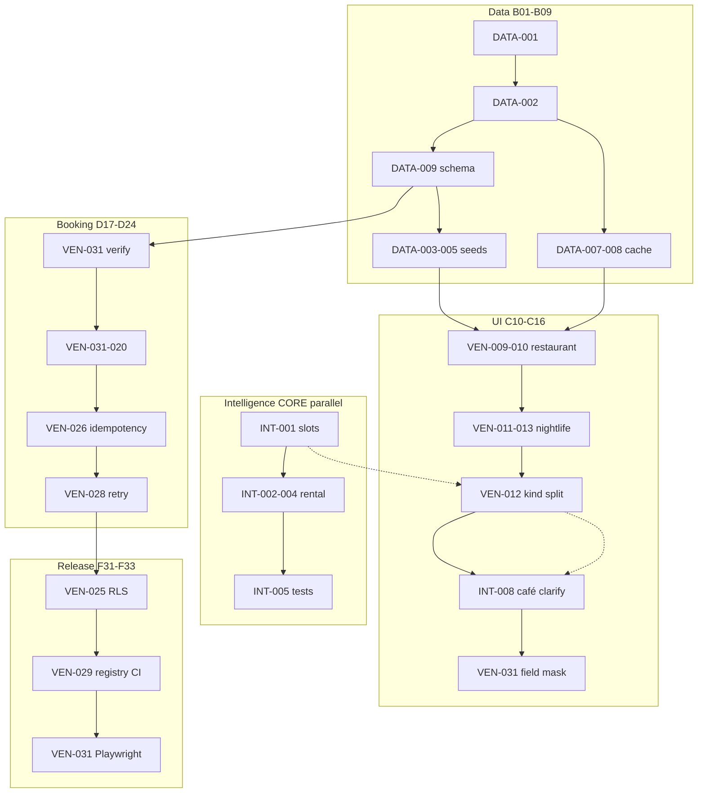

# Implementation order plan

**Rule:** Follow `exec_step` below. **Do not** sort by filename alone (VEN-031 > VEN-031 numerically but runs earlier).

## Mermaid — critical path



## Parallel lanes

| Lane | Can start after | Tasks |
|------|-----------------|-------|
| Intelligence CORE | — | INT-001…005 |
| Venue data | — | DATA-001…009 |
| Coffee tours (optional) | VEN-032 | VEN-032…043 per mvp-index |
| Venue MVP UI | DATA-004/005 + cache | VEN-009…037 |
| Booking | DATA-009 M1 | VEN-031…039 |
| Post-MVP polish | VEN-031 pass | VEN-025…034, CTI post |

## Renumbering — no file renames

| Keep | Why |
|------|-----|
| `009-ven-*` filenames | Git history + PR links |
| `CTI-*` prefix | Distinct from VEN |
| `DATA-*` in data repo | Cross-program canonical |

Add to each task frontmatter when touched:

```yaml
exec_step: 17
track: VEN
```
