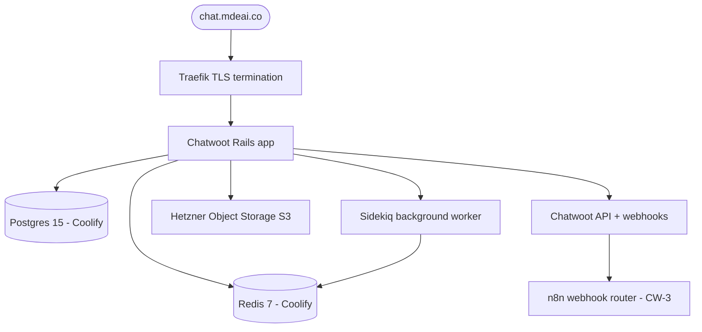

# CW-1 — Deploy Chatwoot on Hetzner via Coolify

## 0. Quick Read

**What this does in one sentence:** Spins up a production-grade Chatwoot instance on Hetzner at `chat.mdeai.co` so the rest of the CW track has a live system to configure.

**Why self-host:** Chatwoot Cloud charges per seat. Self-hosted on Hetzner (€20–40/mo) is unlimited seats, full data ownership (Ley 1581 compliance), and zero WhatsApp message fees at our volume. Coolify makes the deploy a 1-hour operation, not a week.

| Component | Stack |
|-----------|-------|
| Hosting | Hetzner CPX31 (4 vCPU, 8 GB RAM, 160 GB SSD) |
| Deploy manager | Coolify (Docker Compose) |
| Database | Postgres 15 (Coolify-managed) |
| Cache/queue | Redis 7 (Coolify-managed) |
| Object storage | Hetzner Object Storage (S3-compatible) for attachments |
| Reverse proxy | Coolify Traefik with Let's Encrypt TLS |
| Domain | `chat.mdeai.co` → Hetzner IP |



---

## 1. Deployment checklist

1. **Hetzner:** provision CPX31 VPS in `eu-central` (Frankfurt). Add SSH key. Set hostname `chatwoot-prod`.
2. **Coolify:** install Coolify on the VPS (`curl -fsSL https://cdn.coollabs.io/coolify/install.sh | bash`). Access at `http://<IP>:8000`.
3. **Chatwoot:** in Coolify → New Service → "Chatwoot". Set env vars (see §3).
4. **Domain:** add A record `chat.mdeai.co → <Hetzner IP>` in DNS. Coolify handles TLS via Let's Encrypt.
5. **Object storage:** create Hetzner Object Storage bucket `chatwoot-attachments`. Set `ACTIVE_STORAGE_SERVICE=s3_compatible` env vars.
6. **First boot:** visit `chat.mdeai.co/auth/sign_up` → create super-admin account.
7. **SMTP:** configure SendGrid or Postmark for email notifications (password resets, CSAT).

## 2. Required environment variables

```env
# Core
SECRET_KEY_BASE=<64-byte random hex>
FRONTEND_URL=https://chat.mdeai.co

# Database (Coolify injects these from managed Postgres)
DATABASE_URL=postgresql://...

# Redis (Coolify injects)
REDIS_URL=redis://...

# Email
SMTP_ADDRESS=smtp.sendgrid.net
SMTP_USERNAME=apikey
SMTP_PASSWORD=<sendgrid_api_key>
MAILER_SENDER_EMAIL=noreply@mdeai.co

# Object storage (Hetzner S3-compatible)
ACTIVE_STORAGE_SERVICE=s3_compatible
STORAGE_BUCKET_NAME=chatwoot-attachments
STORAGE_REGION=eu-central-1
STORAGE_ACCESS_KEY_ID=<hetzner_access_key>
STORAGE_SECRET_ACCESS_KEY=<hetzner_secret_key>
STORAGE_ENDPOINT=https://eu-central-1.your-objectstorage.com

# Feature flags
ENABLE_ACCOUNT_SIGNUP=false  # disable public signup after admin created
```

All secrets stored in Coolify's encrypted env store — never in `.env.local` or committed to git.

## 3. Edge cases

- **Hetzner firewall:** open ports 80 (HTTP), 443 (HTTPS) only. Close 8000 (Coolify) to public — access via SSH tunnel for management.
- **Backups:** configure Coolify's automated Postgres daily backup to Hetzner Object Storage. Retain 7 days.
- **Chatwoot version pinning:** pin to a stable release tag (not `latest`) in Coolify to prevent surprise auto-upgrades during production operations.
- **Memory:** Chatwoot's Sidekiq worker is memory-hungry. Set `SIDEKIQ_CONCURRENCY=5` for the CPX31 to avoid OOM.

## 4. Acceptance criteria

1. `https://chat.mdeai.co` loads Chatwoot login page with valid TLS cert.
2. Super-admin can log in and create a second admin account.
3. File attachment upload works (stored in Hetzner Object Storage).
4. Sidekiq dashboard (`/sidekiq`) shows workers running (no queued jobs accumulating).
5. Daily Postgres backup job runs and produces a `.dump` file in Object Storage.
