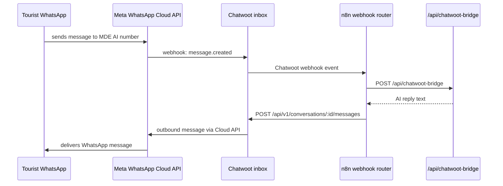

# CW-2 — WhatsApp Cloud API Inbox

## 0. Quick Read

**What this does in one sentence:** Links MDE AI's WhatsApp Business number to Chatwoot so every WhatsApp message is routed into the Chatwoot inbox, and every reply from Mastra is delivered via the official Meta API — replacing the dead `wa_outbox` fire-and-forget stub with a live send/receive loop.

**Why this is P0:** C7 writes to `wa_outbox`; M7 sends reservation confirmations; C14 sends recovery messages — none of these deliver anything until this inbox is live.

| Step | Who | Time |
|------|-----|------|
| Create Meta Developer App + WABA | Patricia / infra | 1 hour |
| Verify business + phone number | Meta review | 1–3 business days |
| Configure Chatwoot inbox | Dev | 30 min |
| Submit message templates | Patricia | 2 hours + Meta review 24–48h |



---

## 1. Configuration steps

### 1A — Meta setup

1. Go to `developers.facebook.com` → Create App → Business → Add WhatsApp product.
2. Create/link a **WhatsApp Business Account (WABA)** for MDE AI.
3. Add a phone number (dedicated number; do not use personal numbers). Complete business verification (upload business registration documents).
4. Generate a **permanent System User access token** (not a temporary 60-day token) with `whatsapp_business_messaging` + `whatsapp_business_management` permissions.
5. Note the **Phone Number ID** and **WABA ID** — used in Chatwoot inbox config.

### 1B — Chatwoot inbox configuration

In Chatwoot: Settings → Inboxes → New Inbox → WhatsApp Cloud API.

```
Phone Number: +57XXXXXXXXX (MDE AI WhatsApp number)
Phone Number ID: <from Meta>
Business Account ID: <WABA ID>
API Access Token: <System User permanent token>
Webhook Verify Token: <random 32-char string>
```

Chatwoot generates the webhook URL: `https://chat.mdeai.co/webhooks/whatsapp/<inbox_id>`. Register this URL in Meta's webhook dashboard.

### 1C — Meta-approved message templates to submit first

| Template name | Category | Use case | Variables |
|---------------|----------|----------|-----------|
| `cart_recovery_v1` | MARKETING | Abandoned checkout re-engagement | `first_name`, `item_name`, `checkout_url` |
| `lead_followup_v1` | MARKETING | Uncontacted rental lead re-engagement | `first_name`, `neighborhood`, `search_url` |
| `reservation_confirmed_v1` | UTILITY | Reservation confirmation for tourist | `first_name`, `venue_name`, `date_time` |
| `venue_new_request_v1` | UTILITY | New reservation request notification to host | `venue_name`, `party_size`, `date_time` |

Submit all 4 templates during business verification. Utility templates have faster approval (hours vs days).

## 2. Environment variables to add

```env
# .env.local (repo root) — add alongside existing keys
WHATSAPP_PHONE_NUMBER_ID=<meta_phone_number_id>
WHATSAPP_WABA_ID=<meta_waba_id>
WHATSAPP_API_TOKEN=<system_user_permanent_token>
CHATWOOT_WEBHOOK_VERIFY_TOKEN=<32-char random>
```

## 3. Edge cases

- **Business verification delay:** Meta review can take 1–3 business days. Start this in parallel with CW-1 deploy. Do not block CW-3 code writing on verification — the bridge can be built and tested with a test phone number.
- **Test vs production numbers:** Meta provides a free test phone number (limited to 5 recipient numbers). Use this for development. Switch to the real business number for production.
- **24-hour window enforcement:** configure Chatwoot's inbox to use the `conversation.opened` event to track window state. CW-3's bridge reads `conversation.meta.channel` + `created_at` to enforce the window before free-form sends.
- **STOP handling:** configure a Chatwoot automation rule: "If message = STOP → label conversation `opted-out` → set `audience_members.opted_in = false` via bridge webhook." This is mandatory for Ley 1581 compliance.
- **Rate limits:** new WABAs start at ~250 conversations/day (tier 1). Submit quality-rating improvement after first 1,000 conversations to upgrade to tier 2 (1,000/day) and beyond.

## 4. Acceptance criteria

1. WhatsApp inbox appears in Chatwoot with `Connected` status.
2. A test message sent to the MDE AI number appears as a conversation in Chatwoot.
3. Chatwoot can send a reply that is delivered to the sender's WhatsApp.
4. All 4 message templates submitted to Meta (pending approval is acceptable at CW-2 close; must be approved before C14 ships).
5. `WHATSAPP_PHONE_NUMBER_ID` and `WHATSAPP_API_TOKEN` added to `.env.local`.
