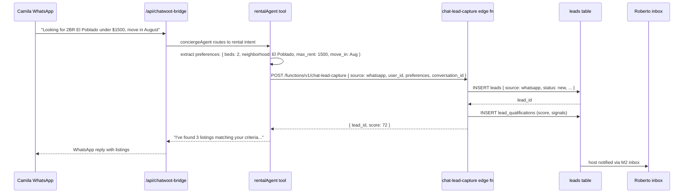

# CW-5 — G2 Lead Capture Hook (WhatsApp → Supabase)

## 0. Quick Read

**What this does in one sentence:** When Camila messages MDE AI on WhatsApp ("I'm looking for a 2BR in El Poblado under $1,500") and the rental agent extracts her preferences, those preferences flow into the same `leads` table as a web-originated lead — so Roberto sees it in his M2 inbox and C4 bills for it the same way.

**The current gap:** The `chat-lead-capture` edge function exists and is wired to the web chat. WhatsApp conversations that express rental intent create no lead. C4 bills zero WhatsApp-originated leads. G2 is already built — CW-5 calls it from the bridge.

| Persona | Before | After |
|---------|--------|-------|
| **Camila** (WhatsApp) | Asks about rentals → gets AI suggestions → no record | Lead captured in Supabase; matched to rental listings |
| **Roberto** (host inbox) | Receives web leads only | WhatsApp leads appear alongside web leads in M2 inbox |
| **Patricia** | Cannot tell which leads came from WhatsApp | `SELECT source, count(*) FROM leads GROUP BY source` → `whatsapp: 14, web: 33` |
| **C4 billing** | Only bills web-originated leads | Bills both channels equally via the same `lead_billing` meter |



---

## 1. Purpose

G2 (`chat-lead-capture` edge function) is the web chat's lead creation hook. It:
- Accepts `{ user_id, preferences, source }` 
- Inserts a `leads` row
- Runs basic qualification scoring
- Returns `{ lead_id, score }`

CW-5's job is simple: make the rental agent (running in CW-3's bridge) call G2 with `source: 'whatsapp'` when it has extracted sufficient rental preferences from a WhatsApp conversation. No new logic — just a new call site.

The existing G2 edge function already handles `source` as a parameter. CW-5 verifies this, adds `source: 'whatsapp'` as a valid enum value if needed, and updates the bridge's rental intent handler to call G2 at the right moment.

## 2. Goals

- `chat-lead-capture` edge function accepts `source: 'whatsapp'` (verify or add)
- CW-3 bridge's rental intent path calls G2 after extracting preferences with sufficient confidence
- Lead created in Supabase with `source = 'whatsapp'`; same schema, same billing flow as web leads
- Chatwoot conversation label updated to `stage:lead` after G2 fires
- `npm run build` exits 0; Vitest floor stays ≥ 401

## 3. Wiring plan

### 3A — Edge function update

| Layer | File | Action |
|-------|------|--------|
| G2 | `supabase/functions/chat-lead-capture/index.ts` | Modify — add `source: z.enum(['web', 'whatsapp', 'instagram', 'facebook'])` to input schema |

### 3B — Bridge update

| Layer | File | Action |
|-------|------|--------|
| Bridge | `src/app/api/chatwoot-bridge/route.ts` | Modify (CW-3) — after rental agent extracts preferences and confidence > 0.7, call G2 with `source: 'whatsapp'` + `conversation_id` |
| Chatwoot client | `src/lib/chatwoot/client.ts` | Modify (CW-4) — add `labelConversation(conversationId, 'stage:lead')` call after G2 success |

### 3C — Mastra tool update

| Layer | File | Action |
|-------|------|--------|
| Capture tool | `src/mastra/tools/capture-lead.ts` | Modify (C4) — accept `source` param; pass through to G2; default `'web'` preserves existing behavior |

## 4. Schema changes

No new tables. Additive change: `leads.source` column may need `'whatsapp'` added to its CHECK constraint if not already present.

```sql
-- Verify and extend if needed:
ALTER TABLE public.leads
  DROP CONSTRAINT IF EXISTS leads_source_check;
ALTER TABLE public.leads
  ADD CONSTRAINT leads_source_check
  CHECK (source IN ('web', 'whatsapp', 'instagram', 'facebook', 'direct'));
```

## 5. Edge cases

- **Preference confidence threshold:** don't capture a lead until the rental agent has extracted at minimum `{ neighborhoods, max_rent }` (or `beds` + `neighborhoods`). Partial preferences below this floor are not worth billing. Add a `hasMinRentalPreferences(prefs): boolean` check in the bridge before calling G2.
- **Duplicate lead guard:** a user may message multiple times about the same rental search. Check `leads` for an existing row with the same `(user_id, source, created_at > now() - 24h)` before calling G2. Don't create duplicate leads for the same conversation session.
- **Source billing parity (C4):** C4's `meter_lead_billing` tool should be called regardless of `source`. Verify the `capture-lead` tool calls `meter_lead_billing` after G2 returns, not just for `source: 'web'`.
- **No `mde_user_id` yet:** if the WhatsApp contact has no Supabase user (CW-4 couldn't match), create a shadow user via `auth.admin.createUser({ phone })` before calling G2. The shadow user can be merged later when the contact signs up on web.

## 6. Acceptance criteria

1. `chat-lead-capture` edge function accepts `source: 'whatsapp'` without validation error.
2. A WhatsApp conversation expressing rental preferences creates a `leads` row with `source = 'whatsapp'`.
3. `C4` metered billing fires for `source = 'whatsapp'` leads the same as for `source = 'web'`.
4. Chatwoot conversation is labeled `stage:lead` after G2 fires.
5. No duplicate leads for the same conversation within a 24h window.
6. `npm run build` exits 0; Vitest floor stays ≥ 401.

## 7. Outcomes

| | Before | After |
|---|---|---|
| WhatsApp leads | Zero captured | Full lead row in Supabase; billed by C4 |
| Lead source analytics | Web only | `SELECT source, count(*) FROM leads GROUP BY source` shows both channels |
| Roberto's inbox (M2) | Web leads only | WhatsApp + web leads unified |
| Lead billing (C4) | Web-only billing | Channel-agnostic billing; WhatsApp leads billed at same rate |
