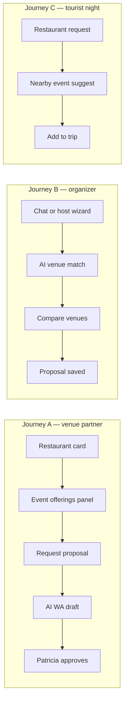
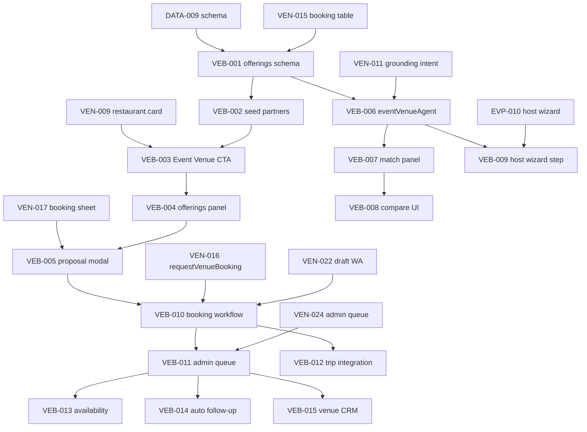

# Event venue booking — VEB task pack

> **Plan source:** [`venues-booking.md`](../docs/venues-booking.md)  
> **Wireframes:** [`wireframes/INDEX.md`](./wireframes/INDEX.md)  
> **Related (do not merge):** place booking MVP [`VEN-015…024`](../mvp/mvp-index.md#phase-4--booking-15-24) · host events [`EVP-010`](../../../events/tasks/MVP/EVP-010-core-host-event-new-wizard.md) · maps [`MAP-004`](../../../maps/INDEX.md)

Turn restaurants, rooftops, bars, and event spaces into **bookable event partners** inside mdeai.

```text
Discover venue → Event offerings → Ask AI → Request proposal → WhatsApp → Confirm → Trip/event
```

**Golden rule:** AI drafts only — Patricia approves before WhatsApp sends. Never show "Booking confirmed" until venue confirms.

---

## Three user journeys

| ID | Persona | Story | Entry |
|----|---------|-------|-------|
| **J-A** | Carlos / Mamacita | Restaurant wants private birthday bookings | Restaurant card → **Event Venue** |
| **J-B** | Roberto | "Venue for 80 founders in Provenza" | `/chat` or host wizard |
| **J-C** | Tourist | Dinner + salsa + rooftop night plan | Restaurant booking → trip |



---

## Task index (core → mvp → advanced)

> **Linear:** [Events Platform](https://linear.app/sanjiovani/project/events-platform-46150ec19346/issues) · disk `VEB-*` → Linear title `EVT-033…055` · map [`veb-evt-mapping.json`](../../linear/veb-evt-mapping.json)

| ID | EVT | Linear | Title | Tier | Depends | Wire |
|----|-----|--------|-------|------|---------|------|
| [VEB-001-core](./VEB-001-core-event-venue-offerings-schema.md) | EVT-033 | [SAN-492](https://linear.app/sanjiovani/issue/SAN-492/evt-033-event-venue-offerings-schema) | Event venue + offerings schema | core | DATA-009, VEN-015 | — |
| [VEB-002-core](./VEB-002-core-event-venue-seed-partners.md) | EVT-034 | [SAN-493](https://linear.app/sanjiovani/issue/SAN-493/evt-034-seed-mamacita-5-event-partners) | Seed Mamacita + 5 event partners | core | VEB-001 | — |
| [VEB-003-mvp](./VEB-003-mvp-restaurant-event-venue-cta.md) | EVT-035 | [SAN-494](https://linear.app/sanjiovani/issue/SAN-494/evt-035-restaurant-card-event-venue-cta) | Restaurant card **Event Venue** CTA | mvp | VEN-009, VEN-010, VEB-002 | W01 |
| [VEB-004-mvp](./VEB-004-mvp-event-offerings-panel.md) | EVT-036 | [SAN-495](https://linear.app/sanjiovani/issue/SAN-495/evt-036-event-offerings-detail-panel) | Event offerings detail panel | mvp | VEB-003 | W01 |
| [VEB-005-mvp](./VEB-005-mvp-request-proposal-modal.md) | EVT-037 | [SAN-496](https://linear.app/sanjiovani/issue/SAN-496/evt-037-request-proposal-modal-hitl) | Request proposal modal (HITL) | mvp | VEB-004, VEN-017 | W02 |
| [VEB-006-mvp](./VEB-006-mvp-eventVenueAgent-tools.md) | EVT-038 | [SAN-497](https://linear.app/sanjiovani/issue/SAN-497/evt-038-eventvenueagent-searchrank-tools) | `eventVenueAgent` + search/rank tools | mvp | VEB-001, VEN-011 | — |
| [VEB-007-mvp](./VEB-007-mvp-venue-match-panel.md) | EVT-039 | [SAN-498](https://linear.app/sanjiovani/issue/SAN-498/evt-039-ai-venue-match-score-panel) | AI venue match score panel | mvp | VEB-006 | W03 |
| [VEB-008-mvp](./VEB-008-mvp-compare-venues-ui.md) | EVT-040 | [SAN-499](https://linear.app/sanjiovani/issue/SAN-499/evt-040-compare-venues-side-by-side) | Compare venues side-by-side | mvp | VEB-007 | W03 |
| [VEB-009-mvp](./VEB-009-mvp-host-wizard-venue-step.md) | EVT-041 | [SAN-500](https://linear.app/sanjiovani/issue/SAN-500/evt-041-host-wizard-venue-step-roberto) | Host wizard venue step (Roberto) | mvp | VEB-006, EVP-010 | W04 |
| [VEB-010-mvp](./VEB-010-mvp-event-booking-workflow.md) | EVT-042 | [SAN-501](https://linear.app/sanjiovani/issue/SAN-501/evt-042-eventvenuebookingworkflow) | `eventVenueBookingWorkflow` | mvp | VEB-005, VEN-016, VEN-022 | — |
| [VEB-011-mvp](./VEB-011-mvp-admin-event-booking-queue.md) | EVT-043 | [SAN-502](https://linear.app/sanjiovani/issue/SAN-502/evt-043-patricia-admin-queue-event-requests) | Patricia admin queue (event requests) | mvp | VEB-010, VEN-024 | W05 |
| [VEB-012-mvp](./VEB-012-mvp-trip-itinerary-booking.md) | EVT-044 | [SAN-503](https://linear.app/sanjiovani/issue/SAN-503/evt-044-add-confirmed-booking-to-trip) | Add confirmed booking to trip | mvp | VEB-010 | — |
| [VEB-013-advanced](./VEB-013-advanced-availability-calendar.md) | EVT-045 | [SAN-504](https://linear.app/sanjiovani/issue/SAN-504/evt-045-venue-availability-calendar) | Venue availability calendar | advanced | VEB-011 | — |
| [VEB-014-advanced](./VEB-014-advanced-auto-followup-drafts.md) | EVT-046 | [SAN-505](https://linear.app/sanjiovani/issue/SAN-505/evt-046-auto-follow-up-wa-drafts-24h) | Auto follow-up WA drafts (24h) | advanced | VEB-011, VEN-023 | — |
| [VEB-015-advanced](./VEB-015-advanced-venue-crm-patricia.md) | EVT-047 | [SAN-506](https://linear.app/sanjiovani/issue/SAN-506/evt-047-venue-crm-for-patricia) | Venue CRM for Patricia | advanced | VEB-011 | — |
| [VEB-016-advanced](./VEB-016-advanced-dynamic-package-pricing.md) | EVT-048 | [SAN-507](https://linear.app/sanjiovani/issue/SAN-507/evt-048-dynamic-package-pricing) | Dynamic package pricing | advanced | VEB-004, VEB-013 | — |
| [VEB-017-advanced](./VEB-017-advanced-sponsor-venue-match.md) | EVT-049 | [SAN-508](https://linear.app/sanjiovani/issue/SAN-508/evt-049-sponsor-venue-match) | Sponsor ↔ venue match | advanced | EVP-029, VEB-007 | — |
| [VEB-018-advanced](./VEB-018-advanced-openclaw-venue-enrichment.md) | EVT-050 | [SAN-509](https://linear.app/sanjiovani/issue/SAN-509/evt-050-openclaw-venue-enrichment-plan) | OpenClaw venue enrichment (plan) | advanced | VEB-002 | — |

### Wireframes (Linear EVT-051…055)

| Wire | EVT | Linear | Paired build |
|------|-----|--------|--------------|
| [W01](./wireframes/VEB-W01-wire-event-offerings-panel.md) | EVT-051 | [SAN-510](https://linear.app/sanjiovani/issue/SAN-510/evt-051-wire-event-offerings-panel-event-venue-cta) | VEB-003, VEB-004 |
| [W02](./wireframes/VEB-W02-wire-request-proposal-modal.md) | EVT-052 | [SAN-511](https://linear.app/sanjiovani/issue/SAN-511/evt-052-wire-request-proposal-modal) | VEB-005 |
| [W03](./wireframes/VEB-W03-wire-venue-match-compare.md) | EVT-053 | [SAN-512](https://linear.app/sanjiovani/issue/SAN-512/evt-053-wire-venue-match-panel-compare) | VEB-007, VEB-008 |
| [W04](./wireframes/VEB-W04-wire-host-venue-step.md) | EVT-054 | [SAN-513](https://linear.app/sanjiovani/issue/SAN-513/evt-054-wire-host-wizard-venue-step) | VEB-009 |
| [W05](./wireframes/VEB-W05-wire-admin-event-booking-queue.md) | EVT-055 | [SAN-514](https://linear.app/sanjiovani/issue/SAN-514/evt-055-wire-admin-event-booking-queue) | VEB-011 |

---

## Dependency graph



---

## Screens to design (wireframe index)

| Screen | Wireframe | Build task | Persona |
|--------|-----------|------------|---------|
| Restaurant card + Event Venue badge | — (extends VEN-009) | VEB-003 | Carlos, Tourist |
| Event offerings panel | [W01](./wireframes/VEB-W01-wire-event-offerings-panel.md) | VEB-004 | Roberto, Tourist |
| Request proposal modal | [W02](./wireframes/VEB-W02-wire-request-proposal-modal.md) | VEB-005 | Roberto |
| AI venue match + compare | [W03](./wireframes/VEB-W03-wire-venue-match-compare.md) | VEB-007, VEB-008 | Roberto |
| Host wizard venue step | [W04](./wireframes/VEB-W04-wire-host-venue-step.md) | VEB-009 | Roberto |
| Admin event booking queue | [W05](./wireframes/VEB-W05-wire-admin-event-booking-queue.md) | VEB-011 | Patricia |
| Trip itinerary row | — (reuse trip shell) | VEB-012 | Tourist |

---

## Stack routing (official docs via MCP)

| Layer | Tool | Verify via |
|-------|------|------------|
| UI | Next.js 16 + shadcn + CopilotKit 1.55.2 | `mcp__copilotkit__search-docs` |
| AI UI | `useCopilotAction` + `renderAndWaitForResponse` | [`13-copilotkit-venues-routing.md`](../docs/13-copilotkit-venues-routing.md) |
| Orchestration | Mastra workflows + lean agents | `mcp__mastra__searchMastraDocs` |
| Reasoning | Gemini `gemini-3.5-flash` only | `gemini-api-docs-mcp` |
| Maps truth | Places API New + field mask | `google-maps-code-assist` |
| Grounding | Maps grounding in Gemini / ADK sidecar Phase 2 | [`11-gemini-maps-adk-venues-routing.md`](../docs/11-gemini-maps-adk-venues-routing.md) |
| Database | Supabase Postgres + RLS | Supabase MCP |
| Semantic rank | pgvector on offerings (optional VEB-007) | [`04-supabase-seeds-vectors.md`](../docs/04-supabase-seeds-vectors.md) |
| Messaging | WhatsApp draft → `wa_outbox` (VEN-023) | [`02-booking-whatsapp.md`](../docs/02-booking-whatsapp.md) |

---

## Agents (lean — one router + workflows)

| Agent | Job | Task |
|-------|-----|------|
| `conciergeAgent` (existing) | Routes venue intent | VEN-011 |
| `eventVenueAgent` | Finds + ranks event-capable venues | VEB-006 |
| `bookingAgent` | Creates `venue_booking_requests` | VEN-016, VEB-010 |
| `whatsappAgent` | Drafts messages — never auto-sends | VEN-022 |
| `mapsGroundingAgent` | Place facts via Places/grounding | VEB-006, MAP-004 |
| `hostEventAgent` (existing) | Roberto wizard + venue step | VEB-009, EVP-009 |

**Do not** spawn a separate agent per feature — use Mastra workflows for validate → insert → draft.

---

## MVP exit criteria (pack gate)

- [ ] Mamacita (or seed partner) shows **Event Venue** when `accepts_event_bookings=true`
- [ ] Offerings panel renders capacity, packages, amenities from Supabase (not LLM invent)
- [ ] Proposal modal saves row with `event_type`, `guest_count`, `event_date`
- [ ] AI drafts WhatsApp; Patricia approves via existing outbox (VEN-023)
- [ ] Roberto can pick a venue in host wizard without breaking EVP-010 publish path
- [ ] Copy says **"Request sent — we'll confirm by WhatsApp"** — never instant confirm
- [ ] RLS on all new tables; field mask on all new Places calls
- [ ] Playwright smoke for W01–W02 happy path

---

## Build order (recommended)

```text
VEB-001 → VEB-002 → VEB-003 → VEB-004 → VEB-005 → VEB-010 → VEB-011
  parallel: VEB-006 → VEB-007 → VEB-008
  after EVP-010 green: VEB-009
  after VEB-010: VEB-012
  Phase 2+: VEB-013…018
```

**Prerequisite:** Complete [`VEN-015…024`](../mvp/mvp-index.md#phase-4--booking-15-24) place booking spine before VEB-010 ships to prod.

---

## Disk reality (audit 2026-06-02)

| Area | On disk? |
|------|----------|
| Place table booking (`venue_booking_requests`) | ✅ VEN-015 schema · 🟡 VEN-021 web persist (branch `feat/ven-021-booking-sheet-persist`, Linear SAN-304) |
| Event offerings schema (`venue_event_offerings`, etc.) | ❌ MCP: table missing |
| Event Venue CTA / offerings UI | ❌ |
| `eventVenueAgent` | ❌ (`hostEventAgent` only) |
| Host wizard venue | 🟡 text field + `set_venue` only (VEB-009 partial) |

Full grades: [`../audit/03-venues-tasks-audit.md`](../audit/03-venues-tasks-audit.md). **Do not mark VEB tasks Done** until disk probes match acceptance.
