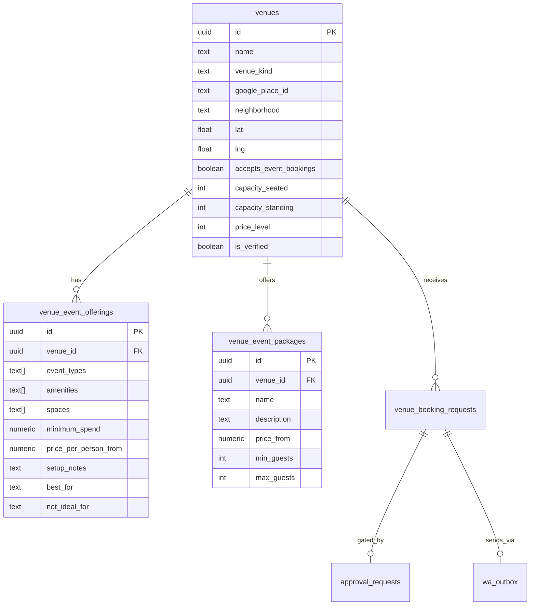

# VEB-001-core — Event venue + offerings schema

## Disk reality (2026-06-02)

**Not on disk.** Supabase MCP: `venue_event_offerings` does not exist. `venue_booking_requests` (DATA-009) is for **table bookings**, not event packages — extend via new tables per this spec.

**Prerequisite met:** VEN-015 schema ✅ · VEN-016/021 booking spine partial ✅.

## At a glance

| | |
|---|---|
| **Linear** | [EVT-033 — Event venue + offerings schema (Supabase)](https://linear.app/sanjiovani/issue/SAN-492/evt-033-event-venue-offerings-schema) · [Events Platform](https://linear.app/sanjiovani/project/events-platform-46150ec19346/issues) |
| **For** | Sofía (schema), Patricia (ops), Roberto (organizer) |
| **Surface** | Supabase migrations |
| **Layer** | DATA |
| **Plan** | [`venues-booking.md`](../../docs/venues-booking.md) §5 |

## What we're building

Database tables so restaurants like **Mamacita Medallo** can expose **event capacity, packages, and amenities** — separate from dinner-table booking but sharing `venue_booking_requests` for proposals.

## User journey

1. Patricia seeds a restaurant with `accepts_event_bookings=true`.
2. Offerings row describes birthday dinners, AI meetups, rooftop capacity.
3. Roberto submits a proposal → row links to `venue_id` + `venue_booking_requests`.

## Data model

## Tables (MVP columns)

| Table | Purpose |
|-------|---------|
| `venues` | Master row per bookable place (may extend `restaurants` view or new table — **pick one in migration**, document in PR) |
| `venue_event_offerings` | Capacity, event types, amenities, contact rules |
| `venue_event_packages` | Named packages ($25/person dinner, $500 min spend) |
| `venue_booking_requests` | **Reuse VEN-015** — add `event_type`, `budget`, `booking_kind=event_proposal` |

## RLS rules

- Public read on `venues`, `venue_event_offerings`, `venue_event_packages` where `is_verified=true` OR linked to published content.
- Insert on `venue_booking_requests`: authenticated user owns row (`auth.uid()`).
- Admin (Patricia): full read/update on booking + approval tables.

## Agents & tools (enabled after this task)

| Tool | Reads |
|------|-------|
| `searchEventVenues` | `venues` + offerings join |
| `requestEventVenueProposal` | INSERT `venue_booking_requests` |

## Workflows

Feeds **VEB-010** `eventVenueBookingWorkflow`.

## Acceptance criteria

- [ ] Migration applies cleanly on staging Supabase
- [ ] RLS enabled + ≥1 policy per new table
- [ ] Seed SQL inserts Mamacita-shaped test row
- [ ] `venue_booking_requests` accepts `booking_kind=event_proposal` without breaking café/restaurant rows
- [ ] Negative test: anon cannot read other users' booking requests
- [ ] MCP schema verify matches migration

## Related

- Place booking table: [`VEN-015`](../mvp/015-ven-booking-requests-schema.md)
- DATA spine: [`DATA-009`](../../../data/tasks-data/data-009-schema-migrations-m1-m3.md)
