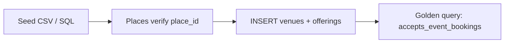

# VEB-002-core — Seed event venue partners

## Disk reality (2026-06-02)

**Not on disk.** `venue_anchors` has café/nightclub dining seeds only — no `accepts_event_bookings` or offerings rows. **Blocked by:** VEB-001.

## At a glance

| | |
|---|---|
| **Linear** | [EVT-034 — Seed event venue partners (Mamacita + 5)](https://linear.app/sanjiovani/issue/SAN-493/evt-034-seed-mamacita-5-event-partners) · [Events Platform](https://linear.app/sanjiovani/project/events-platform-46150ec19346/issues) |
| **For** | Roberto (demo), Carlos (partner story), Lucía (QA) |
| **Surface** | Supabase seed SQL + optional Places verify |
| **Layer** | DATA |

## What we're building

Five **real-shaped** event venue partners so UI and agents have data on day one — not empty panels.

## Seed roster (examples)

| Venue | Kind | Event types | Capacity |
|-------|------|-------------|----------|
| **Mamacita Medallo** | restaurant | Birthdays, private dinners | 60 seated / 120 standing |
| **Rooftop Provenza** (placeholder name) | bar | Networking, launches | 80 standing |
| **Laureles cowork café** | cafe | AI meetups, workshops | 25 seated |
| **Event loft El Poblado** | event_space | Fashion, corporate | 150 standing |
| **Terrace Laureles** | restaurant | Dinners, salsa nights | 40 seated |

Each row: `google_place_id` (verify via Places MCP), `accepts_event_bookings=true`, offerings + at least one package.

## User journey

1. Roberto searches "rooftop for 80 in Provenza" → Mamacita + rooftop appear.
2. Tourist opens Mamacita restaurant card → sees **Hosts Events** badge.

## Workflow

## Acceptance criteria

- [ ] ≥5 venues with `accepts_event_bookings=true`
- [ ] Each has `venue_event_offerings` row with capacity + event_types
- [ ] Each has ≥1 `venue_event_packages` row
- [ ] `google_place_id` verified via Places (field mask documented)
- [ ] Golden query doc in `tasks/venues/seeds/event-venues-golden.sql`

## Related

- Restaurant seed: [`DATA-004`](../../../data/tasks-data/data-004-restaurant-seed.md)
- [`venues-booking.md`](../../docs/venues-booking.md) §12 use cases
