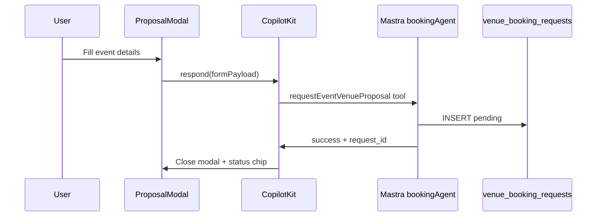

# VEB-005-mvp — Request event proposal modal

## Disk reality (2026-06-02)

**Not on disk.** Reuse **React Hook Form + Zod + shadcn Field** patterns from VEN-017/021 (`venue-booking-form-schema.ts`); event row shape awaits VEB-001.

## At a glance

| | |
|---|---|
| **Linear** | [EVT-037 — Request event proposal modal (CopilotKit HITL)](https://linear.app/sanjiovani/issue/SAN-496/evt-037-request-proposal-modal-hitl) · [Events Platform](https://linear.app/sanjiovani/project/events-platform-46150ec19346/issues) |
| **For** | Roberto, Tourist |
| **Surface** | Sheet/modal over `/chat` or offerings panel |
| **Screen to design** | **W02** |

## What we're building

Collect event proposal details and submit via Mastra — honest copy, no instant confirm.

## Form fields

| Field | Required | Maps to |
|-------|----------|---------|
| Event type | yes | `event_type` |
| Date | yes | `event_date` |
| Time | yes | `event_time` |
| Guest count | yes | `guest_count` |
| Budget range | optional | `budget` |
| Notes | optional | `notes` |
| WhatsApp number | yes | user profile or field |

## User journey

1. User taps **Request event proposal** on offerings panel.
2. Modal opens (standalone or agent-triggered via `renderAndWaitForResponse`).
3. User fills form → Submit.
4. UI shows: **"Request sent — we'll confirm by WhatsApp."**
5. Status chip `pending` on card (VEN-020 pattern).

## CopilotKit pattern

## Agents & tools

| CopilotKit action | Mastra tool |
|-------------------|-------------|
| `request_event_proposal` | `requestEventVenueProposal` |

Reuse field validation from [`VEN-017`](../mvp/017-ven-booking-sheet.md) / [`VEN-021`](../mvp/021-ven-booking-sheet-persist.md) (`venue-booking-form-schema.ts`) where possible. Event proposals may use a **separate** table after VEB-001 — do not overload `venue_booking_requests` without schema extension.

## Acceptance criteria

- [ ] Validates required fields before `respond()`
- [ ] Never shows "Booking confirmed"
- [ ] Works standalone (button) and from agent tool render
- [ ] `booking_kind=event_proposal` on insert
- [ ] Duplicate submit guarded (VEN-026 idempotency)
- [ ] Mobile keyboard-safe layout per W02

## Wireframe

[`VEB-W02`](./wireframes/VEB-W02-wire-request-proposal-modal.md)
