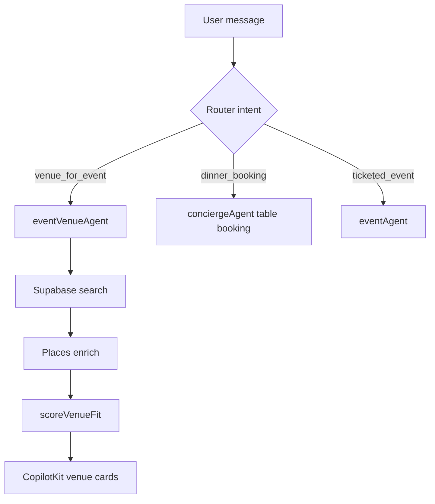

# VEB-006-mvp — eventVenueAgent + tools

## Disk reality (2026-06-02)

**Not on disk.** No `eventVenueAgent` in `mdeapp/src/mastra/agents/`. **Blocked by:** VEB-001 schema, VEN-011/012 nightlife routing for venue discovery.

## At a glance

| | |
|---|---|
| **Linear** | [EVT-038 — eventVenueAgent + search/rank tools](https://linear.app/sanjiovani/issue/SAN-497/evt-038-eventvenueagent-searchrank-tools) · [Events Platform](https://linear.app/sanjiovani/project/events-platform-46150ec19346/issues) |
| **For** | Roberto ("80 founders in Provenza"), Camila (chat) |
| **Surface** | `/chat` via `conciergeAgent` router → `eventVenueAgent` |
| **Layer** | Mastra |

## What we're building

**One lean agent** (not a swarm) that finds and ranks event-capable venues using Supabase first, Places enrichment second, Gemini for explanation only.

## Tools

| Tool | Input | Output |
|------|-------|--------|
| `searchEventVenues` | neighborhood, guest_count, event_type, budget | ranked venue list |
| `getEventVenueOfferings` | venue_id | offerings + packages |
| `scoreVenueFit` | venue_id, event_requirements | 0–100 fit score + reasons |
| `enrichVenueMapContext` | google_place_id | parking, hotels, nightlife (Places field mask) |

## Intent routing

## Example prompts (real)

| User says | Expected behavior |
|-----------|-------------------|
| "Rooftop for 80 people in Provenza" | Filter `accepts_event_bookings`, rank by capacity |
| "Birthday dinner for 20, $500 budget" | Match packages + minimum_spend |
| "Compare Mamacita vs terrace for AI meetup" | Return 2+ venues for VEB-008 |

## Google stack

| Layer | Use |
|-------|-----|
| Supabase | Curated venues + offerings (source of truth) |
| Places API New | Address, photos, map context — **field mask required** |
| Maps grounding (Gemini) | Discover candidates when DB thin — cite sources |
| ADK sidecar | Phase 2 — [`11-gemini-maps-adk-venues-routing.md`](../../docs/11-gemini-maps-adk-venues-routing.md) |

## Working memory slots

| Slot | Purpose |
|------|---------|
| `lastVenueSearchQuery` | Follow-up "compare the second one" |
| `shortlistedVenueIds` | Compare flow |
| `eventRequirements` | guest_count, date, event_type |

## Acceptance criteria

- [ ] Agent registered in `mdeapp/src/mastra/index.ts`
- [ ] Router dispatches venue-for-event intent (confidence ≥ 0.6)
- [ ] Never invents capacity/price — tool data only in cards
- [ ] Places calls logged with field mask audit
- [ ] Vitest: tool schema + mocked Supabase rank
- [ ] MCP verify Gemini model `gemini-3.5-flash`

## Related

- Mastra venues routing: [`12-mastra-venues-routing.md`](../../docs/12-mastra-venues-routing.md)
- [`venues-booking.md`](../../docs/venues-booking.md) §7
