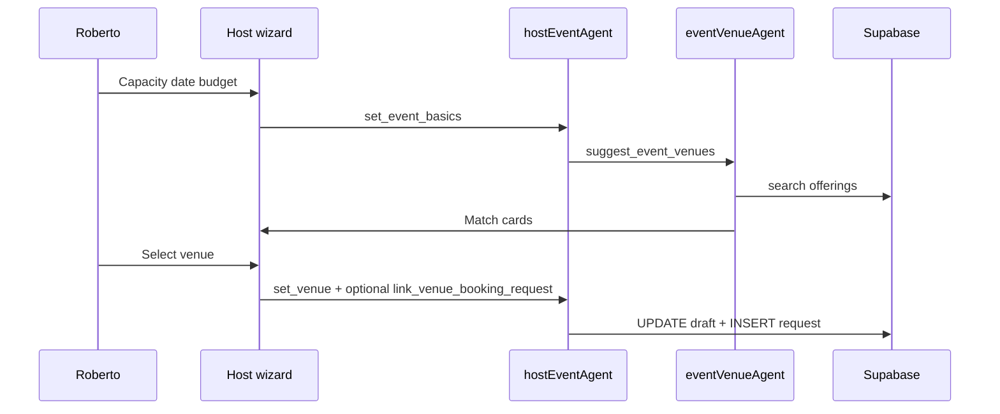

# VEB-009-mvp — Host wizard venue step

## Disk reality (2026-06-02)

**Partial only:** `host-event-form.tsx` venue text field + `host-event-copilot-bridge.tsx` `set_venue` HITL. **Missing:** `eventVenueAgent`, venue match cards, offerings from DB, link to event proposal row.

**Do not mark Done** until VEB-006 + offerings-backed picker ships.

## At a glance

| | |
|---|---|
| **Linear** | [EVT-041 — Host event wizard — venue step (Roberto)](https://linear.app/sanjiovani/issue/SAN-500/evt-041-host-wizard-venue-step-roberto) · [Events Platform](https://linear.app/sanjiovani/project/events-platform-46150ec19346/issues) |
| **For** | Roberto |
| **Surface** | `/host/event/new` workflow strip |
| **Screen to design** | **W04** |

## What we're building

Extend host wizard strip:

```text
Basics ✓ → Venue ● → Tickets ○ → Preview ○
```

Roberto describes capacity/date/budget → `hostEventAgent` + `eventVenueAgent` suggest venues → Roberto picks one → `set_venue` tool updates `EventDraftState` + optional booking request.

## User journey (Journey B + host flow)

1. Roberto: "Startup mixer March 15, 200 cap, Provenza."
2. Agent suggests 3 event venues with match scores.
3. Roberto selects Mamacita → venue bound to event draft.
4. Optional: **Request hold** creates `venue_booking_requests` linked to draft event id.

## Tools (hostEventAgent)

| Tool | UI mirror |
|------|-----------|
| `set_venue` (existing) | Places search + map pin |
| `suggest_event_venues` (new) | Venue match cards from VEB-007 |
| `link_venue_booking_request` | Creates proposal tied to draft |

## Integration with events

| Event artifact | Venue link |
|----------------|------------|
| `EventDraftState.venueId` | Selected `venues.id` |
| `event_venues` row | On publish (EVP-012) |
| `venue_booking_requests.event_draft_id` | Optional FK |

## Sequence



## Acceptance criteria

- [ ] Wizard strip shows Venue step without breaking EVP-010 publish
- [ ] Publish still works with text-only venue if no event venue picked
- [ ] Selected venue shows on live preview card
- [ ] Map pin on preview when `google_place_id` present
- [ ] Playwright: logged-in venue select path (after EVP-010 auth proof)

## Wireframe

[`VEB-W04`](./wireframes/VEB-W04-wire-host-venue-step.md) · Events ref: [`004-wire-host-event-wizard`](../../../events/wireframes/004-wire-host-event-wizard.md)

## Related

- [`EVP-010`](../../../events/tasks/MVP/EVP-010-core-host-event-new-wizard.md)
- [`EVP-016`](../../../events/tasks/MVP/EVP-016-mvp-event-maps-venue-integration.md)
