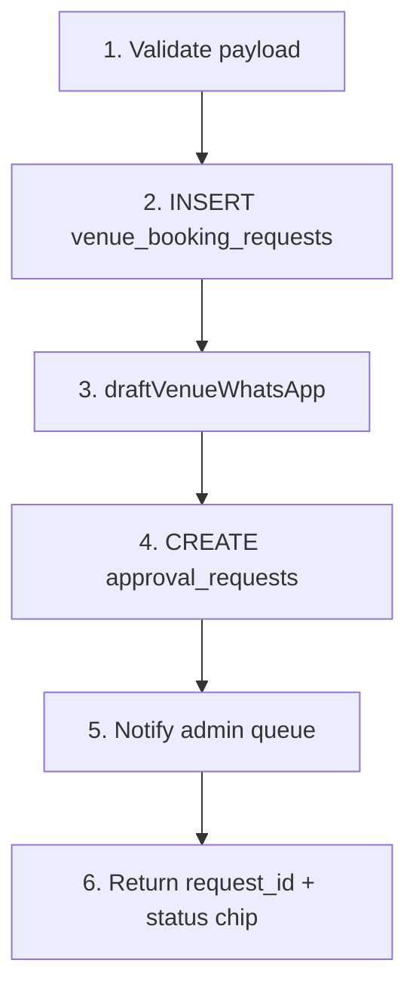
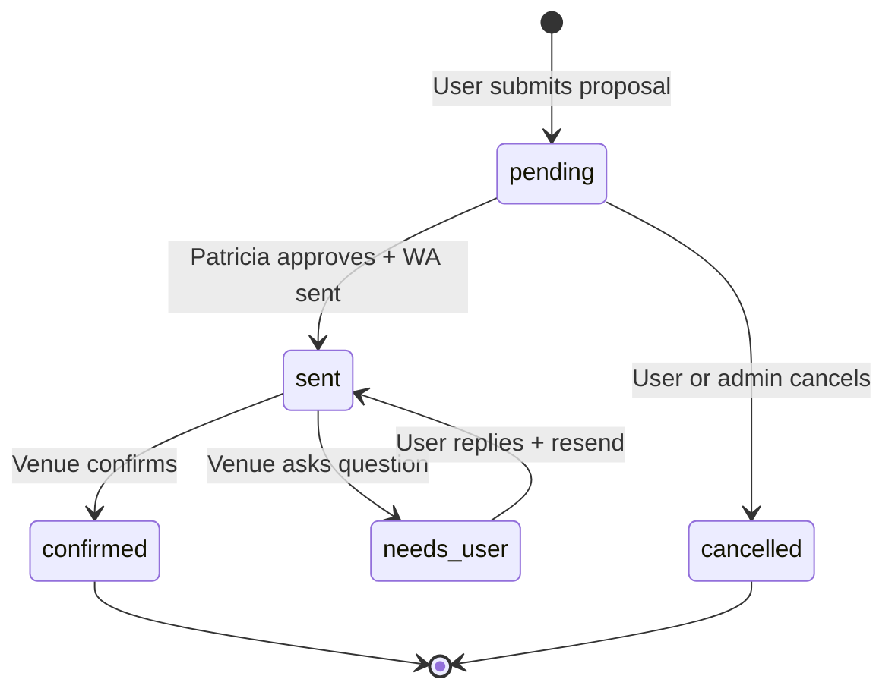

# VEB-010-mvp — eventVenueBookingWorkflow

## Disk reality (2026-06-02)

**Not on disk.** **Blocked by:** VEB-005, VEN-022/023 (WA), VEB-001 schema.

## At a glance

| | |
|---|---|
| **Linear** | [EVT-042 — eventVenueBookingWorkflow (Mastra)](https://linear.app/sanjiovani/issue/SAN-501/evt-042-eventvenuebookingworkflow) · [Events Platform](https://linear.app/sanjiovani/project/events-platform-46150ec19346/issues) |
| **For** | Roberto, Tourist, Patricia |
| **Surface** | Mastra workflow triggered by proposal modal or agent |
| **Layer** | Mastra |

## What we're building

Deterministic workflow for event proposals — extends place booking flow from [`02-booking-whatsapp.md`](../../docs/02-booking-whatsapp.md).

## Workflow steps

## Step detail

| Step | Action | Failure |
|------|--------|---------|
| Validate | Zod schema: dates, guest_count, venue_id | 400 to UI |
| Insert | `booking_kind=event_proposal`, `status=pending` | Retry UX VEN-028 |
| Draft WA | Gemini proposes message — **no send** | Save partial draft |
| Approval | Link `approval_request_id` | Queue for Patricia |
| Notify | Optional in-app / email Patricia | Non-blocking |

## State machine (booking request)

## Files (expected)

- `mdeapp/src/mastra/workflows/event-venue-booking-workflow.ts`
- Register in `mdeapp/src/mastra/index.ts`
- Reuse `draftVenueWhatsApp` from VEN-022

## Acceptance criteria

- [ ] Vitest workflow with mocked Supabase + Gemini draft
- [ ] Idempotent on duplicate submit (VEN-026)
- [ ] `ai_runs` or booking audit row per execution
- [ ] WhatsApp draft stored before Patricia sees queue
- [ ] Never calls WA send API from workflow — outbox only (VEN-023)

## Related

- [`VEN-016`](../mvp/016-ven-request-venue-booking-tool.md)
- [`VEN-030`](../post-mvp/030-ven-mastra-booking-workflow.md) — generalize after VEB-010
