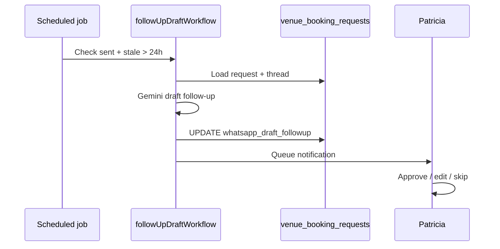

# VEB-014-advanced — Auto follow-up WA drafts

> **Linear:** [EVT-046 — Auto follow-up WhatsApp drafts (24h no reply)](https://linear.app/sanjiovani/issue/SAN-505/evt-046-auto-follow-up-wa-drafts-24h) · **Project:** [Events Platform](https://linear.app/sanjiovani/project/events-platform-46150ec19346/issues)

## Phase 2+ automation — draft only, Patricia approves.

## What we're building

When `status=sent` and no venue reply for 24h, Mastra drafts a polite follow-up → Patricia queue — **never auto-send**.

## Workflow

## Acceptance criteria

- [ ] Feature flag `VENUE_AUTO_FOLLOWUP=0` default off
- [ ] Max 1 follow-up draft per request
- [ ] Audit log entry on draft creation
- [ ] Suppression if user cancelled or venue confirmed

## Related

- [`venues-booking.md`](../../docs/venues-booking.md) §6 Advanced AI
