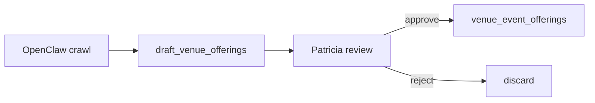

# VEB-018-advanced — OpenClaw venue enrichment (plan)

> **Linear:** [EVT-050 — OpenClaw venue enrichment (plan only)](https://linear.app/sanjiovani/issue/SAN-509/evt-050-openclaw-venue-enrichment-plan) · **Project:** [Events Platform](https://linear.app/sanjiovani/project/events-platform-46150ec19346/issues)

## Plan only — no auto-publish (same gate as EVP-031)

## What we're building

Specification for OpenClaw to scrape venue websites / Instagram for event packages → **draft rows** for Patricia — mirrors event discovery approval pattern.

## Flow

## Hard rules

1. No service-role in `mdeapp/src`
2. No auto-write to production offerings
3. Human approval before seed merge
4. Feature flag default off

## Deliverable

- [ ] Plan doc section in this file expanded after OCL stakeholder review
- [ ] Link to [`06-openclaw-automation.md`](../../docs/06-openclaw-automation.md)
- [ ] No implementation until VEB-011 ops proven

## Related

- [`EVP-031`](../../../events/tasks/EVP-031-advanced-openclaw-automation-plan.md)
