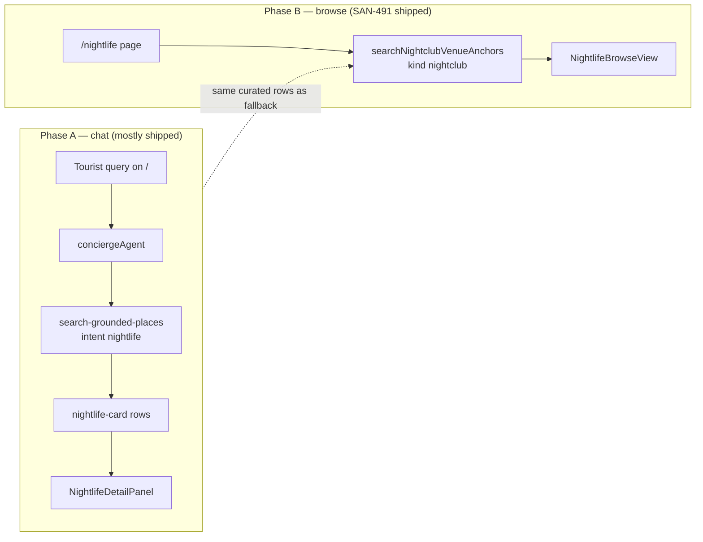
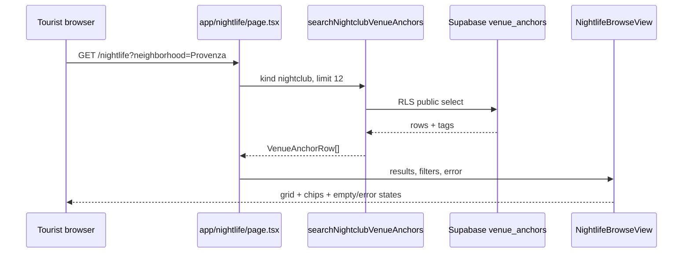

# SCREEN-022 — Nightlife Listings + Map (Clubs & Bars)

> **Places group 007:** [005-008-places-README.md](005-008-places-README.md) · Wire: [007-wire-nightlife-listings-map.md](007-wire-nightlife-listings-map.md) · Mirror pattern: [005-scr-cafe-listings-map-booking.md](005-scr-cafe-listings-map-booking.md)

## 1. Purpose

Chat-first **nightclub and bar discovery** for Tourists on `/`: ranked venue cards (reggaeton clubs, rooftop bars, salsa nights at clubs), map pins, right-column `NightlifeDetailPanel`, and optional handoff to **ticketed events** (SCREEN-006) when the venue has a listed event.

## 2. Goals

**Phase A (MVP):**

- `NightlifeResultCard` list from `search-grounded-places` with `intent: "nightlife"`.
- Filter **in** bars, nightclubs, discotecas, rooftop lounges; **exclude** quiet cafés (inverse of café intent).
- Map pin sync (F50); pin category `nightlife` or reuse `place` with distinct marker color.
- `NightlifeDetailPanel` in right column (clone `CafeDetailPanel` pattern): Overview · Reviews · Location.
- Medellín-native **safety line** in agent copy (licensed taxis, stay in busy areas) — not generic travel fluff.
- Chips: `[Open now]` `[After 11pm]` `[Provenza]` `[Laureles]` `[Live DJ]` `[Salsa club]`.
- Optional CTA: **See events tonight** → `search-events` when user wants ticketed nights.

**Phase B (optional):**

- Hybrid rank: merge grounded clubs + Supabase `events` rows at same lat/lng.
- “Busy after 11pm” heuristic from opening hours + summary keywords.

## 3. Personas

| Persona | Journey |
|---------|---------|
| **Tourist** | “Best reggaeton clubs near Provenza tonight” → cards + map → detail → Directions / Save |
| **Andrés** | Club with ticketed party → **Buy tickets** links to SCREEN-014 or in-thread event card |

## 4. Workflows — files to touch

| Area | Action |
|------|--------|
| Mastra | Extend `search-grounded-places.ts` — add `intent: "nightlife"` filter (include `bar`, `night_club`, `nightclub`, discoteca types; exclude café primary types) |
| Mastra | Concierge instructions — route nightlife/club/reggaeton/discoteca queries to grounded nightlife intent |
| UI | `NightlifeResultCard.tsx` + generative block in `search-tool-renders.tsx` |
| UI | `NightlifeDetailPanel.tsx` — reuse cafe panel structure; vibe tags (reggaeton, rooftop, dress code from summary only) |
| UI | `rental-ui-context.tsx` — `nightlifeDetail`, column mode toggle |
| Map | Distinct marker style for nightlife pins |
| Tests | `SCREEN-022-nightlife-listings.spec.ts`; assert café intent does **not** return same query |

## 5. Agent

| Agent | Tool |
|-------|------|
| `conciergeAgent` | `search-grounded-places` (`intent: "nightlife"`) |
| Same agent | `search-events` when user asks for ticketed party / cover charge / “event tonight” |

Do **not** add `nightlifeAgent` in Phase A — keep concierge lean.

## 6. Integrations

| Layer | Rule |
|-------|------|
| Discovery | ADK Grounding Lite via extended intent filter |
| Detail | `getPlaceDetails` + field mask (same as café) |
| Events overlap | If `placeId` matches event venue, show “Events here” link to SCREEN-006 cards |
| Sheet | **Do not** use SCREEN-007 venue sheet for clubs |

## 6b. `/nightlife` browse page (SAN-491 — ship after chat Phase A)

Mirror **SAN-490** `/restaurants`:

| Step | Action |
|------|--------|
| 1 | Copy `app/restaurants/page.tsx` → `app/nightlife/page.tsx` (replace placeholder) |
| 2 | **Create** `NightlifeBrowseView` from `RestaurantBrowseView` pattern |
| 3 | Loader: **`searchNightclubVenueAnchors`** (`kind = nightclub` in `venue_anchors`) — same pattern as `/restaurants` → `searchRestaurants`; optional ADK enrich later |
| 4 | Playwright: `SCREEN-022-nightlife-browse.spec.ts` + chat spec `SCREEN-022-nightlife-listings.spec.ts` |
| 5 | Evidence: `tasks/venues/tasks/evidence/SCREEN-022-evidence.md` |

**Real-world:** Carlos opens `/nightlife`, filters Provenza, picks a reggaeton club without typing in chat.

**Status (2026-06-04):** Steps 1–5 shipped; browse + chat Playwright green. **Done gate:** `npm run floor` on merge branch.

## 7. Acceptance criteria (Phase A — chat)

- [x] “reggaeton clubs Provenza tonight” returns ≥2 nightlife cards (not café cards) — `nightlife-card` + grounded filter.
- [x] Cards show open-now or hours when Places provides them; no fabricated “open until 4am”.
- [x] Detail panel opens in right column; map restores on close.
- [x] Safety note visible once per nightlife thread — `NightlifeSafetyNotice` in detail panel (`sessionStorage`).
- [x] Playwright SCREEN-022 pass — chat + browse specs green on prod (`ae9a1e6`). Floor: run on next `mdeapp` touch or CI.

## 8. Tests

```bash
cd mdeapp
PW_SKIP_WEBSERVER=1 npx playwright test e2e/screens/SCREEN-022-nightlife-listings.spec.ts --project=chromium
npm run floor
```

**Negative:** “quiet café Laureles” must **not** call nightlife intent.

## 9. Do not do

- ~~Standalone `/nightlife` catalog before chat mode works~~ → **browse page is P0 (SAN-491)** after in-chat cards pass Playwright
- Duplicate café discovery path for clubs
- Invent dress codes, cover prices, or safety claims not in Places/summary
- Browser-side Places API
- **`POST /api/venues/search`** — not on disk; browse loads via server component calling `searchNightclubVenueAnchors` (mirror `searchRestaurants` on `/restaurants`)

## 10. Diagrams

### 10a. Scope split — chat vs browse (SAN-491)



### 10b. Browse page data flow (mirror SAN-490)



### 10c. Done gate — what SAN-491 must prove

```mermaid
stateDiagram-v2
  accTitle: SAN-491 execution readiness
  accDescr: Chat Phase A can pass before browse ships; browse has its own AC.

  [*] --> ChatPhaseA: VEN-011/012/013
  ChatPhaseA --> ChatDone: SCREEN-022 Playwright chat 2/2
  ChatDone --> BrowseBuild: NightlifeBrowseView + page loader
  BrowseBuild --> BrowseTest: e2e /nightlife assertions
  BrowseTest --> Evidence: tasks/evidence/SCREEN-022-evidence.md
  Evidence --> ProductionReady: floor green + 0 console errors

  ChatPhaseA --> BrowseBuild: allowed parallel if chat green
  note right of BrowseBuild
    Do not block on VEN-013 In Review
    sitemap stale blocker — remove
  end note
```


