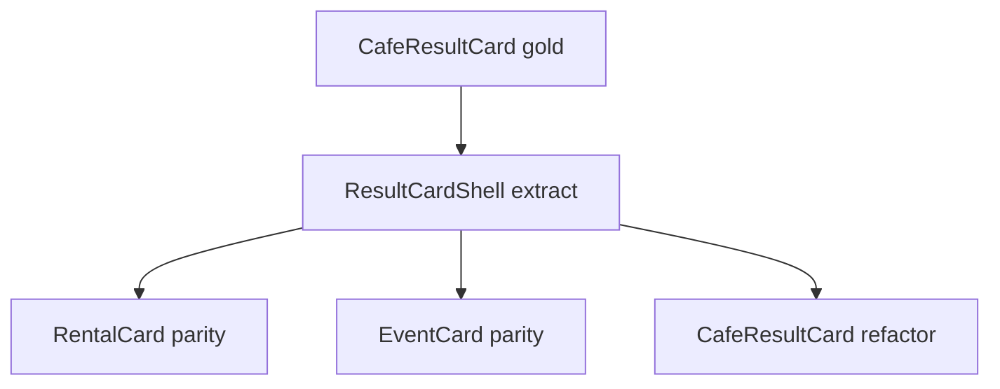

# UX-023 — ResultCardShell + primitives (M0)

> **Does not block UX-022 or UX-025.** Ship wiring + rich `RestaurantCard` first; extract shell after proof on `main`.

## Purpose

One layout engine for selection ring, hover→pin, aria, footer border-t, overflow — domain cards supply content slots only.

## Affected files

| Create | Modify |
|--------|--------|
| `components/cards/base-result-card.tsx` | `cafe-result-card.tsx` |
| `result-card-media.tsx` | `rental-card.tsx` (behavior-preserving) |
| `result-card-header.tsx` | `event-card.tsx` |
| `result-card-badges.tsx` | |
| `result-card-footer.tsx` | |
| `result-card-actions.tsx` | |

## Rules

- **CafeResultCard snapshot must match** before/after (pixel-equivalent classes).
- **RentalCard snapshot must match** — no redesign.
- Shell owns: `cn()` selected, `data-pin-id`, `data-result-kind`, `data-selected`, hover/focus→`onSelect`, keyboard on body.

## Tests

- Vitest: shell renders slots; missing photo → placeholder.
- Vitest: `onSelect` called on mouseEnter.
- Existing cafe/rental/event card tests stay green.

## Acceptance

- [x] CafeResultCard uses shell; visual parity verified (screenshot or test).
- [x] RentalCard uses shell; visual parity verified.
- [x] EventCard uses shell; `cn()` not template literals.
- [ ] `npm run floor` green (blocked: unrelated `restaurants/page.tsx` lint).

## Flow diagram

## Verification (2026-06-01)

| Claim | Result |
|-------|--------|
| `blocks` | Updated — **does not block** UX-025/026 (shipped on branch without shell) |
| Shell exists | ✅ `result-card-shell.tsx` + vitest |
| Rental snapshot parity | ✅ rental-card-copy tests green |
